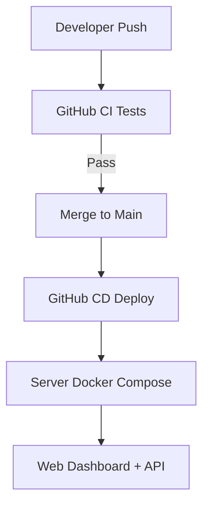

# Contributing

Branching, approvals, protected areas.

> This page was auto-generated from existing repo docs. Check TODO/TBD markers.

## Branching
- feat|fix|chore/ABC-123-desc

## Quality Gates
- Quick lint + typecheck on write; full tests on APPROVE:RUN

## Protected Folders
- Strategy core, guardrails, infra/CI/CD

---
**From:** `DEPLOY.md`

# One-Go Docker Deploy

## Prerequisites
- Docker Desktop (or Docker Engine + Compose V2)
- No process listening on host ports **3000** (API) and **8080** (Dashboard)

## Quick start
```bash
# From repo root
make up
# or explicitly:
docker compose --profile local up -d
```

**Dashboard** → http://localhost:8080

**API** (health, if implemented) → http://localhost:3000/health

## What it does
- Builds the workspace with PNPM in a multi-stage Dockerfile
- Produces two images:
  - **api** (Node 20) on port 3000
  - **dashboard** (Nginx) on port 8080, proxying `/api/*` to `api:3000`
- No secrets are committed. Copy `.env.template` to `.env` and fill in real values as needed.

## Useful commands
```
make logs     # tail logs
make ps       # container status
make down     # stop stack
make build    # rebuild images (no cache)
```

## Troubleshooting
- **Port already in use (3000/8080)** → stop the conflicting process or container (`docker ps` then `docker stop <id>`).
- **Build fails on dashboard** → ensure TypeScript DOM libs/shims are present; run `pnpm -C apps/dashboard build` locally to check.
- **Health endpoint** → If `/health` is not implemented, either add one in the API or adjust/remove the healthcheck.

## Gapfill maintenance (1-minute bars)
- One-shot: `make gapfill` (fetches only missing minutes in the last 30 days; duplicate-safe).
- Nightly: `gapfill-cron` service runs at **02:20 UTC (GMT)** and writes logs to `/var/log/gapfill-cron.log`.

Verify:
```bash
docker compose --profile local up -d gapfill-cron
docker compose logs --tail=20 gapfill-cron
```


---
**From:** `PROJECT.md`

# Prism-Apex: Operator-Assisted Trading (Project Overview)

> **Non-negotiable:** Prism-Apex NEVER places orders automatically. It produces **tickets only**. A human operator enters OCO brackets in Tradovate. No exceptions.

## Mission
Operator-assisted trading for Apex Trader Funding accounts on Tradovate:
- **Prism-Apex is the brain** (signals, guardrails, tickets, telemetry).
- **A human is the hands** (manual order entry into Tradovate using OCO).
- Strict **Apex guardrails** enforced in code; violations result in **ticket rejection** (no orders sent).

## Runtime Model (Docker-only)
Local/staging uses **Docker Compose** only. No host Node/Python needed.
Public API (read-only for operators):
- `GET /health`
- `GET /ready`
- `GET /openapi.json`
- `GET /version`

## Dataflow (High-Level)


Tradovate Market Data WS (live)
│
├─▶ Bar/VWAP/ATR series
│
├─▶ Strategy Orchestrator
│ ├─ VWAP First-Touch
│ └─ Opening-Session Breakout
│
├─▶ Apex Guardrails & Sizing (rules-apex)
│
└─▶ Ticket Store (JSONL, per-day)
└─ Operator copies ticket into Tradovate as OCO


### In-Scope Strategies (MVP)
- **VWAP First-Touch**  
  Code: `packages/strategies/src/vwapFirstTouch.ts`  
  Config: `configs/strategies/vwap-first-touch.json`
- **Opening-Session Breakout (OSB)**  
  Code: `packages/strategies/src/osbBreakout.ts`  
  Config: `configs/strategies/opening-session-breakout.json`

Strategy toggling/scheduling is allowed via config; new strategies can be added later.

## Apex Guardrails (Enforced)
- **Stop required** (funded or if configured) and on **correct side**.
- **Risk:Reward clamp** to policy; reject `<min` or `>max`.
- **Half-size until buffer cleared**; **anti-windfall sizing**.
- **Trailing drawdown awareness** baked into acceptance/sizing.
- **EOD flat window suppression** (see below).
- **Consistency tracking** with optional operator notes.
- Enforcement level is configurable (see `packages/rules-apex`, `configs/rules/apex.json`, `apex/rules.json`).

## Tickets (Canonical)
Each accepted idea is written as a **ticket** the operator can copy into Tradovate.

Shape:
```json
{
  "symbol": "MESZ5",
  "side": "BUY|SELL",
  "entry": 5550.25,
  "stop": 5544.25,
  "target": 5560.25,
  "qty": 2,
  "accountId": "APEX-123456",
  "timestampUtc": "2025-09-09T14:31:22Z",
  "meta": {
    "strategy": "vwap-first-touch",
    "rr": 1.5,
    "guardrails": ["stopSideOk","rrInRange","sizeHalfUntilBuffer"],
    "sizingHint": "half-size",
    "consistencyNotes": "FT1 after pullback"
  },
  "accepted": true,
  "reasons": []
}
```

Tickets are persisted to per-day JSONL files and exposed via:

GET /tickets?date=YYYY-MM-DD

GET /export/tickets?date=YYYY-MM-DD (CSV)

See details in docs/tickets.md.

EOD Behavior

Strategies automatically suppress new tickets inside the EOD flat window (config-driven buffer before session close).

Dashboard shows an EOD countdown to flat window start.

Any ticket evaluated inside suppression returns accepted=false with reason EOD_WINDOW.

Operator Console

See docs/operator-console.md for the exact copy format, OCO mapping in Tradovate, fanout to multiple accounts, rejection codes, and the EOD countdown behavior.

Quality & CI (unchanged)

Node: pnpm lint && pnpm typecheck && pnpm test

Python: ruff --fix && black --check && pytest -q

Depcheck: pnpm run scan:dead

JSON logs; no PII; CORS allow-list via env; health/readiness/metrics present.


---
**From:** `README-dev.md`


Developer Guide
Ports at a glance

API (compose): 3000
Dashboard (compose): 5180
Dashboard dev (compose dev profile): 5179
Ingress proxy (compose): 8080

Dev workflow (hot reload, if scripts exist)
./dev_api.sh              # API on :8000 (Fastify watch) — optional
pnpm --filter @prism-apex/dashboard-lite dev   # Vite dev UI on :5173 (if applicable)

Prod-like workflow (Docker)
make up          # local parity stack (db, api, dashboard, ingress, cron)
make seed        # optional one-off ingest/gapfill/tickets jobs
make down        # stop local stack

Sanity checks
curl -fsS http://localhost:3000/health
curl -fsS http://localhost:3000/ready

Notes

This repo may contain pre-existing lint/typecheck/test failures; CI runs are non-blocking except for the no-order-API guard, which is hard-fail by design.

If Docker is not installed locally, compose builds will be skipped. Install Docker to run containers.

Absolute rule

The codebase must never introduce broker order placement (tickets-only). CI enforces this at PR time.

### API-focused commands
- `pnpm build:api` — build only the API workspace and its deps
- `pnpm typecheck:api` — typecheck API scope
- `pnpm test:api` — run API tests only

### API bundling
- Runtime artifact is **CommonJS**: `apps/api/dist/server.cjs` (bundled by **tsup**).
- Typechecking remains via `tsc --noEmit` using `tsconfig.build.json`.
- If your entry file is not `src/server.ts`, update `apps/api/tsup.config.ts`.

### Path aliases
- Source of truth: `tsconfig.paths.json`. `tsconfig.base.json` extends it so every workspace inherits the same `paths` map.
- Use the `@prism-apex/<workspace>` pattern when importing. Examples:
  - `@prism-apex/app-api/*` → `apps/api/src/*`
  - `@prism-apex/rules-apex/*` → `packages/rules-apex/src/*`
- Vitest pulls in the map via the `vite-tsconfig-paths` plugin (see the shared `vitest.config.ts` family), and Node-based setups/scripts load `tsconfig-paths/register` (e.g., `apps/api/test.setup.ts`).
- Update `tsconfig.paths.json` whenever folders move; the rest follows automatically.

## Ports & Env
See [docs/ports-and-env.md](docs/ports-and-env.md) for guidance on API and dashboard port variables.


---
**From:** `docs/ARCHITECTURE_OVERVIEW.md`

# Prism-Apex Architecture Overview (Tickets-Only Brain)

Prism-Apex is the **brain** for operator-assisted trading on Apex Trader Funding accounts. We generate levels, guardrails, and tickets so a human operator can execute manually inside Tradovate. The platform never places an order or liquidates via API.

---

## Core Flow (Yahoo → DB → ORR → Tickets → Dashboard)
1. **Yahoo delayed feed → DB** — background jobs pull ≈15-minute delayed data from the Yahoo Finance API and load it into Postgres.
2. **Derived series in DB** — ORR and its namesake strategies read bar/VWAP/ATR series stored in the DB (no direct market-side API required).
3. **Guardrails & sizing** — logic in `packages/rules` / `packages/rules-apex` plus configs under `configs/` enforce Apex program rules before a ticket is emitted.
4. **Ticket emission** — strategies append structured tickets to `tickets/*.jsonl`; these JSONL files are the operator’s source of truth.
5. **Dashboard visualisation** — `apps/dashboard*` projects read tickets and telemetry so operators can review intent.
6. **Manual execution** — the operator copies the ticket into Tradovate as an OCO. Prism-Apex never places orders or liquidates via API.

---

## Repository Landmarks
- `apps/api/` — Node/TypeScript API serving telemetry, health, and ticket downloads.
- `apps/dashboard*/` — Vite/React dashboards for operators.
- `packages/` — Shared runtime libraries (indicators, strategies, guardrails, telemetry).
- `scripts/` — Operational tooling (`scan_repo.sh`, `cleanup_repo.sh`, etc.).
- `configs/` & `config/` — Strategy toggles, environment templates, guardrail settings.
- `tickets/` — Sacred JSONL ticket log. Archive, never delete.
- `docs/` — Architecture notes, cleanup/report artifacts, runbooks.
- `docker-compose*.yml` / `Dockerfile*` — Docker-first runtime definition. Keep docs aligned with exposed ports.

---

## Guardrails & Compliance Reminders
- **Absolutely no** automated order placement or emergency liquidation is implemented here.
- All automation stops at ticket generation. Operators remain the hands.
- Cleanup scripts protect source/config/migration directories, `.env*`, and tickets.

---

## Onboarding Checklist
1. Read `docs/CODEBASE_OVERVIEW.md` and this overview to understand the operator-assisted workflow.
2. Review `docs/REPO_SCAN_REPORT.md` plus `docs/REPO_SCAN_QUESTIONS.md` before approving any cleanup.
3. Keep local Node on 20.x LTS; use `pnpm lint`, `pnpm typecheck`, `pnpm test`, and `pnpm run scan:dead` for signal.
4. Run `scripts/cleanup_repo.sh` periodically to remove clutter (dry-run first if unsure).
5. When adding new strategies or configs, document which files are canonical for operators.

Staying within these boundaries keeps Prism-Apex compliant while giving operators the clarity they need.


---
**From:** `docs/CI.md`

# CI Guardrails

- **Hard rule (fails CI):** no code may include broker order APIs:
  `placeOrder`, `startOrderStrategy`, `liquidatePosition`.
  This project is *tickets-only*; operators place OCOs manually.

- **Soft checks (non-blocking for now):**
  - `pnpm -r lint`
  - `pnpm -r typecheck`
  - `pnpm -r test`

Artifacts are uploaded on failure to help debugging.


---
**From:** `docs/CODEBASE_OVERVIEW.md`

# Prism-Apex Codebase Overview (Tickets-Only Brain)

> Prism-Apex is the **brain**; the human operator is the **hands**. The repo never places or cancels live orders — it produces tickets, telemetry, and guardrails so an operator can work safely inside Tradovate.

---

## Current Functionality Snapshot (Yahoo → DB → ORR → Tickets → Dashboard)
- **Yahoo delayed feed populates the DB** — background workers pull ≈15-minute delayed candles from the Yahoo Finance API into Postgres.
- **Strategies read DB-derived series** — ORR and sibling playbooks use bar/VWAP/ATR series from the DB; no broker API feed is hit.
- **Tickets-first workflow** — strategy output is appended to `tickets/*.jsonl` and surfaced in the Dashboard for review.
- **Manual OCO execution** — operators key tickets into Tradovate by hand; Prism-Apex never submits or cancels orders via API.


## Core Flow at a Glance

1. **Market data ingestion** (primarily under `packages/*` and `apps/api/src/feeds`) processes WebSocket/REST sources into derived series (VWAP, ATR, bias signals).
2. **Strategies** inside `packages/strategies`, `packages/rules-apex`, and related helpers evaluate those series and emit structured opportunities.
3. **Guardrails + sizing** (`packages/rules`, `packages/rules-apex`, config files under `configs/` & `config/`) enforce Apex limits, risk tolerances, and program compliance.
4. **Ticketizer** writes append-only JSONL tickets into `tickets/*.jsonl` via services in `apps/api/src/tickets`. Each ticket captures entry, stops/targets, sizing, and rationale.
5. **Operator dashboard** (`apps/dashboard`, `apps/dashboard-lite`) provides read-only telemetry. It may read from Tradovate for balances/fills, but **never** sends orders.
6. **Operator copies ticket → Tradovate** as OCO orders. Execution stays manual, keeping us within the “no automated orders” rule.

---

## Repository Landmarks

- `apps/api/`
  - Node/TypeScript API (pnpm workspace project).
  - Provides REST + WebSocket endpoints for telemetry, ticket download, health probes.
  - Stores strategy orchestrator jobs (`src/jobs`) and guardrails integration tests (`src/tests`).
- `apps/dashboard/`, `apps/dashboard-lite/`
  - Front-end telemetry surfaces. Expect Vite + React with vitest configs in the root.
  - Pulls tickets, account summaries, and health information. Does **not** place trades.
- `tickets/`
  - Operational JSONL log of every approved ticket. Treat as immutable history: archive only, never delete.
- `packages/`
  - Shared libraries: indicators, strategies, runtime, rules, telemetry. Most cross-cutting logic lives here.
  - `packages/runtime` glues strategies + guardrails together.
- `configs/`, `config/`
  - Strategy enablement, environment toggles, size policies. Clarify which files are production vs experimental.
- `scripts/`
  - Operational utilities. `scan_repo.sh` is read-only; any cleanup script we add later will default to archive-first and require explicit opt-in for deletion.
- `docs/`
  - Architecture ADRs, runbooks, compliance notes, and now:
    - `REPO_SCAN_REPORT.md` & `REPO_SCAN_QUESTIONS.md`
    - `SCAN_SUMMARY_MESSAGE.md` (paste-ready status)
    - This overview (`CODEBASE_OVERVIEW.md`) for onboarding.
- `docker-compose*.yml`, `Dockerfile`
  - Define the Docker-only runtime assumption. Align documented ports with these manifests to avoid drift.
- `requirements.txt`, potential Python helpers
  - Python 3.11 utilities (ETL, analytics). Respect lint/format defaults if you extend them.

---

## Development Guardrails

- **Node toolchain:** Target **Node 20.x LTS** with `pnpm`; linting uses the flat ESLint config in `.eslint`. TypeScript configs live in `tsconfig.base.json` with project references per package.
- **Testing:**
  - `pnpm lint`, `pnpm typecheck`, `pnpm test` (vitest) are the usual quality gates.
  - `pnpm run scan:dead` (depcheck) surfaces unused dependencies.
- **Python:** When Python utilities are touched, stick to Python 3.11, `ruff`, and `pytest` conventions.
- **Danger zones:** Any code path that mentions “placeOrder”, “submitOrder”, etc. must remain disabled or guarded — the scan heuristics surface these so we can confirm they stay dormant.

---

## Working With the Tickets-Only Constraint

- Tickets are the hand-off contract: strategy output → operator input.
- Never auto-call broker APIs from this repo. If you discover historical code that hints at automated order placement, flag it before changing anything.
- Treat `tickets/*.jsonl` as permanent records. Cleanups should archive (e.g., move under `archive/`) rather than delete.
- Build artefacts (`dist/`, `build/`, caches) should generally stay out of git and be reproducible.

---

## Onboarding Checklist for New Contributors

1. Read `CODEBASE_OVERVIEW.md` (this file) and `docs/REPO_SCAN_REPORT.md` to understand current data.
2. Answer/confirm the items in `docs/REPO_SCAN_QUESTIONS.md` when planning cleanups or refactors.
3. Bring local Node to 20.x before running pnpm scripts to avoid engine warnings.
4. When updating configs/strategies, document the canonical source of truth so operators know what’s live versus experimental.
5. Run checks (`pnpm lint`, `pnpm typecheck`, `pnpm test`) in CI—failures may be pre-existing; coordinate before fixing.

Staying inside these guardrails keeps Prism-Apex compliant with the operator-assisted mission while giving us the visibility we need to keep accounts safe.


---
**From:** `docs/CONTRIBUTING-scripts.md`

If your local repo has no 'origin' remote configured, Codex prompts will skip 'git push' and print a compare URL hint instead.


---
**From:** `docs/DOCS_SYNC_REPORT.md`

# Docs Sync Report

- Timestamp: 2025-10-04T15:44:52+0100
- Base branch: chore/cleanup-delete-and-docs
- Working branch: chore/docs-sync-orr-yahoo

## Updated
- docs/ARCHITECTURE_OVERVIEW.md
- docs/CODEBASE_OVERVIEW.md
- docs/README_NAV.md

## Deleted (orphaned/stale)
- (none)

## Orphaned docs (not linked)
- docs/CI.md
- docs/CONTRIBUTING-scripts.md
- docs/DEPLOY-LOCAL-INGRESS.md
- docs/LOCAL_DEV.md
- docs/MAINTENANCE.md
- docs/PLATFORMS/tradovate.md
- docs/POST_MERGE_VERIFY.md
- docs/RELEASE_NOTES.md
- docs/UPGRADE.md
- docs/accounts.md
- docs/adr/ADR-2025-09-09-docker-api-only.md
- docs/adr/ADR-2025-09-09-operator-assisted-architecture.md
- docs/analytics/payout_tracker.md
- docs/analytics/post_trade.md
- docs/apex/01_rules.md
- docs/apex/02_funded_rules.md
- docs/apex/03_funding_process.md
- docs/apex/04_platforms.md
- docs/apex/05_notifications.md
- docs/apex/06_knowledge_base.md
- docs/audit/guide.md
- docs/backtest/overview.md
- docs/backtest/tick-readiness.md
- docs/calibration/summary.md
- docs/compliance/rule-engine.md
- docs/config.md
- docs/configs/ACCOUNTS.md
- docs/configs/README.md
- docs/consistency.md
- docs/dashboard/guide.md
- docs/dashboard/overview.md
- docs/deployment/guide.md
- docs/deployment/hardening.md
- docs/dev/quickstart.md
- docs/export.md
- docs/multi-account/guide.md
- docs/notifications/guide.md
- docs/operator-console.md
- docs/operator/handbook.md
- docs/operator/quick-cards/cheat-sheet.md
- docs/operator/quick-cards/eod-flat.md
- docs/operator/quick-cards/execute-ticket.md
- docs/operator/quick-cards/incidents-&-escalation.md
- docs/operator/quick-cards/monitor-&-alerts.md
- docs/operator/quick-cards/sod-checklist.md
- docs/operator/training-deck.md
- docs/payouts/calendar.md
- docs/release/checklist.md
- docs/release/go-live-checklist.md
- docs/release/operator_signoff.md
- docs/release/runbook-rollback.md
- docs/release/sign-off-template.md
- docs/release/uat-scenarios.md
- docs/rules/overview.md
- docs/simulator/overview.md
- docs/strategy-switcher/guide.md
- docs/telemetry.md
- docs/tickets.md

## Broken doc links
- (none found)


---
**From:** `docs/RELEASE_NOTES.md`

# Prism Apex Tool — Release Notes

## v0.1.0 (Unquarantine milestone)

### Highlights

- **API** restored on Fastify 5 with typed routes and OpenAPI 3.1 generator.
- **Strategies**: Open Session Breakout, VWAP First-Touch (read-only suggestions).
- **Tickets**: `POST /tickets/promote`, `GET /tickets?date=YYYY-MM-DD`, CSV export.
- **Security**: optional Bearer auth; local rate-limit with public route bypasses; `/ready`.
- **DX**: SDK package for typed client calls; per-pkg typecheck; Vitest harness; Docker (dev + prod).
- **Docs**: README overhaul, upgrade guide, release notes.

### Breaking / Behavioral

- Node **20.x** required; ESM everywhere.
- Bearer auth **off by default**; enable via `BEARER_TOKEN` (public: `/health`, `/ready`, `/openapi.json`, `/version`).
- Rate-limit defaults: `RATE_LIMIT_MAX=60`, `RATE_LIMIT_WINDOW_MS=60000`, `RATE_LIMIT_MAX_BUCKETS=50000`.

### New Endpoints

- `GET /ready` — readiness probe.
- `GET /market/symbols`, `GET /market/sessions`
- `POST /signals/osb`, `POST /signals/vwap-first-touch`
- `POST /tickets/promote`, `GET /tickets?date=YYYY-MM-DD`
- `GET /export/tickets?date=YYYY-MM-DD`

### Tooling & Tests

- Per-workspace typecheck via `tsconfig.typecheck.json`.
- Global Vitest setup resets modules and quiets logs.
- Docker Compose for dev; multi-stage production Dockerfile.

### Known Gaps

- No auto-execution of orders (by design).
- No external email/Slack integrations (local-only for now).


> Legacy repo scan appendix removed (out of date after compose profile consolidation). See README.md for up-to-date stack details.

---
**From:** `docs/SCAN_SUMMARY_MESSAGE.md`

# Scan Outputs — Paste-Ready Summary

Here’s a friendly message you can drop into chat/PR to explain what the repo scan delivered and what to do next.

---

## ✅ What shipped in the scan PR

- **scripts/scan_repo.sh** — read-only scanner for either the working tree or a provided ZIP snapshot.
  - Emits JSON/CSV inventories under `docs/scan/`, `docs/REPO_SCAN_REPORT.md`, and `docs/REPO_SCAN_QUESTIONS.md`.
  - Flags possible **port bindings** and any **order-placement-adjacent** code paths for manual review (nothing auto-modified).
- **docs/REPO_SCAN_REPORT.md** — tree + extension breakdown, manifest inventory, and lists of large files, logs, caches, env/build artifacts, and tickets.
- **docs/REPO_SCAN_QUESTIONS.md** — approvals you need to give before any cleanup (notebooks, logs retention, env files, build artifacts, canonical strategy configs, and sacred tickets).
- **docs/README_NAV.md** — now links to the scan report/questions so operators can find them fast.
- **docs/scan/** — machine-readable CSV/JSON artifacts for repeated review or automation.

No runtime behaviour changed; Docker-first assumptions are intact.

---

## 📝 Context worth calling out

- Pre-existing local changes were left untouched:
- Legacy compose overrides (e.g., `docker-compose.override.dashboard.yml`) were removed during the profile consolidation.
  - `apps/api/dist-cjs/` is an untracked build output already in the tree.
- Scanner expects standard CLI utilities plus `python3` and `rg`; it honours the Node 20.x LTS + Python 3.11 targets you outlined.

---

## 🔎 Informational checks (non-blocking)

- `pnpm lint` → **fails** on pre-existing lint issues (`no-useless-escape`, `no-console`, `no-var`, etc.).
  - Surfaces Node engine mismatch: local Node v24 vs repo target **Node 20.x**.
- `pnpm typecheck` → **passes** (same engine warning).
- `pnpm test -q` → API vitest suite **passes**; only engine warnings.
- `pnpm run scan:dead` → completes; `depcheck` says several devDependencies look unused.

These checks were run for signal only; nothing was altered to appease them.

---

## ➡️ Suggested next moves

1. Answer the prompts in `docs/REPO_SCAN_QUESTIONS.md` so we can script a precise, archive-first cleanup:
   - Notebooks: archive all vs keep a curated subset?
   - Logs: delete entirely or keep the most recent N?
   - Temp/DB dumps: archive or remove?
   - `.env*`: which stay as examples vs ignored?
   - Build output directories (`/dist`, `/build`): treat as generated and keep out of git?
   - Confirm `tickets/*.jsonl` remain **sacred** and only ever archived.
   - Confirm **no API order placement** code paths should exist; decide what to do if heuristics flagged anything suspicious.
2. Legacy compose override artefacts (`docker-compose.override.dashboard.yml`, etc.) are intentionally retired; ensure follow-up docs reference the new profiles.
3. (Optional) Resolve or accept the lint warnings and align local Node to 20.x to eliminate engine noise.

Once those decisions are in, I can draft the cleanup plan/PR without risking important operator workflows.


---
**From:** `docs/UPGRADE.md`

# Upgrade Guide

## From older snapshots to v0.1.0

1. **Engines & Package Manager**

- Use Node **20.x** and pnpm **9.x**.
- `corepack enable && pnpm -v` should show 9.x.

2. **Install**

```bash
pnpm install
```

3. **Environment**

Copy `.env.example` → `.env`.

Optional auth

```bash
export BEARER_TOKEN="change-me"
```

Optional rate-limit tuning

```bash
export RATE_LIMIT_MAX=60
export RATE_LIMIT_WINDOW_MS=60000
export RATE_LIMIT_MAX_BUCKETS=50000
```

4. **Run locally**

```bash
pnpm --filter ./apps/api dev
# or Docker:
pnpm compose:up
```

5. **Validate**

```bash
curl http://localhost:3000/health
curl http://localhost:3000/ready
curl http://localhost:3000/openapi.json
```

6. **Tests / Typecheck**

```bash
pnpm test          # per-workspace
pnpm typecheck     # source-only typecheck
pnpm coverage      # API package coverage
```

7. **Docker production image**

```bash
pnpm docker:build
pnpm docker:run
```

## Notes

- ESM only. Legacy CJS configs should be removed or converted.
- Public routes: `/health`, `/ready`, `/openapi.json`, `/version`.


---
**From:** `docs/backtest/overview.md`

# Prism Apex Backtesting Framework

## What It Does

- Replays OHLCV bars to simulate ORB and VWAP strategies.
- Applies Apex guardrails: stop required, ≤5R cap, EOD flat (session close), daily loss proximity.
- Outputs JSON + CSV (fills, daily summaries).

## Quick Start

```bash
node apps/cli/src/backtest.js \
  --strategy=ORB \
  --data=data/ES_1m.csv \
  --mode=evaluation \
  --open=14:30 --close=21:59 \
  --tickValue=50 --seed=42
```

Outputs
`backtest.json` → summary + fills + daily

`backtest-fills.csv` → one row per filled trade

`backtest-daily.csv` → per-day PnL summary

## Config Notes (MVP)

- Session times: use UTC/GMT equivalents to enforce EOD flat.
- ≤5R cap: engine clamps targets above 5R.
- Daily loss cap: soft emulation via per-day PnL in backtest.
- Determinism: `--seed` controls slippage randomness (if enabled).

## Extend Later (Tick-Level)

- Replace simulateTrade with tick-matching engine.
- Add partial fills, queue priority, and latency models.
- Plug in full Prompt 24 compliance pass per-trade & end-of-day.

## Caveats

- Bar-level fills can over-estimate executions vs ticks.
- Use conservative slippage settings in pre-prod studies.

---

**QUALITY GATES (must pass)**

- `npm run test -w tests` (Vitest) → `tests/backtest/engine.spec.ts` passes.
- CLI produces `*.json` and `*.csv` and prints a summary.
- 5R clamp verified; daily loss proximity flags populated.
- No `any`, TypeScript strict OK.

**COMPLETION CHECK**  
Files created/updated:

- `packages/backtest/src/types.ts`
- `packages/backtest/src/io.ts`
- `packages/backtest/src/util.ts`
- `packages/backtest/src/fills.ts`
- `packages/backtest/src/engine.ts`
- `packages/backtest/src/adapters/orb.ts`
- `packages/backtest/src/adapters/vwap.ts`
- `packages/backtest/src/index.ts`
- `apps/cli/src/backtest.ts`
- `tests/backtest/engine.spec.ts`
- `docs/backtest/overview.md`


---
**From:** `docs/deployment/guide.md`

# Prism Apex Tool — Deployment Guide

## Local Development

- Run `make dashboard` for local API/UI.
- Calibration: `make calibrate`.
- Payouts: `make payouts`.

## Docker

```bash
docker compose build
docker compose up -d
```

## GitHub Actions

CI runs on develop: lint, tests, calibration.

CD runs on main: deploys to server via SSH + Docker.

## Server Deployment

SSH into server.

```bash
cd ~/prism-apex-tool
./infra/deploy.sh
```

## Visuals




---
**From:** `docs/dev/quickstart.md`

# Prism Apex – Dev Quickstart

This guide gives you three one-liners to prove the MVP works locally without real credentials.

---

## 0) Prereqs

- Node 20+
- npm workspaces installed (`npm ci` at repo root)
- (Optional) Docker if you want to run the API in containers

---

## 1) Seed the API store (safe demo state)

```bash
make seed
```

Outputs: `.data/state.json` with demo tickets, recipients, and risk context.

## 2) Run a sample backtest (ORB on ES 1m)

```bash
make backtest
```

Outputs:

- `out/es_orb_sample.json` (summary)
- `out/es_orb_sample-fills.csv`
- `out/es_orb_sample-daily.csv`

## 3) Full demo script

```bash
make demo
```

Builds CLI, runs backtest, writes results to `./out`.

### What you should see

- JSON summary printed to console.
- CSV files with fills and per-day PnL.
- No network calls or secrets required.

---

## Next Steps

- Point the API to read-only Tradovate credentials (when ready).
- Connect Slack/Telegram tokens to receive alerts (Prompt 18).
- Follow the Operator Handbook (Prompt 21) for the manual input workflow.

---

**QUALITY GATES (must pass)**

- `make seed` creates `.data/state.json` without errors.
- `make backtest` writes `out/es_orb_sample.*` files and prints a JSON summary.
- `make demo` runs end-to-end without external dependencies.
- All new TS compiles with `tsc` (strict) and no `any`.

**COMPLETION CHECK**  
Files created/updated:

- `data/ES_1m.sample.csv`
- `apps/api/scripts/seed.ts`
- `apps/cli/scripts/demo.sh`
- `Makefile` (new targets)
- `docs/dev/quickstart.md`


---
**From:** `docs/release/go-live-checklist.md`

# Prism Apex Tool — Go-Live Master Checklist (Oct 1)

**Owners:** Sean (CTO), Craig (CEO), Solutions Architect, IT PM, Lead Operator  
**Environment:** Production (single Ubuntu host, Docker)  
**Decision Gate:** All boxes ✅ before enabling live operations on Oct 1.

---

## 1) Infrastructure & Deploy

- [ ] Server specs validated against plan (CPU/RAM/disk/network).
- [ ] OS updated and rebooted within last 7 days.
- [ ] Docker + compose plugin installed (see `infra/scripts/bootstrap.sh`).
- [ ] `infra/docker-compose.prod.yml` present on server.
- [ ] `infra/.env.prod.example` copied to `${PROD_STACK_DIR}/.env` with real values.
- [ ] GitHub Actions `deploy` workflow green on the latest tagged release.
- [ ] `http://<server>:8080/health` returns `{ ok: true }`.
- [ ] `http://<server>/` dashboard loads.

## 2) Configuration & Secrets

- [ ] TRADOVATE read-only credentials stored in `.env` (no write permissions).
- [ ] TradingView `TRADINGVIEW_WEBHOOK_SECRET` set (if alerts used).
- [ ] SMTP/Telegram/Slack/Twilio tokens loaded (optional; at least one required).
- [ ] `DAILY_LOSS_CAP_USD` configured to Apex account level.
- [ ] Timezone assumptions documented as GMT/UTC in Operator Handbook.

## 3) Notifications (at least one must work)

- [ ] `/notify/register` called with recipients (Slack channel ID or email).
- [ ] `/notify/test` returns transports OK (non-200 is a blocker).
- [ ] Operator sees test alert in chosen channel (screenshot captured).

## 4) Signals & Tickets (MVP manual flow)

- [ ] TradingView → Webhook → `/ingest` (or equivalent) verified with HMAC.
- [ ] `/signals/preview` normalizes to ≤5R target and blocks invalid tickets.
- [ ] `/tickets/commit` creates ticket visible on dashboard.
- [ ] Operator can manually key ticket into **Tradovate** with matching Stop + Target.
- [ ] Missing OCO triggers **CRITICAL** alert and dashboard **Pause** flag.

## 5) Guardrails & Rules (Apex)

- [ ] EOD window alerts fire at **20:49–20:54 (WARN)** and **20:55–20:59 (CRITICAL)** GMT.
- [ ] Daily loss proximity alerts at **≥70%** (WARN) and **≥85%** (CRITICAL).
- [ ] Consistency proximity alerts in funded mode at **≥25%/≥30%**.
- [ ] Stop-loss required — tickets without stops are **blocked** in preview.
- [ ] Dashboard shows **flat** state at EOD (no open positions).

## 6) Observability & Logs

- [ ] API logs include request IDs and warning/error lines are visible with `docker compose logs`.
- [ ] `/jobs/status` shows recent run times and `flags.ocoMissing` = false in steady state.
- [ ] Disk space > 20% free; log rotation plan in place.

## 7) Security & Access

- [ ] SSH keys restricted to deployment user.
- [ ] No secrets committed to repo; all via GitHub Secrets or server `.env`.
- [ ] Dashboard behind allowed IPs or temporary auth (MVP), documented.

## 8) Operator Handbook & Training

- [ ] Operators trained on **handbook** (SOD, During Session, EOD, Incidents).
- [ ] Dry-run session completed with sample tickets and screenshots.
- [ ] Escalation tree clear (names, Slack handles, phone on file).

## 9) UAT Completion

- [ ] All **UAT scenarios** in `docs/release/uat-scenarios.md` show **PASS**.
- [ ] Evidence (screens, JSON exports) archived in `/evidence/YYYY-MM-DD`.

## 10) Executive Sign-Off

- [ ] `docs/release/sign-off-template.md` completed with signatures/dates.

**Final Decision:**

- [ ] ✅ GO LIVE on Oct 1
- [ ] ❌ BLOCKED (attach reason)


---
**From:** `docs/release/uat-scenarios.md`

# Prism Apex Tool — UAT Scenarios & Scripts

**Goal:** Prove MVP works end-to-end with manual execution and Apex guardrails before Oct 1.  
**Test Window:** Preferably same time window as live operations. All times GMT.

---

## Legend

- **Actor:** System / Operator
- **Input:** What to do
- **Expected:** Pass criteria
- **Evidence:** What to capture (screenshot/json)

---

## UAT-01 Health & Deploy

- **Actor:** System
- **Input:** `GET /health`
- **Expected:** `{ ok: true }`
- **Evidence:** cURL output saved

---

## UAT-02 Notifications (Slack or Email)

- **Actor:** System
- **Input:** `POST /notify/test { "message": "UAT-02", "level": "INFO", "tags": ["UAT"] }`
- **Expected:** At least one transport returns OK; operator sees message
- **Evidence:** Slack/email screenshot

---

## UAT-03 Signal Preview — ORB

- **Actor:** System
- **Input:** `POST /signals/preview` with an ORB long (entry=5000, stop=4990, target=5025, size=1, mode="evaluation")
- **Expected:** `normalized.target` ≤ 5R; `block=false`; reasons empty or informational
- **Evidence:** JSON response saved

---

## UAT-04 Ticket Commit — ORB

- **Actor:** System → Operator
- **Input:** `POST /tickets/commit` using normalized values from UAT-03; Operator keys order in **Tradovate** with Stop+Target OCO
- **Expected:** Ticket appears on dashboard; Tradovate shows working order with linked OCO
- **Evidence:** Dashboard + Tradovate screenshots

---

## UAT-05 Missing OCO Detected

- **Actor:** Operator (negative test)
- **Input:** Enter a dummy order **without** OCO on Tradovate (test/sim)
- **Expected:** Within 15s, **CRITICAL** alert + dashboard **Pause** flag
- **Evidence:** Alert screenshot + `/jobs/status` showing `flags.ocoMissing=true`

---

## UAT-06 Daily Loss Proximity (Simulated)

- **Actor:** System
- **Input:** Set `DAILY_LOSS_CAP_USD=100` (temp) and seed negative PnL via backtest hook or mock
- **Expected:** WARN at ≥70%, CRITICAL at ≥85%
- **Evidence:** Alert screenshots; `/rules/status` JSON

---

## UAT-07 EOD Alerts

- **Actor:** System
- **Input:** Temporarily stub time to fall inside **20:49–20:54** and **20:55–20:59** GMT windows
- **Expected:** WARN then CRITICAL emitted once per day
- **Evidence:** Alert transcripts or logs; `/jobs/status` timestamps

---

## UAT-08 Consistency Proximity (Funded Mode)

- **Actor:** System
- **Input:** Set `store.setPeriodProfit(1000)` and `store.setTodayProfit(310)` (test route or script)
- **Expected:** CRITICAL alert (≥30%)
- **Evidence:** Alert screenshot; `/rules/status` JSON

---

## UAT-09 VWAP Ticket Lifecycle

- **Actor:** System → Operator
- **Input:** `POST /signals/preview` for VWAP; then `POST /tickets/commit`; operator keys into Tradovate with OCO
- **Expected:** Same as ORB flow; block if missing stop/invalid R
- **Evidence:** JSON + screenshots

---

## UAT-10 End-of-Day Flat

- **Actor:** Operator
- **Input:** Before **21:59 GMT**, close any open trades; verify no positions remaining
- **Expected:** Dashboard shows **flat**; system sends EOD confirmation alert
- **Evidence:** Dashboard flat screen + alert screenshot

---

## UAT-11 Readiness Reports

- **Actor:** System
- **Input:** `GET /reports`
- **Expected:** JSON shows realistic metrics (win_rate, avg_r, max_dd, rule_breaches)
- **Evidence:** JSON saved

---

## UAT-12 OpenAPI & SDK Smoke

- **Actor:** System
- **Input:** `GET /openapi.json` then call a couple of SDK methods (`getHealth`, `listTickets`)
- **Expected:** SDK returns valid objects without runtime errors
- **Evidence:** Console output + snippet

---

## UAT Summary Table (to be completed)

| ID     | Result (PASS/FAIL) | Owner | Evidence Link | Notes |
| ------ | ------------------ | ----- | ------------- | ----- |
| UAT-01 |                    |       |               |       |
| UAT-02 |                    |       |               |       |
| UAT-03 |                    |       |               |       |
| UAT-04 |                    |       |               |       |
| UAT-05 |                    |       |               |       |
| UAT-06 |                    |       |               |       |
| UAT-07 |                    |       |               |       |
| UAT-08 |                    |       |               |       |
| UAT-09 |                    |       |               |       |
| UAT-10 |                    |       |               |       |
| UAT-11 |                    |       |               |       |
| UAT-12 |                    |       |               |       |


---
**From:** `docs/safe_cleanup.md`

<!-- BEGIN: SAFE_CLEANUP_DOC -->
# Safe Cleanup Script (`safe_cleanup.sh`)


> **TL;DR**
> - Preview (dry-run): `./safe_cleanup.sh`
> - Execute locally (prompted): `DRY_RUN=0 ./safe_cleanup.sh`
> - CI/scripted (no prompt, logged): `AUTO_YES=1 DRY_RUN=0 ./safe_cleanup.sh | tee cleanup_real.log`

_Last updated: 2025-10-01_


A **safe-by-default** helper that removes **only untracked files** within a tight allow-list of cache/scratch locations. It runs from the repo root, defaults to **dry-run**, prints a plan, and appends a timestamped summary to `docs/YAHOO_DATA_CLEANUP.md`.

---

## Contents
- [Quick Start](#quick-start)
- [Behavior Matrix](#behavior-matrix)
- [Exit Codes & Return Behavior](#exit-codes--return-behavior)
- [Allow-List & Directory Handling](#allow-list--directory-handling)
- [Logging & Audit Trail](#logging--audit-trail)
- [Usage Patterns & CI](#usage-patterns--ci)
- [Safety Guarantees](#safety-guarantees)
- [Why Untracked-Only?](#why-untracked-only)
- [Operator Checklist](#operator-checklist)
- [Operator Runbook Snippets](#operator-runbook-snippets)
- [Known Pitfalls](#known-pitfalls)
- [Security & PII](#security--pii)
- [FAQ](#faq)
- [Troubleshooting](#troubleshooting)
- [Glossary](#glossary)
- [Tickets-Only Posture Reminder](#tickets-only-posture-reminder)
---
- [Platform Notes & Shell Equivalents](#platform-notes--shell-equivalents)
- [Operator Integration (Makefile / Justfile)](#operator-integration-makefile--justfile)
- [Contributing (Docs/Tooling)](#contributing-docstooling)
- [What Good Looks Like](#what-good-looks-like)
- [Maintenance & Ownership](#maintenance--ownership)
- [Prerequisites & Compatibility](#prerequisites--compatibility)
- [Env Vars Quick Reference](#env-vars-quick-reference)

## Quick Start
Preview (no deletions):
```bash
./safe_cleanup.sh
```

Execute interactively (you will be prompted):
```bash
DRY_RUN=0 ./safe_cleanup.sh
```

Run unattended (CI/script) and capture output:
```bash
AUTO_YES=1 DRY_RUN=0 ./safe_cleanup.sh | tee cleanup_real.log
```

---

## Behavior Matrix
| Setting / Mode            | Default | Effect                                                                | Best For                      |
|---------------------------|---------|-----------------------------------------------------------------------|-------------------------------|
| `DRY_RUN=1`               | ✅      | Plan only; prints intended deletions.                                 | First pass / sanity check.    |
| `DRY_RUN=0`               | ❌      | Performs deletions limited to the allow-list.                         | Actual cleanup once vetted.   |
| `AUTO_YES=1`              | ❌      | Skips confirmation prompt (non-interactive environments).             | CI jobs, scripts, cron.       |
| `AUTO_YES=0` with a TTY   | ✅      | Prompts “Proceed with this plan?” before deleting.                    | Local interactive runs.       |
| Logging (always on)       | —       | Appends summary to `docs/YAHOO_DATA_CLEANUP.md` with ISO timestamp.   | Audit trail / operator notes. |

---

## Exit Codes & Return Behavior
| Code | Meaning             | Typical Cause / Action                                              |
|:----:|---------------------|---------------------------------------------------------------------|
| `0`  | Success             | Dry-run or execute completed as planned.                           |
| `1`  | Generic failure     | Not in a git repo, cannot change to repo root, or runtime error.   |
| `2`  | Usage error         | Unsupported flag or invalid invocation; rerun with defaults.       |
| `130`| Operator aborted    | You declined the confirmation prompt during interactive execution. |

> The script uses `set -euo pipefail` to fail fast. CI runners should set `AUTO_YES=1` to avoid hanging on prompts.

---

## Allow-List & Directory Handling
- Allow-listed roots: `backups/`, `data/`, `.cache/`, `cache/`, `caches/`, `tmp/`
- Build caches: `coverage/`, `.nyc_output/`, `.pytest_cache/`, `.ruff_cache/`, `.mypy_cache/`, `.turbo/`, `.next/`, `.vercel/`, `build/`
- Uses `git ls-files --others --exclude-standard -z` to consider **untracked-only** entries
- Skips directories that contain tracked files (`git ls-files -- <dir>` check)
- Removes allow-listed directories only if they become empty after cleanup

---

## Logging & Audit Trail
Each run appends a section similar to:
```
## 2025-02-10T21:34:11-05:00
=== SAFE CLEANUP (UNTRACKED ONLY) ===
Git root: /path/to/repo
Dry run: 0
-- Files to delete (untracked, in allow-listed dirs): 3
  - tmp/foo.log
```
Keep `docs/YAHOO_DATA_CLEANUP.md` in version control to share context across operators.

---

## Usage Patterns & CI
- Post-build tidy: clear `.next/`, `.turbo/`, or other caches between compose runs.
- Merge readiness: ensure scratch artifacts are gone before opening PRs.
- CI housekeeping: scheduled hygiene on ephemeral runners.

### CI Snippet
```yaml
- name: Safe cleanup of untracked caches
  run: AUTO_YES=1 DRY_RUN=0 ./safe_cleanup.sh
```
> Decide whether to archive or discard the updated `docs/YAHOO_DATA_CLEANUP.md` in CI artifacts.

---

## Safety Guarantees
- Never deletes tracked files.
- Dry-run by default; destructive mode requires `DRY_RUN=0`.
- Confirmation prompt enforced unless `AUTO_YES=1`.
- Bound strictly to the allow-listed locations.

---

## Why Untracked-Only?
Caches, build outputs, and scratch data should be ignored by Git. Limiting deletions to untracked content prevents accidental removal of fixtures, migrations, or other tracked assets.

---

## Operator Checklist
1. Preview: `./safe_cleanup.sh`
2. Execute locally: `DRY_RUN=0 ./safe_cleanup.sh` (confirm when prompted)
3. Execute in CI/script: `AUTO_YES=1 DRY_RUN=0 ./safe_cleanup.sh | tee cleanup_real.log`
4. Verify: `git status -sb` (no unintended changes) and skim `docs/YAHOO_DATA_CLEANUP.md`
5. Optional: rerun Docker stack (`make up`)
6. Operate: follow the tickets-only posture; copy tickets into Tradovate manually

---

## Operator Runbook Snippets
- **Preview candidates (local):**
  ```bash
  ./safe_cleanup.sh
  ```
- **Interactive execute:**
  ```bash
  DRY_RUN=0 ./safe_cleanup.sh
  ```
- **CI / scripted execute with log:**
  ```bash
  AUTO_YES=1 DRY_RUN=0 ./safe_cleanup.sh | tee cleanup_real.log
  ```
- **Verify workspace & tail log:**
  ```bash
  git status -sb
  tail -n 40 docs/YAHOO_DATA_CLEANUP.md
  ```
- **Optional follow-up (stack + tickets-cron logs):**
  ```bash
  make up \
    && sleep 8 \
    && docker compose logs --no-color tickets-cron | tail -n 120
  ```

---

## Known Pitfalls
- **No TTY during interactive run:** Without a TTY, the prompt can’t read input. Use `AUTO_YES=1` for non-interactive contexts.
- **Tracked files inside caches:** Directories containing tracked files are skipped intentionally. Remove or untrack them if you want the script to clean them.
- **Commit hooks noise:** Docs-only commits may print “No staged files match…”. If hooks stall or fail, re-run with `--no-verify` (docs-only).
- **CI log growth:** Repeated CI runs append to `docs/YAHOO_DATA_CLEANUP.md`. Decide whether to keep or reset it between runs.

---

## Security & PII
- Cleanup logs contain only relative file paths within the allow-listed directories; no credentials or PII are captured.
- It is safe to share the log within the team, but review entries before posting externally.
- In CI, either archive the log as an artifact for visibility or prune it if builds are ephemeral.

---

## FAQ
- **Shell lacks `mapfile` — will it fail?** No. The script uses a POSIX-friendly loop.
- **“No candidates” output — is something wrong?** Usually not; the tree may be clean or files are out of scope.
- **Does it delete Docker volumes or containers?** No. Only affects repo files. Use `docker compose down -v` separately if needed.

---

## Troubleshooting
### Docker daemon / `docker.sock` permission error
```
permission denied while trying to connect to the Docker daemon socket ...
```
1. Ensure Docker Desktop/daemon is running.
2. macOS: restart Docker Desktop if sockets become stale.
3. Linux: add user to `docker` group (`sudo usermod -aG docker $USER && newgrp docker`).
4. Remote contexts: `docker context use <context>`.

### Pre-commit hook loops
Docs-only commits may loop noisily. Bypass carefully with:
```bash
git commit -m "docs: update cleanup guide" --no-verify
```
Use `--no-verify` only for documentation-only changes.

---

## Glossary
- **Untracked:** Files not known to Git (`git ls-files --others --exclude-standard`).
- **Allow-list:** Explicit directories where deletions are permitted.
- **TTY:** Interactive terminal required for prompts when `AUTO_YES=0`.
- **CI:** Continuous Integration; non-interactive runners should set `AUTO_YES=1`.

---

## Tickets-Only Posture Reminder
Local maintenance only — no order placement and no strategy changes. Continue the operator flow: tidy → run Docker stack → manually copy tickets into Tradovate OCO orders.

### Platform Notes & Shell Equivalents
**macOS/Linux (POSIX shells like bash/zsh):**
```bash
./safe_cleanup.sh                # dry-run (default)
DRY_RUN=0 ./safe_cleanup.sh      # execute with prompt
AUTO_YES=1 DRY_RUN=0 ./safe_cleanup.sh | tee cleanup_real.log
```

**Windows PowerShell:**
```powershell
# Dry-run
./safe_cleanup.sh

# Execute with auto-yes and capture log
$env:AUTO_YES = "1"
$env:DRY_RUN  = "0"
./safe_cleanup.sh | Tee-Object -FilePath cleanup_real.log

# Optional cleanup
Remove-Item Env:AUTO_YES, Env:DRY_RUN -ErrorAction SilentlyContinue
```

**Windows Subsystem for Linux (WSL):**
Use the POSIX examples inside WSL. If the repo lives on the Windows filesystem, prefer a WSL path (e.g., `/home/...`) to avoid permission quirks.

---

## Operator Integration (Makefile / Justfile)
**Makefile**
```make
.PHONY: clean:safe
clean:safe:
	@AUTO_YES?=0 DRY_RUN?=1 bash -lc './safe_cleanup.sh'
# Examples:
#   make clean:safe                         # dry-run
#   make clean:safe DRY_RUN=0               # execute with prompt
#   make clean:safe DRY_RUN=0 AUTO_YES=1    # execute no prompt
```

**Justfile**
```just
# just clean-safe
clean-safe:
    AUTO_YES={{AUTO_YES | default("0")}} DRY_RUN={{DRY_RUN | default("1")}} ./safe_cleanup.sh
# Examples:
#   just clean-safe
#   just clean-safe DRY_RUN=0
#   just clean-safe AUTO_YES=1 DRY_RUN=0
```

---

## Contributing (Docs/Tooling)
- Keep PRs focused and small; scope to docs/tooling improvements.
- Never add automated order placement, liquidation logic, or other trading automation in this path.
- Target the `Test` branch (never main) and note operator impact in the PR description.

### What Good Looks Like

**Dry-run (expected):**
```text
=== SAFE CLEANUP (UNTRACKED ONLY) ===
Git root: /…/prism-apex-tool-Test
Dry run: 1

-- Files to delete (untracked, in allow-listed dirs): 0
  (none)

-- Directories to delete recursively (build caches): 2
  - .next
  - .turbo
(auto-continue: dry-run or AUTO_YES set or non-interactive)
[DRY-RUN] No deletions performed.
```

**Execute with AUTO_YES (expected when there are candidates):**
```text
=== SAFE CLEANUP (UNTRACKED ONLY) ===
Git root: /…/prism-apex-tool-Test
Dry run: 0

-- Files to delete (untracked, in allow-listed dirs): 3
  - tmp/sim.log
  - data/snap/cache.bin
  - .cache/test.idx

-- Directories to delete recursively (build caches): 1
  - .turbo

removed dir .turbo
deleted tmp/sim.log
deleted data/snap/cache.bin
deleted .cache/test.idx
rmdir tmp (empty)
Done.
```

> If the output lists tracked files or non-allow-listed paths, **stop and investigate** before proceeding.

### Maintenance & Ownership
- **Owners**: Tooling/Docs maintainers (this path is docs/tooling-only).
- **Scope**: Do **not** introduce order placement, liquidation logic, or strategy changes here.
- **How to contribute**: Open a small PR to `Test` with operator impact noted; keep edits scoped to docs/tooling.
- **Operating posture**: Tickets-only remains in force—operators still copy tickets into Tradovate OCO manually.

### Prerequisites & Compatibility
- **Git** installed with the repository cloned locally (script runs from repo root).
- **Shell**: POSIX-compatible (bash/zsh); supported on **macOS**, **Linux**, and **WSL**. PowerShell users can use `$env:` syntax from the Platform Notes section.
- **Docker** (optional): required only if you run the follow-up compose smoke checks; the cleanup itself has no Docker dependency.

### Env Vars Quick Reference
| Variable | Default | When to override | Effect |
|----------|:-------:|------------------|--------|
| `DRY_RUN` | `1` | Set `DRY_RUN=0` to perform deletions. | Toggle between preview and actual cleanup. |
| `AUTO_YES` | `0` | Set `AUTO_YES=1` for non-interactive runs (CI/scripts). | Skips the confirmation prompt when `DRY_RUN=0`. |

[↩︎ Back to top](#safe-cleanup-script-safe_cleanupsh)
<!-- END: SAFE_CLEANUP_DOC -->


---
**From:** `reports/harvest/20250910-173432/summary.md`

# Harvest r2 — 20250910-173432

- Typecheck exit status: 2
- Approx TS error hits (grep): 172

## Top TS files (current)
     14 packages/indicators/__tests__/swings.spec.ts
     14 packages/indicators/__tests__/atr.spec.ts
     13 apps/api/test/rules/engine.test.ts
     12 packages/strategies/src/vwapFirstTouch.ts
     11 packages/sdk/src/index.ts
     10 packages/indicators/__tests__/vwap.spec.ts
      8 apps/api/src/jobs/strategies.ts
      7 packages/clients-tradovate/__tests__/telemetry.spec.ts
      6 packages/rules-apex/src/applyGuards.ts
      6 packages/indicators/src/swings.ts
      6 apps/api/src/jobs/ticketizer.ts
      5 packages/strategies/tests/osbBreakout.spec.ts
      5 packages/runtime/__tests__/ws.resilience.spec.ts
      4 packages/strategies/tests/vwapFirstTouch.spec.ts
      4 packages/strategies/src/osbBreakout.ts

## Top TS codes (current)
     56 error TS18048
     54 error TS2532
     13 error TS2305
     12 error TS2345
      8 error TS2339
      5 error TS2561
      5 error TS2322
      4 error TS2307
      3 error TS2769
      3 error TS2554
      3 error TS1343
      2 error TS2540
      1 error TS4104
      1 error TS2614
      1 error TS2578

## Tail: lint_l4_tail.txt
```
No matching log found for pattern: reports/lint/l4/*/lint.out
```

## Tail: lint_r3_tail.txt
```
No matching log found for pattern: reports/lint/round3/*/lint.out
```

## Tail: lint_r2_1_tail.txt
```
No matching log found for pattern: reports/lint/round2_1/*/lint.out
```

## Tail: unit_t7_tail.txt
```
No matching log found for pattern: reports/tests/t7/*/unit.out
```

## Tail: types_r5_tail.txt
```
packages/indicators/__tests__/atr.spec.ts(63,16): error TS2532: Object is possibly 'undefined'.
packages/indicators/__tests__/atr.spec.ts(63,31): error TS2532: Object is possibly 'undefined'.
packages/indicators/__tests__/atr.spec.ts(64,16): error TS2532: Object is possibly 'undefined'.
packages/indicators/__tests__/atr.spec.ts(64,30): error TS2532: Object is possibly 'undefined'.
packages/indicators/__tests__/swings.spec.ts(1,31): error TS2307: Cannot find module '../../__tests__/helpers/assert' or its corresponding type declarations.
packages/indicators/__tests__/swings.spec.ts(22,76): error TS2345: Argument of type 'number | undefined' is not assignable to parameter of type 'number'.
  Type 'undefined' is not assignable to type 'number'.
packages/indicators/__tests__/swings.spec.ts(25,23): error TS2532: Object is possibly 'undefined'.
packages/indicators/__tests__/swings.spec.ts(25,42): error TS2532: Object is possibly 'undefined'.
packages/indicators/__tests__/swings.spec.ts(26,23): error TS2532: Object is possibly 'undefined'.
packages/indicators/__tests__/swings.spec.ts(26,42): error TS2532: Object is possibly 'undefined'.
packages/indicators/__tests__/swings.spec.ts(27,23): error TS2532: Object is possibly 'undefined'.
packages/indicators/__tests__/swings.spec.ts(27,42): error TS2532: Object is possibly 'undefined'.
packages/indicators/__tests__/swings.spec.ts(28,23): error TS2532: Object is possibly 'undefined'.
packages/indicators/__tests__/swings.spec.ts(28,42): error TS2532: Object is possibly 'undefined'.
packages/indicators/__tests__/swings.spec.ts(29,23): error TS2532: Object is possibly 'undefined'.
packages/indicators/__tests__/swings.spec.ts(29,42): error TS2532: Object is possibly 'undefined'.
packages/indicators/__tests__/swings.spec.ts(38,76): error TS2345: Argument of type 'number | undefined' is not assignable to parameter of type 'number'.
  Type 'undefined' is not assignable to type 'number'.
packages/indicators/__tests__/swings.spec.ts(40,42): error TS2532: Object is possibly 'undefined'.
packages/indicators/__tests__/swings.spec.ts(40,61): error TS2532: Object is possibly 'undefined'.
packages/indicators/__tests__/vwap.spec.ts(1,31): error TS2307: Cannot find module '../../__tests__/helpers/assert' or its corresponding type declarations.
packages/indicators/__tests__/vwap.spec.ts(13,3): error TS2322: Type '{ ts: string | undefined; open: number; high: number; low: number; close: number; volume: number; }[]' is not assignable to type 'Bar1m[]'.
  Type '{ ts: string | undefined; open: number; high: number; low: number; close: number; volume: number; }' is not assignable to type 'Bar1m'.
    Types of property 'ts' are incompatible.
      Type 'string | undefined' is not assignable to type 'string'.
        Type 'undefined' is not assignable to type 'string'.
packages/indicators/__tests__/vwap.spec.ts(15,25): error TS18048: 'open' is possibly 'undefined'.
packages/indicators/__tests__/vwap.spec.ts(15,38): error TS18048: 'high' is possibly 'undefined'.
packages/indicators/__tests__/vwap.spec.ts(15,50): error TS18048: 'low' is possibly 'undefined'.
packages/indicators/__tests__/vwap.spec.ts(15,63): error TS18048: 'close' is possibly 'undefined'.
packages/indicators/__tests__/vwap.spec.ts(15,79): error TS18048: 'volume' is possibly 'undefined'.
packages/indicators/__tests__/vwap.spec.ts(28,17): error TS2532: Object is possibly 'undefined'.
packages/indicators/__tests__/vwap.spec.ts(28,33): error TS2532: Object is possibly 'undefined'.
packages/indicators/__tests__/vwap.spec.ts(28,48): error TS2532: Object is possibly 'undefined'.
packages/indicators/__tests__/vwap.spec.ts(43,37): error TS2345: Argument of type 'number | undefined' is not assignable to parameter of type 'number'.
  Type 'undefined' is not assignable to type 'number'.
packages/indicators/src/swings.ts(19,9): error TS2532: Object is possibly 'undefined'.
packages/indicators/src/swings.ts(20,32): error TS2532: Object is possibly 'undefined'.
packages/indicators/src/swings.ts(20,51): error TS2532: Object is possibly 'undefined'.
packages/indicators/src/swings.ts(22,9): error TS2532: Object is possibly 'undefined'.
packages/indicators/src/swings.ts(23,32): error TS2532: Object is possibly 'undefined'.
packages/indicators/src/swings.ts(23,51): error TS2532: Object is possibly 'undefined'.
packages/rules-apex/src/applyGuards.ts(31,14): error TS2339: Property 'push' does not exist on type 'readonly ["phase:eval" | "phase:funded"]'.
packages/rules-apex/src/applyGuards.ts(32,14): error TS2339: Property 'push' does not exist on type 'readonly ["phase:eval" | "phase:funded"]'.
packages/rules-apex/src/applyGuards.ts(33,46): error TS2339: Property 'push' does not exist on type 'readonly ["phase:eval" | "phase:funded"]'.
packages/rules-apex/src/applyGuards.ts(34,39): error TS2339: Property 'push' does not exist on type 'readonly ["phase:eval" | "phase:funded"]'.
packages/rules-apex/src/applyGuards.ts(60,14): error TS2339: Property 'push' does not exist on type 'readonly ["phase:eval" | "phase:funded"]'.
packages/rules-apex/src/applyGuards.ts(73,7): error TS4104: The type 'readonly ["phase:eval" | "phase:funded"]' is 'readonly' and cannot be assigned to the mutable type 'string[]'.
packages/rules-apex/test/stop.spec.ts(5,17): error TS2554: Expected 3 arguments, but got 2.
packages/rules-apex/test/stop.spec.ts(13,17): error TS2554: Expected 3 arguments, but got 2.
packages/rules-apex/test/stop.spec.ts(21,17): error TS2554: Expected 3 arguments, but got 2.
packages/rules/src/apex.ts(38,21): error TS18048: 'h' is possibly 'undefined'.
packages/rules/src/apex.ts(38,32): error TS18048: 'm' is possibly 'undefined'.
packages/rules/src/apex.ts(38,41): error TS18048: 's' is possibly 'undefined'.
packages/rules/src/config.ts(11,59): error TS1343: The 'import.meta' meta-property is only allowed when the '--module' option is 'es2020', 'es2022', 'esnext', 'system', 'node16', 'node18', 'node20', or 'nodenext'.
packages/runtime/__tests__/ws.resilience.spec.ts(31,5): error TS18048: 'first' is possibly 'undefined'.
packages/runtime/__tests__/ws.resilience.spec.ts(37,5): error TS18048: 'second' is possibly 'undefined'.
packages/runtime/__tests__/ws.resilience.spec.ts(46,11): error TS2558: Expected 0-1 type arguments, but got 2.
packages/runtime/__tests__/ws.resilience.spec.ts(49,49): error TS2345: Argument of type '[string | undefined]' is not assignable to parameter of type 'never'.
packages/runtime/__tests__/ws.resilience.spec.ts(54,12): error TS2532: Object is possibly 'undefined'.
packages/sdk/src/index.ts(2,3): error TS2305: Module '"./types.js"' has no exported member 'OSBInput'.
packages/sdk/src/index.ts(3,3): error TS2305: Module '"./types.js"' has no exported member 'VWAPInput'.
packages/sdk/src/index.ts(4,3): error TS2305: Module '"./types.js"' has no exported member 'SuggestionResult'.
packages/sdk/src/index.ts(5,3): error TS2305: Module '"./types.js"' has no exported member 'SymbolsResponse'.
packages/sdk/src/index.ts(6,3): error TS2305: Module '"./types.js"' has no exported member 'SessionsResponse'.
packages/sdk/src/index.ts(49,3): error TS2305: Module '"./types.js"' has no exported member 'Bar'.
packages/sdk/src/index.ts(50,3): error TS2305: Module '"./types.js"' has no exported member 'OSBInput'.
packages/sdk/src/index.ts(51,3): error TS2305: Module '"./types.js"' has no exported member 'VWAPInput'.
packages/sdk/src/index.ts(52,3): error TS2305: Module '"./types.js"' has no exported member 'SuggestionResult'.
packages/sdk/src/index.ts(53,3): error TS2305: Module '"./types.js"' has no exported member 'SymbolsResponse'.
packages/sdk/src/index.ts(54,3): error TS2305: Module '"./types.js"' has no exported member 'SessionsResponse'.
packages/signals/src/__tests__/core.spec.ts(25,12): error TS18048: 's' is possibly 'undefined'.
packages/signals/src/__tests__/core.spec.ts(26,12): error TS18048: 's' is possibly 'undefined'.
packages/signals/src/__tests__/core.spec.ts(36,12): error TS2532: Object is possibly 'undefined'.
packages/strategies/src/config/strategy-config.ts(35,41): error TS1343: The 'import.meta' meta-property is only allowed when the '--module' option is 'es2020', 'es2022', 'esnext', 'system', 'node16', 'node18', 'node20', or 'nodenext'.
packages/strategies/src/osbBreakout.ts(57,19): error TS18048: 'lastBar' is possibly 'undefined'.
packages/strategies/src/osbBreakout.ts(57,70): error TS18048: 'lastBar' is possibly 'undefined'.
packages/strategies/src/osbBreakout.ts(58,21): error TS18048: 'lastBar' is possibly 'undefined'.
packages/strategies/src/osbBreakout.ts(58,71): error TS18048: 'lastBar' is possibly 'undefined'.
packages/strategies/src/vwapFirstTouch.ts(47,18): error TS2532: Object is possibly 'undefined'.
packages/strategies/src/vwapFirstTouch.ts(47,41): error TS2532: Object is possibly 'undefined'.
packages/strategies/src/vwapFirstTouch.ts(52,41): error TS2532: Object is possibly 'undefined'.
packages/strategies/src/vwapFirstTouch.ts(56,21): error TS2532: Object is possibly 'undefined'.
packages/strategies/src/vwapFirstTouch.ts(58,18): error TS18048: 'vnow' is possibly 'undefined'.
packages/strategies/src/vwapFirstTouch.ts(58,60): error TS18048: 'vnow' is possibly 'undefined'.
packages/strategies/src/vwapFirstTouch.ts(63,30): error TS18048: 'touchBar' is possibly 'undefined'.
packages/strategies/src/vwapFirstTouch.ts(63,47): error TS18048: 'vnow' is possibly 'undefined'.
packages/strategies/src/vwapFirstTouch.ts(69,24): error TS2345: Argument of type 'number | undefined' is not assignable to parameter of type 'number'.
  Type 'undefined' is not assignable to type 'number'.
packages/strategies/src/vwapFirstTouch.ts(70,24): error TS2345: Argument of type 'number | undefined' is not assignable to parameter of type 'number'.
  Type 'undefined' is not assignable to type 'number'.
packages/strategies/src/vwapFirstTouch.ts(74,24): error TS2345: Argument of type 'number | undefined' is not assignable to parameter of type 'number'.
  Type 'undefined' is not assignable to type 'number'.
packages/strategies/src/vwapFirstTouch.ts(75,24): error TS2345: Argument of type 'number | undefined' is not assignable to parameter of type 'number'.
  Type 'undefined' is not assignable to type 'number'.
packages/strategies/tests/osbBreakout.spec.ts(38,12): error TS18048: 's' is possibly 'undefined'.
packages/strategies/tests/osbBreakout.spec.ts(39,12): error TS18048: 's' is possibly 'undefined'.
packages/strategies/tests/osbBreakout.spec.ts(40,12): error TS18048: 's' is possibly 'undefined'.
packages/strategies/tests/osbBreakout.spec.ts(112,25): error TS18048: 's' is possibly 'undefined'.
packages/strategies/tests/osbBreakout.spec.ts(112,34): error TS18048: 's' is possibly 'undefined'.
packages/strategies/tests/vwapFirstTouch.spec.ts(36,12): error TS18048: 's' is possibly 'undefined'.
packages/strategies/tests/vwapFirstTouch.spec.ts(37,12): error TS18048: 's' is possibly 'undefined'.
packages/strategies/tests/vwapFirstTouch.spec.ts(38,25): error TS18048: 's' is possibly 'undefined'.
packages/strategies/tests/vwapFirstTouch.spec.ts(38,34): error TS18048: 's' is possibly 'undefined'.
packages/ticketizer/src/fanout.ts(48,12): error TS2339: Property 'maxContractsAllowed' does not exist on type '{}'.
packages/ticketizer/src/fanout.ts(93,35): error TS2339: Property 'maxContractsAllowed' does not exist on type '{}'.
tests/setup/vitest.setup.ts(16,15): error TS2540: Cannot assign to 'NODE_ENV' because it is a read-only property.
tests/setup/vitest.setup.ts(17,15): error TS2540: Cannot assign to 'LOG_LEVEL' because it is a read-only property.
tests/setup/vitest.setup.ts(23,5): error TS2578: Unused '@ts-expect-error' directive.
vitest.local.config.ts(5,3): error TS2769: No overload matches this call.
  The last overload gave the following error.
    Object literal may only specify known properties, and 'projects' does not exist in type 'UserConfigExport'.
vitest.local.config.ts(23,9): error TS2769: No overload matches this call.
  The last overload gave the following error.
    Object literal may only specify known properties, and 'maxThreads' does not exist in type 'ProjectConfig'.
vitest.local.config.ts(48,9): error TS2769: No overload matches this call.
  The last overload gave the following error.
    Object literal may only specify known properties, and 'maxThreads' does not exist in type 'ProjectConfig'.
 ELIFECYCLE  Command failed with exit code 2.
```

## Tail: types_r3_tail.txt
```
packages/clients-tradovate/__tests__/telemetry.spec.ts(98,18): error TS2339: Property 'bufferCleared' does not exist on type 'never'.
packages/clients-tradovate/src/__tests__/ws.spec.ts(30,12): error TS18048: 'inst' is possibly 'undefined'.
packages/clients-tradovate/src/__tests__/ws.spec.ts(31,12): error TS18048: 'inst' is possibly 'undefined'.
packages/clients-tradovate/src/__tests__/ws.spec.ts(41,5): error TS18048: 'first' is possibly 'undefined'.
packages/indicators/__tests__/atr.spec.ts(12,3): error TS2322: Type '{ ts: string | undefined; open: number; high: number; low: number; close: number; volume: number; }[]' is not assignable to type 'Bar1m[]'.
  Type '{ ts: string | undefined; open: number; high: number; low: number; close: number; volume: number; }' is not assignable to type 'Bar1m'.
    Types of property 'ts' are incompatible.
      Type 'string | undefined' is not assignable to type 'string'.
        Type 'undefined' is not assignable to type 'string'.
packages/indicators/__tests__/atr.spec.ts(14,25): error TS18048: 'open' is possibly 'undefined'.
packages/indicators/__tests__/atr.spec.ts(14,38): error TS18048: 'high' is possibly 'undefined'.
packages/indicators/__tests__/atr.spec.ts(14,50): error TS18048: 'low' is possibly 'undefined'.
packages/indicators/__tests__/atr.spec.ts(14,63): error TS18048: 'close' is possibly 'undefined'.
packages/indicators/__tests__/atr.spec.ts(14,79): error TS18048: 'volume' is possibly 'undefined'.
packages/indicators/__tests__/atr.spec.ts(59,26): error TS2345: Argument of type 'Bar1m | undefined' is not assignable to parameter of type 'Bar1m'.
  Type 'undefined' is not assignable to type 'Bar1m'.
packages/indicators/__tests__/atr.spec.ts(59,35): error TS2532: Object is possibly 'undefined'.
packages/indicators/__tests__/atr.spec.ts(61,7): error TS2532: Object is possibly 'undefined'.
packages/indicators/__tests__/atr.spec.ts(61,22): error TS2532: Object is possibly 'undefined'.
packages/indicators/__tests__/atr.spec.ts(62,16): error TS2532: Object is possibly 'undefined'.
packages/indicators/__tests__/atr.spec.ts(62,31): error TS2532: Object is possibly 'undefined'.
packages/indicators/__tests__/atr.spec.ts(63,16): error TS2532: Object is possibly 'undefined'.
packages/indicators/__tests__/atr.spec.ts(63,30): error TS2532: Object is possibly 'undefined'.
packages/indicators/__tests__/swings.spec.ts(21,76): error TS2345: Argument of type 'number | undefined' is not assignable to parameter of type 'number'.
  Type 'undefined' is not assignable to type 'number'.
packages/indicators/__tests__/swings.spec.ts(24,23): error TS2532: Object is possibly 'undefined'.
packages/indicators/__tests__/swings.spec.ts(24,42): error TS2532: Object is possibly 'undefined'.
packages/indicators/__tests__/swings.spec.ts(25,23): error TS2532: Object is possibly 'undefined'.
packages/indicators/__tests__/swings.spec.ts(25,42): error TS2532: Object is possibly 'undefined'.
packages/indicators/__tests__/swings.spec.ts(26,23): error TS2532: Object is possibly 'undefined'.
packages/indicators/__tests__/swings.spec.ts(26,42): error TS2532: Object is possibly 'undefined'.
packages/indicators/__tests__/swings.spec.ts(27,23): error TS2532: Object is possibly 'undefined'.
packages/indicators/__tests__/swings.spec.ts(27,42): error TS2532: Object is possibly 'undefined'.
packages/indicators/__tests__/swings.spec.ts(28,23): error TS2532: Object is possibly 'undefined'.
packages/indicators/__tests__/swings.spec.ts(28,42): error TS2532: Object is possibly 'undefined'.
packages/indicators/__tests__/swings.spec.ts(37,76): error TS2345: Argument of type 'number | undefined' is not assignable to parameter of type 'number'.
  Type 'undefined' is not assignable to type 'number'.
packages/indicators/__tests__/swings.spec.ts(39,42): error TS2532: Object is possibly 'undefined'.
packages/indicators/__tests__/swings.spec.ts(39,61): error TS2532: Object is possibly 'undefined'.
packages/indicators/__tests__/vwap.spec.ts(12,3): error TS2322: Type '{ ts: string | undefined; open: number; high: number; low: number; close: number; volume: number; }[]' is not assignable to type 'Bar1m[]'.
  Type '{ ts: string | undefined; open: number; high: number; low: number; close: number; volume: number; }' is not assignable to type 'Bar1m'.
    Types of property 'ts' are incompatible.
      Type 'string | undefined' is not assignable to type 'string'.
        Type 'undefined' is not assignable to type 'string'.
packages/indicators/__tests__/vwap.spec.ts(14,25): error TS18048: 'open' is possibly 'undefined'.
packages/indicators/__tests__/vwap.spec.ts(14,38): error TS18048: 'high' is possibly 'undefined'.
packages/indicators/__tests__/vwap.spec.ts(14,50): error TS18048: 'low' is possibly 'undefined'.
packages/indicators/__tests__/vwap.spec.ts(14,63): error TS18048: 'close' is possibly 'undefined'.
packages/indicators/__tests__/vwap.spec.ts(14,79): error TS18048: 'volume' is possibly 'undefined'.
packages/indicators/__tests__/vwap.spec.ts(27,17): error TS2532: Object is possibly 'undefined'.
packages/indicators/__tests__/vwap.spec.ts(27,33): error TS2532: Object is possibly 'undefined'.
packages/indicators/__tests__/vwap.spec.ts(27,48): error TS2532: Object is possibly 'undefined'.
packages/indicators/__tests__/vwap.spec.ts(42,37): error TS2345: Argument of type 'number | undefined' is not assignable to parameter of type 'number'.
  Type 'undefined' is not assignable to type 'number'.
packages/indicators/src/swings.ts(19,9): error TS2532: Object is possibly 'undefined'.
packages/indicators/src/swings.ts(20,32): error TS2532: Object is possibly 'undefined'.
packages/indicators/src/swings.ts(20,51): error TS2532: Object is possibly 'undefined'.
packages/indicators/src/swings.ts(22,9): error TS2532: Object is possibly 'undefined'.
packages/indicators/src/swings.ts(23,32): error TS2532: Object is possibly 'undefined'.
packages/indicators/src/swings.ts(23,51): error TS2532: Object is possibly 'undefined'.
packages/rules-apex/test/stop.spec.ts(5,17): error TS2554: Expected 3 arguments, but got 2.
packages/rules-apex/test/stop.spec.ts(13,17): error TS2554: Expected 3 arguments, but got 2.
packages/rules-apex/test/stop.spec.ts(21,17): error TS2554: Expected 3 arguments, but got 2.
packages/rules/src/apex.ts(38,21): error TS18048: 'h' is possibly 'undefined'.
packages/rules/src/apex.ts(38,32): error TS18048: 'm' is possibly 'undefined'.
packages/rules/src/apex.ts(38,41): error TS18048: 's' is possibly 'undefined'.
packages/rules/src/config.ts(11,59): error TS1343: The 'import.meta' meta-property is only allowed when the '--module' option is 'es2020', 'es2022', 'esnext', 'system', 'node16', 'node18', 'node20', or 'nodenext'.
packages/runtime/__tests__/ws.resilience.spec.ts(31,5): error TS18048: 'first' is possibly 'undefined'.
packages/runtime/__tests__/ws.resilience.spec.ts(37,5): error TS18048: 'second' is possibly 'undefined'.
packages/runtime/__tests__/ws.resilience.spec.ts(46,11): error TS2558: Expected 0-1 type arguments, but got 2.
packages/runtime/__tests__/ws.resilience.spec.ts(49,49): error TS2345: Argument of type '[string | undefined]' is not assignable to parameter of type 'never'.
packages/runtime/__tests__/ws.resilience.spec.ts(54,12): error TS2532: Object is possibly 'undefined'.
packages/signals/src/__tests__/core.spec.ts(25,12): error TS18048: 's' is possibly 'undefined'.
packages/signals/src/__tests__/core.spec.ts(26,12): error TS18048: 's' is possibly 'undefined'.
packages/signals/src/__tests__/core.spec.ts(36,12): error TS2532: Object is possibly 'undefined'.
packages/strategies/src/config/strategy-config.ts(35,41): error TS1343: The 'import.meta' meta-property is only allowed when the '--module' option is 'es2020', 'es2022', 'esnext', 'system', 'node16', 'node18', 'node20', or 'nodenext'.
packages/strategies/src/osbBreakout.ts(39,19): error TS18048: 'lastBar' is possibly 'undefined'.
packages/strategies/src/osbBreakout.ts(39,70): error TS18048: 'lastBar' is possibly 'undefined'.
packages/strategies/src/osbBreakout.ts(40,21): error TS18048: 'lastBar' is possibly 'undefined'.
packages/strategies/src/osbBreakout.ts(40,71): error TS18048: 'lastBar' is possibly 'undefined'.
packages/strategies/src/vwapFirstTouch.ts(29,18): error TS2532: Object is possibly 'undefined'.
packages/strategies/src/vwapFirstTouch.ts(29,41): error TS2532: Object is possibly 'undefined'.
packages/strategies/src/vwapFirstTouch.ts(34,41): error TS2532: Object is possibly 'undefined'.
packages/strategies/src/vwapFirstTouch.ts(38,21): error TS2532: Object is possibly 'undefined'.
packages/strategies/src/vwapFirstTouch.ts(40,18): error TS18048: 'vnow' is possibly 'undefined'.
packages/strategies/src/vwapFirstTouch.ts(40,60): error TS18048: 'vnow' is possibly 'undefined'.
packages/strategies/src/vwapFirstTouch.ts(45,30): error TS18048: 'touchBar' is possibly 'undefined'.
packages/strategies/src/vwapFirstTouch.ts(45,47): error TS18048: 'vnow' is possibly 'undefined'.
packages/strategies/src/vwapFirstTouch.ts(51,24): error TS2345: Argument of type 'number | undefined' is not assignable to parameter of type 'number'.
  Type 'undefined' is not assignable to type 'number'.
packages/strategies/src/vwapFirstTouch.ts(52,24): error TS2345: Argument of type 'number | undefined' is not assignable to parameter of type 'number'.
  Type 'undefined' is not assignable to type 'number'.
packages/strategies/src/vwapFirstTouch.ts(56,24): error TS2345: Argument of type 'number | undefined' is not assignable to parameter of type 'number'.
  Type 'undefined' is not assignable to type 'number'.
packages/strategies/src/vwapFirstTouch.ts(57,24): error TS2345: Argument of type 'number | undefined' is not assignable to parameter of type 'number'.
  Type 'undefined' is not assignable to type 'number'.
packages/strategies/tests/osbBreakout.spec.ts(38,12): error TS18048: 's' is possibly 'undefined'.
packages/strategies/tests/osbBreakout.spec.ts(39,12): error TS18048: 's' is possibly 'undefined'.
packages/strategies/tests/osbBreakout.spec.ts(40,12): error TS18048: 's' is possibly 'undefined'.
packages/strategies/tests/osbBreakout.spec.ts(112,25): error TS18048: 's' is possibly 'undefined'.
packages/strategies/tests/osbBreakout.spec.ts(112,34): error TS18048: 's' is possibly 'undefined'.
packages/strategies/tests/vwapFirstTouch.spec.ts(36,12): error TS18048: 's' is possibly 'undefined'.
packages/strategies/tests/vwapFirstTouch.spec.ts(37,12): error TS18048: 's' is possibly 'undefined'.
packages/strategies/tests/vwapFirstTouch.spec.ts(38,25): error TS18048: 's' is possibly 'undefined'.
packages/strategies/tests/vwapFirstTouch.spec.ts(38,34): error TS18048: 's' is possibly 'undefined'.
packages/ticketizer/src/fanout.ts(48,12): error TS2339: Property 'maxContractsAllowed' does not exist on type '{}'.
packages/ticketizer/src/fanout.ts(93,35): error TS2339: Property 'maxContractsAllowed' does not exist on type '{}'.
tests/setup/vitest.setup.ts(16,15): error TS2540: Cannot assign to 'NODE_ENV' because it is a read-only property.
tests/setup/vitest.setup.ts(17,15): error TS2540: Cannot assign to 'LOG_LEVEL' because it is a read-only property.
tests/setup/vitest.setup.ts(23,5): error TS2578: Unused '@ts-expect-error' directive.
vitest.local.config.ts(5,3): error TS2769: No overload matches this call.
  The last overload gave the following error.
    Object literal may only specify known properties, and 'projects' does not exist in type 'UserConfigExport'.
vitest.local.config.ts(23,9): error TS2769: No overload matches this call.
  The last overload gave the following error.
    Object literal may only specify known properties, and 'maxThreads' does not exist in type 'ProjectConfig'.
vitest.local.config.ts(48,9): error TS2769: No overload matches this call.
  The last overload gave the following error.
    Object literal may only specify known properties, and 'maxThreads' does not exist in type 'ProjectConfig'.
 ELIFECYCLE  Command failed with exit code 2.
```


---
**From:** `var/pnl/README.md`

# Daily PnL Data (for Consistency Metrics)

Create `var/pnl/daily.json` with an array of objects:

```json
[
  { "date": "2025-08-18", "pnl": 320.5 },
  { "date": "2025-08-19", "pnl": -150.0 }
]
```

date: YYYY-MM-DD

pnl: number (positive for profit, negative for loss)

The API route GET /report/consistency?window=8 reads this file. If it is missing or empty,
the route responds with 204 No Content.

====================
INTEGRATION NOTES

Register apps/api/src/routes/consistency.ts in your API server the same way other routes are registered.

No external services required.

Keep the window query between 1..15 (clamped in code).

====================
RUN / VERIFY

pnpm --filter @prism-apex/metrics typecheck

pnpm --filter @prism-apex/metrics test

pnpm --filter @prism-apex/api test

(Optional) create var/pnl/daily.json and curl:
curl -s "http://localhost:3000/report/consistency?window=8
" | jq .
