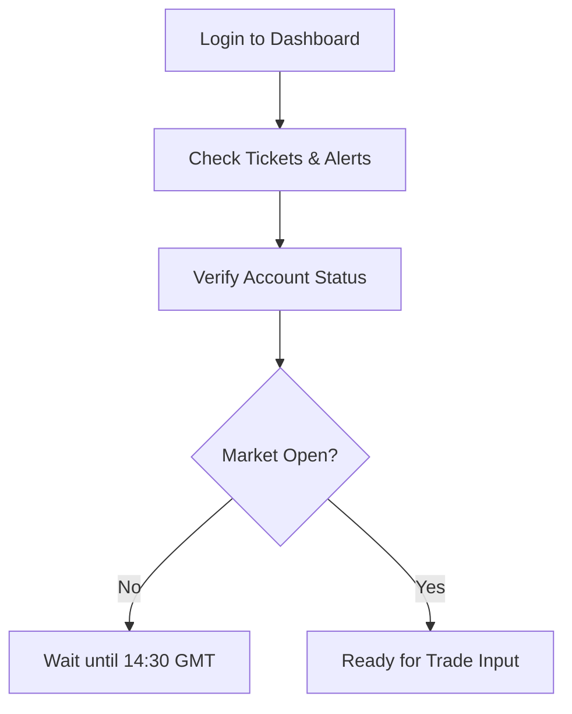
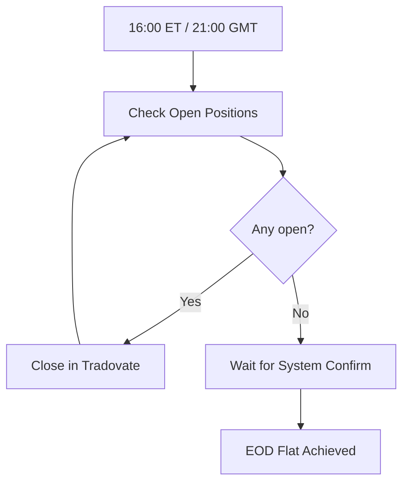
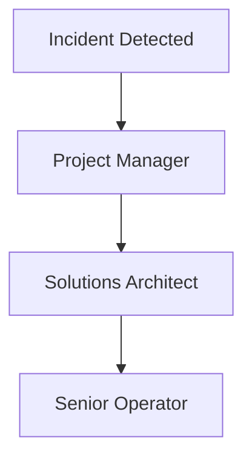

# Glossary

Shared terms used across docs.

> This page was auto-generated from existing repo docs. Check TODO/TBD markers.

- VWAP first-touch
- OSB
- OCO
- Tickets store
- Guardrails (Apex)

---
**From:** `apex/platforms/rithmic.md`

# Rithmic + NinjaTrader

**Purpose:** Document setup and caveats for Rithmic accounts.

## Setup Steps

- TODO: Provide step-by-step account linking and platform install instructions.

## Windows Requirement

- Platform requires Windows environment.
- Compliance Note: Unsupported OS use may breach terms.

## Technical Difficulty

- Rated 7/10.
- Compliance Note: Operators should verify user competency before recommendation.

## Pros

- Low latency execution.
- Flexible automation support.
- Compliance Note: Automation must log orders for audit.

## Cons

- Windows-only; complex initial configuration; no mobile support.
- Compliance Note: Document exceptions for Mac users.

## Watchouts

- Server selection impacts latency.
- Concurrent logins restricted.
- Data status must be real-time.
- Compliance Note: Monitor for unauthorized API connections.

TODO: Add screenshots of NinjaTrader config.


---
**From:** `docs/compliance/rule-engine.md`

# Compliance Rule Engine

## Purpose

Codify Apex Trader Funding rules into machine-enforceable checks.

## How It Works

- Loads `apex/rules.json` definitions.
- Validates `AccountState` against all rules via `checkCompliance`.
- Returns `{ ok, violations[] }`.
- Violations feed into the Alerts pipeline.

## Example

```ts
import { checkCompliance, AccountState } from '../../apps/api/src/services/rules/engine.js';

const state: AccountState = {
  phase: 'evaluation',
  balance: 50000,
  equityHigh: 50000,
  openPositions: [],
  tradeHistory: [],
  dayPnL: {},
  trailingDrawdown: 49000,
};

const res = checkCompliance(state);
console.log(res.ok);
```

## Rules Covered

| JSON id             | Rule                  | Apex Reference                       |
| ------------------- | --------------------- | ------------------------------------ |
| eval-profit-target  | Profit Target         | Evaluation Handbook §Profit Target   |
| eval-trailing-dd    | Trailing Drawdown     | Evaluation Handbook §Drawdown        |
| eval-min-days       | Minimum Trading Days  | Evaluation Handbook §7 Days          |
| eval-eod-flat       | End of Day Flat       | Evaluation Handbook §EOD             |
| eval-resets         | Account Resets        | Evaluation Handbook §Resets          |
| funded-stoploss     | Stop-Loss Required    | Funded Account Handbook §Stops       |
| funded-consistency  | Consistency Rule      | Funded Account Handbook §Consistency |
| funded-scaling      | Half-Contract Scaling | Funded Account Handbook §Scaling     |
| funded-windfall     | No All-In/Windfall    | Funded Account Handbook §Windfall    |
| funded-dd-lock      | Trailing DD Lock      | Funded Account Handbook §DD Lock     |
| funded-news         | News Trading Ban      | Funded Account Handbook §News        |
| payout-safety-net   | Safety Net            | Payouts Handbook §Safety Net         |
| payout-cadence      | Payout Cadence        | Payouts Handbook §Cadence            |
| payout-profit-split | Profit Split          | Payouts Handbook §Profit Split       |

## Operator Impact

- Operators see compliance alerts before inputting trades.
- Violations mean: **do not place ticket**.

## Future Work

- Map remaining Apex rules into `apex/rules.json`.
- Add a diagram of the compliance flow.


---
**From:** `docs/operator/handbook.md`

# Prism Apex Tool – Operator Handbook

---

## 1. Start of Day Checklist

### Step-by-step

1. Open your browser and log in to the **Prism Apex Dashboard**.
2. Review the dashboard home page.
3. Confirm system health:
   - Trade tickets display current signals.
   - Alerts panel is empty.
   - Account status shows correct balance and margin.
4. Verify trading session open times:
   - CME Futures open **9:30 AM ET (14:30 GMT)**.
   - Prism Apex Tool begins generating tickets from this time.
5. Log in to **Tradovate** and keep the order entry panel ready.
6. Ensure Slack/Telegram connection for automated alerts.

[Placeholder: screenshot of dashboard home]



---

## 2. During Session

### 2.1 Inputting Trades

1. On the dashboard, review each trade ticket (symbol, side, entry, stop, target).
2. In **Tradovate**, manually enter orders with matching values.
3. Include stop-loss and target on every order (**Apex rule**).
4. Confirm the order is accepted in Tradovate and visible on the dashboard.

[Placeholder: screenshot of ticket table]
[Placeholder: screenshot of Tradovate order entry]

### 2.2 Monitoring Alerts

- Alerts panel refreshes every 5 seconds.
- Watch for:
  - Daily loss cap approaching
  - Trailing drawdown breach
  - Scaling exceeded
  - Flat required (EOD)

### 2.3 Responding to Pause Conditions

1. If a **"System Paused"** alert appears:
   - Do **not** enter new trades.
   - Close any pending entries if instructed.
   - Notify Solutions Architect via Slack/Telegram.
2. Resume only when the dashboard shows **"System Active"**.

---

## 3. End of Day (EOD) Close

### Step-by-step

1. At **4:45 PM ET (21:45 GMT)** begin wind-down.
2. Ensure all trades are closed by **4:59 PM ET (21:59 GMT)** (Apex rule: daily flat).
3. Check dashboard Account Status → confirm no open positions or working orders.
4. Export or screenshot the daily dashboard summary.
5. Verify Slack/Telegram confirmation message is received.



[Placeholder: screenshot of flat positions screen]

---

## 4. Incident Steps & Escalation

### 4.1 Platform/API Down

1. Pause trading immediately.
2. Attempt one reconnect.
3. If unresolved → notify **Project Manager (PM)** and **Solutions Architect**.
4. Document the outage in the daily log.

### 4.2 Ticket Cannot Be Entered

1. Retry order entry once.
2. If still failing → flag in Slack `#ops-incidents`.
3. Record the issue in the daily log and wait for guidance.

### 4.3 Rule Breach Alert Triggered

1. Stop trading immediately.
2. Close any open positions.
3. Notify **Senior Operator**.
4. Wait for clearance before resuming.

### Escalation Path

- Primary contact: **PM**
- Secondary contact: **Solutions Architect**
- Tertiary contact: **Senior Operator**



---

## 5. Glossary

- **ORB (Opening Range Breakout)** – Trade triggered when price breaks the first 15–30 minute range.
- **VWAP (Volume Weighted Average Price)** – Average price weighted by volume; benchmark for fair value.
- **Trailing Drawdown** – Apex rule: peak balance minus fixed buffer; breaching this pauses trading.
- **Scaling** – Limiting contract size based on account balance.
- **Stop-loss** – Pre-set order to exit a trade if it moves against us.
- **Flat** – No open positions or working orders.

---


---
**From:** `docs/operator/quick-cards/cheat-sheet.md`

# Cheat Sheet — Terms & Times

## Terms (Plain English)

- **ORB (Open Session Breakout):** Trade the break of the first ~15m range after open.
- **VWAP:** Volume-weighted average price; “fair” intraday benchmark.
- **OCO:** One-Cancels-the-Other (Stop + Target paired).
- **Flat:** No open positions.
- **≤5R:** Max target is 5× risk distance from entry to stop.
- **Consistency:** In funded mode, one day’s profit should not exceed ~30% of period profit.

## Times (GMT)

- **Session focus (CME RTH):** 14:30–21:59 GMT
- **EOD alerts:** T–10 (20:49–20:54), T–5 (20:55–20:59), **Flat by 21:59**

## Quick Math

- **R (Risk):** |Entry − Stop|
- **5R target:** Entry ± 5×R (system clamps automatically)

## Do / Don’t

- **Do:** Follow tickets exactly; confirm OCO; watch alerts.
- **Don’t:** Trade after 21:59 GMT; ignore CRITICAL alerts.


---
**From:** `docs/safe_cleanup.md`

<!-- BEGIN: SAFE_CLEANUP_DOC -->
# Safe Cleanup Script (`safe_cleanup.sh`)


> **TL;DR**
> - Preview (dry-run): `./safe_cleanup.sh`
> - Execute locally (prompted): `DRY_RUN=0 ./safe_cleanup.sh`
> - CI/scripted (no prompt, logged): `AUTO_YES=1 DRY_RUN=0 ./safe_cleanup.sh | tee cleanup_real.log`

_Last updated: 2025-10-01_


A **safe-by-default** helper that removes **only untracked files** within a tight allow-list of cache/scratch locations. It runs from the repo root, defaults to **dry-run**, prints a plan, and appends a timestamped summary to `docs/YAHOO_DATA_CLEANUP.md`.

---

## Contents
- [Quick Start](#quick-start)
- [Behavior Matrix](#behavior-matrix)
- [Exit Codes & Return Behavior](#exit-codes--return-behavior)
- [Allow-List & Directory Handling](#allow-list--directory-handling)
- [Logging & Audit Trail](#logging--audit-trail)
- [Usage Patterns & CI](#usage-patterns--ci)
- [Safety Guarantees](#safety-guarantees)
- [Why Untracked-Only?](#why-untracked-only)
- [Operator Checklist](#operator-checklist)
- [Operator Runbook Snippets](#operator-runbook-snippets)
- [Known Pitfalls](#known-pitfalls)
- [Security & PII](#security--pii)
- [FAQ](#faq)
- [Troubleshooting](#troubleshooting)
- [Glossary](#glossary)
- [Tickets-Only Posture Reminder](#tickets-only-posture-reminder)
---
- [Platform Notes & Shell Equivalents](#platform-notes--shell-equivalents)
- [Operator Integration (Makefile / Justfile)](#operator-integration-makefile--justfile)
- [Contributing (Docs/Tooling)](#contributing-docstooling)
- [What Good Looks Like](#what-good-looks-like)
- [Maintenance & Ownership](#maintenance--ownership)
- [Prerequisites & Compatibility](#prerequisites--compatibility)
- [Env Vars Quick Reference](#env-vars-quick-reference)

## Quick Start
Preview (no deletions):
```bash
./safe_cleanup.sh
```

Execute interactively (you will be prompted):
```bash
DRY_RUN=0 ./safe_cleanup.sh
```

Run unattended (CI/script) and capture output:
```bash
AUTO_YES=1 DRY_RUN=0 ./safe_cleanup.sh | tee cleanup_real.log
```

---

## Behavior Matrix
| Setting / Mode            | Default | Effect                                                                | Best For                      |
|---------------------------|---------|-----------------------------------------------------------------------|-------------------------------|
| `DRY_RUN=1`               | ✅      | Plan only; prints intended deletions.                                 | First pass / sanity check.    |
| `DRY_RUN=0`               | ❌      | Performs deletions limited to the allow-list.                         | Actual cleanup once vetted.   |
| `AUTO_YES=1`              | ❌      | Skips confirmation prompt (non-interactive environments).             | CI jobs, scripts, cron.       |
| `AUTO_YES=0` with a TTY   | ✅      | Prompts “Proceed with this plan?” before deleting.                    | Local interactive runs.       |
| Logging (always on)       | —       | Appends summary to `docs/YAHOO_DATA_CLEANUP.md` with ISO timestamp.   | Audit trail / operator notes. |

---

## Exit Codes & Return Behavior
| Code | Meaning             | Typical Cause / Action                                              |
|:----:|---------------------|---------------------------------------------------------------------|
| `0`  | Success             | Dry-run or execute completed as planned.                           |
| `1`  | Generic failure     | Not in a git repo, cannot change to repo root, or runtime error.   |
| `2`  | Usage error         | Unsupported flag or invalid invocation; rerun with defaults.       |
| `130`| Operator aborted    | You declined the confirmation prompt during interactive execution. |

> The script uses `set -euo pipefail` to fail fast. CI runners should set `AUTO_YES=1` to avoid hanging on prompts.

---

## Allow-List & Directory Handling
- Allow-listed roots: `backups/`, `data/`, `.cache/`, `cache/`, `caches/`, `tmp/`
- Build caches: `coverage/`, `.nyc_output/`, `.pytest_cache/`, `.ruff_cache/`, `.mypy_cache/`, `.turbo/`, `.next/`, `.vercel/`, `build/`
- Uses `git ls-files --others --exclude-standard -z` to consider **untracked-only** entries
- Skips directories that contain tracked files (`git ls-files -- <dir>` check)
- Removes allow-listed directories only if they become empty after cleanup

---

## Logging & Audit Trail
Each run appends a section similar to:
```
## 2025-02-10T21:34:11-05:00
=== SAFE CLEANUP (UNTRACKED ONLY) ===
Git root: /path/to/repo
Dry run: 0
-- Files to delete (untracked, in allow-listed dirs): 3
  - tmp/foo.log
```
Keep `docs/YAHOO_DATA_CLEANUP.md` in version control to share context across operators.

---

## Usage Patterns & CI
- Post-build tidy: clear `.next/`, `.turbo/`, or other caches between compose runs.
- Merge readiness: ensure scratch artifacts are gone before opening PRs.
- CI housekeeping: scheduled hygiene on ephemeral runners.

### CI Snippet
```yaml
- name: Safe cleanup of untracked caches
  run: AUTO_YES=1 DRY_RUN=0 ./safe_cleanup.sh
```
> Decide whether to archive or discard the updated `docs/YAHOO_DATA_CLEANUP.md` in CI artifacts.

---

## Safety Guarantees
- Never deletes tracked files.
- Dry-run by default; destructive mode requires `DRY_RUN=0`.
- Confirmation prompt enforced unless `AUTO_YES=1`.
- Bound strictly to the allow-listed locations.

---

## Why Untracked-Only?
Caches, build outputs, and scratch data should be ignored by Git. Limiting deletions to untracked content prevents accidental removal of fixtures, migrations, or other tracked assets.

---

## Operator Checklist
1. Preview: `./safe_cleanup.sh`
2. Execute locally: `DRY_RUN=0 ./safe_cleanup.sh` (confirm when prompted)
3. Execute in CI/script: `AUTO_YES=1 DRY_RUN=0 ./safe_cleanup.sh | tee cleanup_real.log`
4. Verify: `git status -sb` (no unintended changes) and skim `docs/YAHOO_DATA_CLEANUP.md`
5. Optional: rerun Docker stack (`make up`)
6. Operate: follow the tickets-only posture; copy tickets into Tradovate manually

---

## Operator Runbook Snippets
- **Preview candidates (local):**
  ```bash
  ./safe_cleanup.sh
  ```
- **Interactive execute:**
  ```bash
  DRY_RUN=0 ./safe_cleanup.sh
  ```
- **CI / scripted execute with log:**
  ```bash
  AUTO_YES=1 DRY_RUN=0 ./safe_cleanup.sh | tee cleanup_real.log
  ```
- **Verify workspace & tail log:**
  ```bash
  git status -sb
  tail -n 40 docs/YAHOO_DATA_CLEANUP.md
  ```
- **Optional follow-up (stack + tickets-cron logs):**
  ```bash
  make up \
    && sleep 8 \
    && docker compose logs --no-color tickets-cron | tail -n 120
  ```

---

## Known Pitfalls
- **No TTY during interactive run:** Without a TTY, the prompt can’t read input. Use `AUTO_YES=1` for non-interactive contexts.
- **Tracked files inside caches:** Directories containing tracked files are skipped intentionally. Remove or untrack them if you want the script to clean them.
- **Commit hooks noise:** Docs-only commits may print “No staged files match…”. If hooks stall or fail, re-run with `--no-verify` (docs-only).
- **CI log growth:** Repeated CI runs append to `docs/YAHOO_DATA_CLEANUP.md`. Decide whether to keep or reset it between runs.

---

## Security & PII
- Cleanup logs contain only relative file paths within the allow-listed directories; no credentials or PII are captured.
- It is safe to share the log within the team, but review entries before posting externally.
- In CI, either archive the log as an artifact for visibility or prune it if builds are ephemeral.

---

## FAQ
- **Shell lacks `mapfile` — will it fail?** No. The script uses a POSIX-friendly loop.
- **“No candidates” output — is something wrong?** Usually not; the tree may be clean or files are out of scope.
- **Does it delete Docker volumes or containers?** No. Only affects repo files. Use `docker compose down -v` separately if needed.

---

## Troubleshooting
### Docker daemon / `docker.sock` permission error
```
permission denied while trying to connect to the Docker daemon socket ...
```
1. Ensure Docker Desktop/daemon is running.
2. macOS: restart Docker Desktop if sockets become stale.
3. Linux: add user to `docker` group (`sudo usermod -aG docker $USER && newgrp docker`).
4. Remote contexts: `docker context use <context>`.

### Pre-commit hook loops
Docs-only commits may loop noisily. Bypass carefully with:
```bash
git commit -m "docs: update cleanup guide" --no-verify
```
Use `--no-verify` only for documentation-only changes.

---

## Glossary
- **Untracked:** Files not known to Git (`git ls-files --others --exclude-standard`).
- **Allow-list:** Explicit directories where deletions are permitted.
- **TTY:** Interactive terminal required for prompts when `AUTO_YES=0`.
- **CI:** Continuous Integration; non-interactive runners should set `AUTO_YES=1`.

---

## Tickets-Only Posture Reminder
Local maintenance only — no order placement and no strategy changes. Continue the operator flow: tidy → run Docker stack → manually copy tickets into Tradovate OCO orders.

### Platform Notes & Shell Equivalents
**macOS/Linux (POSIX shells like bash/zsh):**
```bash
./safe_cleanup.sh                # dry-run (default)
DRY_RUN=0 ./safe_cleanup.sh      # execute with prompt
AUTO_YES=1 DRY_RUN=0 ./safe_cleanup.sh | tee cleanup_real.log
```

**Windows PowerShell:**
```powershell
# Dry-run
./safe_cleanup.sh

# Execute with auto-yes and capture log
$env:AUTO_YES = "1"
$env:DRY_RUN  = "0"
./safe_cleanup.sh | Tee-Object -FilePath cleanup_real.log

# Optional cleanup
Remove-Item Env:AUTO_YES, Env:DRY_RUN -ErrorAction SilentlyContinue
```

**Windows Subsystem for Linux (WSL):**
Use the POSIX examples inside WSL. If the repo lives on the Windows filesystem, prefer a WSL path (e.g., `/home/...`) to avoid permission quirks.

---

## Operator Integration (Makefile / Justfile)
**Makefile**
```make
.PHONY: clean:safe
clean:safe:
	@AUTO_YES?=0 DRY_RUN?=1 bash -lc './safe_cleanup.sh'
# Examples:
#   make clean:safe                         # dry-run
#   make clean:safe DRY_RUN=0               # execute with prompt
#   make clean:safe DRY_RUN=0 AUTO_YES=1    # execute no prompt
```

**Justfile**
```just
# just clean-safe
clean-safe:
    AUTO_YES={{AUTO_YES | default("0")}} DRY_RUN={{DRY_RUN | default("1")}} ./safe_cleanup.sh
# Examples:
#   just clean-safe
#   just clean-safe DRY_RUN=0
#   just clean-safe AUTO_YES=1 DRY_RUN=0
```

---

## Contributing (Docs/Tooling)
- Keep PRs focused and small; scope to docs/tooling improvements.
- Never add automated order placement, liquidation logic, or other trading automation in this path.
- Target the `Test` branch (never main) and note operator impact in the PR description.

### What Good Looks Like

**Dry-run (expected):**
```text
=== SAFE CLEANUP (UNTRACKED ONLY) ===
Git root: /…/prism-apex-tool-Test
Dry run: 1

-- Files to delete (untracked, in allow-listed dirs): 0
  (none)

-- Directories to delete recursively (build caches): 2
  - .next
  - .turbo
(auto-continue: dry-run or AUTO_YES set or non-interactive)
[DRY-RUN] No deletions performed.
```

**Execute with AUTO_YES (expected when there are candidates):**
```text
=== SAFE CLEANUP (UNTRACKED ONLY) ===
Git root: /…/prism-apex-tool-Test
Dry run: 0

-- Files to delete (untracked, in allow-listed dirs): 3
  - tmp/sim.log
  - data/snap/cache.bin
  - .cache/test.idx

-- Directories to delete recursively (build caches): 1
  - .turbo

removed dir .turbo
deleted tmp/sim.log
deleted data/snap/cache.bin
deleted .cache/test.idx
rmdir tmp (empty)
Done.
```

> If the output lists tracked files or non-allow-listed paths, **stop and investigate** before proceeding.

### Maintenance & Ownership
- **Owners**: Tooling/Docs maintainers (this path is docs/tooling-only).
- **Scope**: Do **not** introduce order placement, liquidation logic, or strategy changes here.
- **How to contribute**: Open a small PR to `Test` with operator impact noted; keep edits scoped to docs/tooling.
- **Operating posture**: Tickets-only remains in force—operators still copy tickets into Tradovate OCO manually.

### Prerequisites & Compatibility
- **Git** installed with the repository cloned locally (script runs from repo root).
- **Shell**: POSIX-compatible (bash/zsh); supported on **macOS**, **Linux**, and **WSL**. PowerShell users can use `$env:` syntax from the Platform Notes section.
- **Docker** (optional): required only if you run the follow-up compose smoke checks; the cleanup itself has no Docker dependency.

### Env Vars Quick Reference
| Variable | Default | When to override | Effect |
|----------|:-------:|------------------|--------|
| `DRY_RUN` | `1` | Set `DRY_RUN=0` to perform deletions. | Toggle between preview and actual cleanup. |
| `AUTO_YES` | `0` | Set `AUTO_YES=1` for non-interactive runs (CI/scripts). | Skips the confirmation prompt when `DRY_RUN=0`. |

[↩︎ Back to top](#safe-cleanup-script-safe_cleanupsh)
<!-- END: SAFE_CLEANUP_DOC -->


