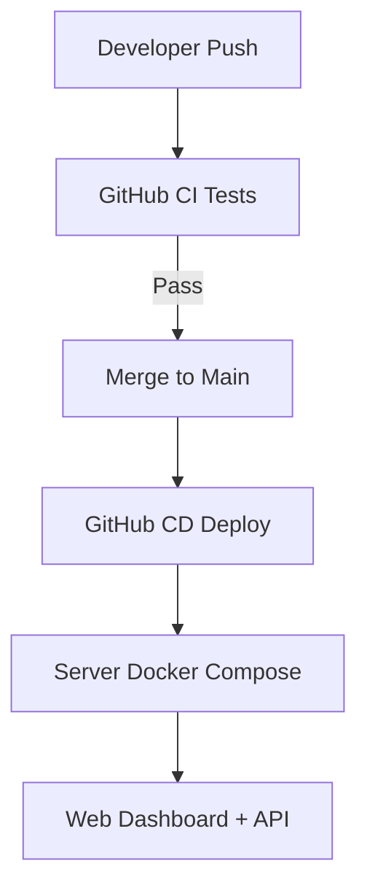
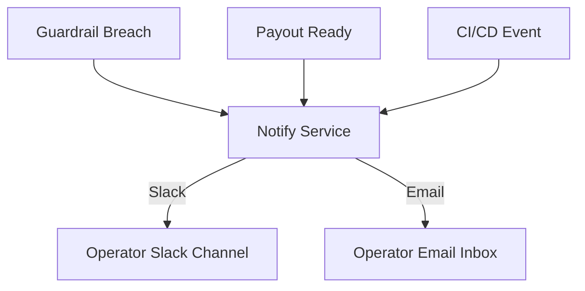

# Operations (Runbook)

Day-to-day ops, smoke checks, incident playbooks.

> This page was auto-generated from existing repo docs. Check TODO/TBD markers.

## First 5 Minutes
- `docker compose ps`
- Health endpoints/metrics (TBD)

## Common Tasks
- Start/stop services
- Rotate logs
- Reconcile tickets vs positions

## Incidents
- Token expiry → re-auth
- WS disconnect → backoff + resubscribe
- Rate-limit penalty → wait + p-ticket (see Integrations)

---
**From:** `DEPLOY.md`

# One-Go Docker Deploy

## Prerequisites
- Docker Desktop (or Docker Engine + Compose V2)
- No process listening on host ports **3000** (API) and **8080** (Dashboard)

## Quick start
```bash
# From repo root
make up
# optional: make seed
```

**Dashboard** → http://localhost:8080

**API** (health, if implemented) → http://localhost:3000/health

## What it does
- Builds the workspace with PNPM in a multi-stage Dockerfile
- Produces two images:
  - **api** (Node 20) on port 3000
  - **dashboard** (Nginx) on port 8080, proxying `/api/*` to `api:3000`
- No secrets are committed. Copy `.env.template` to `.env` and fill in real values as needed.

## Useful commands
```
make logs     # tail logs
make ps       # container status
make down     # stop stack
make build    # rebuild images (no cache)
```

## Troubleshooting
- **Port already in use (3000/8080)** → stop the conflicting process or container (`docker ps` then `docker stop <id>`).
- **Build fails on dashboard** → ensure TypeScript DOM libs/shims are present; run `pnpm -C apps/dashboard build` locally to check.
- **Health endpoint** → If `/health` is not implemented, either add one in the API or adjust/remove the healthcheck.

## Gapfill maintenance (1-minute bars)
- One-shot: `make gapfill` (fetches only missing minutes in the last 30 days; duplicate-safe).
- Nightly: `gapfill-cron` service runs at **02:20 UTC (GMT)** and writes logs to `/var/log/gapfill-cron.log`.

Verify:
```bash
docker compose --profile local up -d gapfill-cron
docker compose logs --tail=20 gapfill-cron
```

## Ticket maintenance (ORR strategy)
- `tickets-cron` runs `apps/tickets/dist/backfill-orr.js` on a rolling basis (loop every 60 s) so each session’s tickets are generated automatically after bars land. It uses the same `YAHOO_SYMBOLS` set as the ingest jobs (ES/NQ micros, YM, RTY, GC, CL, 6E, EURUSD, BTC).
- Bring it up the same way as the gapfill cron:
  ```bash
  docker compose --profile local up -d tickets-cron
  docker compose logs --tail=20 tickets-cron
  ```
- In a server deploy, leave both cron services running; `gapfill-cron` handles the daily bar sweep, and `tickets-cron` ensures the ORR strategy backfills without manual intervention.

## Realtime bars & tickets (Yahoo-governed)
- The ops helper `tools/codex/enable-realtime.sh` now wraps the full compose bundle so every host (local laptop or server) brings up `gapfill-realtime` + `tickets-realtime` with the governor, curl shim, and symbol defaults.
- Equivalent manual compose invocation if you prefer explicit commands:
  ```bash
  docker compose \
    -f docker-compose.yml \
    -f compose.ingress-db.override.yml \
    -f compose.gapfill-realtime.override.yml \
    -f compose.tickets-realtime.override.yml \
    -f compose.codex-governor.override.yml \
    -f compose.codex-forcecurl.override.yml \
    up -d gapfill-realtime tickets-realtime
  ```
- This ensures every deployment gets governed curl (`/opt/codex/bin/curl`), the Node fetch hook, and the expanded `YAHOO_SYMBOLS` default (ES/NQ micros, YM, RTY, GC, CL, 6E, EURUSD, BTC) without relying on manual env tweaks.


---
**From:** `README-Docker.md`

# Docker — API-only quickstart

## Prereqs
- Docker Desktop (Compose v2)

## Run
```bash
make up
docker compose --profile local ps

Verify
curl -fsS http://localhost:3000/health
curl -fsS http://localhost:3000/openapi.json | head -n 20
curl -fsS http://localhost:3000/ready
curl -fsS http://localhost:3000/version
bash scripts/smoke-openapi.sh
bash scripts/smoke-endpoints.sh
bash scripts/smoke-api-docker.sh
```

Notes:

This compose is API-only. Public endpoints: /health, /ready, /openapi.json, /version.

scripts/smoke-api.sh is dev-only (requires host Node/tsc). Prefer the Docker-only scripts above.

For server deploys, the `prod` profile (see `make prod-up`) may map port 80 (via 80:${PORT:-8000}); local quickstart uses port 3000.


---
**From:** `README-dev.md`


Developer Guide
Ports at a glance

API (compose): 3000
Dashboard (compose): 5180
Dashboard dev (compose dev profile): 5179
Ingress proxy (compose): 8080

Dev workflow (hot reload, if scripts exist)
./dev_api.sh              # API on :8000 (Fastify watch) — optional
pnpm --filter @prism-apex/dashboard-lite dev   # Vite dev UI on :5173 (if applicable)

Prod-like workflow (Docker)
make up          # local parity stack (db, api, dashboard, ingress, cron)
make up-dev

Sanity checks
curl -fsS http://localhost:3000/health
curl -fsS http://localhost:3000/ready

Notes

This repo may contain pre-existing lint/typecheck/test failures; CI runs are non-blocking except for the no-order-API guard, which is hard-fail by design.

If Docker is not installed locally, compose builds will be skipped. Install Docker to run containers.

Absolute rule

The codebase must never introduce broker order placement (tickets-only). CI enforces this at PR time.

### API-focused commands
- `pnpm build:api` — build only the API workspace and its deps
- `pnpm typecheck:api` — typecheck API scope
- `pnpm test:api` — run API tests only

### API bundling
- Runtime artifact is **CommonJS**: `apps/api/dist/server.cjs` (bundled by **tsup**).
- Typechecking remains via `tsc --noEmit` using `tsconfig.build.json`.
- If your entry file is not `src/server.ts`, update `apps/api/tsup.config.ts`.

### Path aliases
- Source of truth: `tsconfig.paths.json`. `tsconfig.base.json` extends it so every workspace inherits the same `paths` map.
- Use the `@prism-apex/<workspace>` pattern when importing. Examples:
  - `@prism-apex/app-api/*` → `apps/api/src/*`
  - `@prism-apex/rules-apex/*` → `packages/rules-apex/src/*`
- Vitest pulls in the map via the `vite-tsconfig-paths` plugin (see the shared `vitest.config.ts` family), and Node-based setups/scripts load `tsconfig-paths/register` (e.g., `apps/api/test.setup.ts`).
- Update `tsconfig.paths.json` whenever folders move; the rest follows automatically.

## Ports & Env
See [docs/ports-and-env.md](docs/ports-and-env.md) for guidance on API and dashboard port variables.


---
**From:** `docs/ARCHITECTURE_OVERVIEW.md`

# Prism-Apex Architecture Overview (Tickets-Only Brain)

Prism-Apex is the **brain** for operator-assisted trading on Apex Trader Funding accounts. We generate levels, guardrails, and tickets so a human operator can execute manually inside Tradovate. The platform never places an order or liquidates via API.

---

## Core Flow (Yahoo → DB → ORR → Tickets → Dashboard)
1. **Yahoo delayed feed → DB** — background jobs pull ≈15-minute delayed data from the Yahoo Finance API and load it into Postgres.
2. **Derived series in DB** — ORR and its namesake strategies read bar/VWAP/ATR series stored in the DB (no direct market-side API required).
3. **Guardrails & sizing** — logic in `packages/rules` / `packages/rules-apex` plus configs under `configs/` enforce Apex program rules before a ticket is emitted.
4. **Ticket emission** — strategies append structured tickets to `tickets/*.jsonl`; these JSONL files are the operator’s source of truth.
5. **Dashboard visualisation** — `apps/dashboard*` projects read tickets and telemetry so operators can review intent.
6. **Manual execution** — the operator copies the ticket into Tradovate as an OCO. Prism-Apex never places orders or liquidates via API.

---

## Repository Landmarks
- `apps/api/` — Node/TypeScript API serving telemetry, health, and ticket downloads.
- `apps/dashboard*/` — Vite/React dashboards for operators.
- `packages/` — Shared runtime libraries (indicators, strategies, guardrails, telemetry).
- `scripts/` — Operational tooling (`scan_repo.sh`, `cleanup_repo.sh`, etc.).
- `configs/` & `config/` — Strategy toggles, environment templates, guardrail settings.
- `tickets/` — Sacred JSONL ticket log. Archive, never delete.
- `docs/` — Architecture notes, cleanup/report artifacts, runbooks.
- `docker-compose.yml` (profiles for local/prod/dev/jobs) / `Dockerfile*` — Docker-first runtime definition. Keep docs aligned with exposed ports.

---

## Guardrails & Compliance Reminders
- **Absolutely no** automated order placement or emergency liquidation is implemented here.
- All automation stops at ticket generation. Operators remain the hands.
- Cleanup scripts protect source/config/migration directories, `.env*`, and tickets.

---

## Onboarding Checklist
1. Read `docs/CODEBASE_OVERVIEW.md` and this overview to understand the operator-assisted workflow.
2. Review `docs/REPO_SCAN_REPORT.md` plus `docs/REPO_SCAN_QUESTIONS.md` before approving any cleanup.
3. Keep local Node on 20.x LTS; use `pnpm lint`, `pnpm typecheck`, `pnpm test`, and `pnpm run scan:dead` for signal.
4. Run `scripts/cleanup_repo.sh` periodically to remove clutter (dry-run first if unsure).
5. When adding new strategies or configs, document which files are canonical for operators.

Staying within these boundaries keeps Prism-Apex compliant while giving operators the clarity they need.


---
**From:** `docs/CODEBASE_OVERVIEW.md`

# Prism-Apex Codebase Overview (Tickets-Only Brain)

> Prism-Apex is the **brain**; the human operator is the **hands**. The repo never places or cancels live orders — it produces tickets, telemetry, and guardrails so an operator can work safely inside Tradovate.

---

## Current Functionality Snapshot (Yahoo → DB → ORR → Tickets → Dashboard)
- **Yahoo delayed feed populates the DB** — background workers pull ≈15-minute delayed candles from the Yahoo Finance API into Postgres.
- **Strategies read DB-derived series** — ORR and sibling playbooks use bar/VWAP/ATR series from the DB; no broker API feed is hit.
- **Tickets-first workflow** — strategy output is appended to `tickets/*.jsonl` and surfaced in the Dashboard for review.
- **Manual OCO execution** — operators key tickets into Tradovate by hand; Prism-Apex never submits or cancels orders via API.


## Core Flow at a Glance

1. **Market data ingestion** (primarily under `packages/*` and `apps/api/src/feeds`) processes WebSocket/REST sources into derived series (VWAP, ATR, bias signals).
2. **Strategies** inside `packages/strategies`, `packages/rules-apex`, and related helpers evaluate those series and emit structured opportunities.
3. **Guardrails + sizing** (`packages/rules`, `packages/rules-apex`, config files under `configs/` & `config/`) enforce Apex limits, risk tolerances, and program compliance.
4. **Ticketizer** writes append-only JSONL tickets into `tickets/*.jsonl` via services in `apps/api/src/tickets`. Each ticket captures entry, stops/targets, sizing, and rationale.
5. **Operator dashboard** (`apps/dashboard`, `apps/dashboard-lite`) provides read-only telemetry. It may read from Tradovate for balances/fills, but **never** sends orders.
6. **Operator copies ticket → Tradovate** as OCO orders. Execution stays manual, keeping us within the “no automated orders” rule.

---

## Repository Landmarks

- `apps/api/`
  - Node/TypeScript API (pnpm workspace project).
  - Provides REST + WebSocket endpoints for telemetry, ticket download, health probes.
  - Stores strategy orchestrator jobs (`src/jobs`) and guardrails integration tests (`src/tests`).
- `apps/dashboard/`, `apps/dashboard-lite/`
  - Front-end telemetry surfaces. Expect Vite + React with vitest configs in the root.
  - Pulls tickets, account summaries, and health information. Does **not** place trades.
- `tickets/`
  - Operational JSONL log of every approved ticket. Treat as immutable history: archive only, never delete.
- `packages/`
  - Shared libraries: indicators, strategies, runtime, rules, telemetry. Most cross-cutting logic lives here.
  - `packages/runtime` glues strategies + guardrails together.
- `configs/`, `config/`
  - Strategy enablement, environment toggles, size policies. Clarify which files are production vs experimental.
- `scripts/`
  - Operational utilities. `scan_repo.sh` is read-only; any cleanup script we add later will default to archive-first and require explicit opt-in for deletion.
- `docs/`
  - Architecture ADRs, runbooks, compliance notes, and now:
    - `REPO_SCAN_REPORT.md` & `REPO_SCAN_QUESTIONS.md`
    - `SCAN_SUMMARY_MESSAGE.md` (paste-ready status)
    - This overview (`CODEBASE_OVERVIEW.md`) for onboarding.
- `docker-compose.yml`, `Dockerfile`
  - Define the Docker-only runtime assumption. Profiles replace the old override matrix; keep documented ports aligned with these manifests.
- `requirements.txt`, potential Python helpers
  - Python 3.11 utilities (ETL, analytics). Respect lint/format defaults if you extend them.

---

## Development Guardrails

- **Node toolchain:** Target **Node 20.x LTS** with `pnpm`; linting uses the flat ESLint config in `.eslint`. TypeScript configs live in `tsconfig.base.json` with project references per package.
- **Testing:**
  - `pnpm lint`, `pnpm typecheck`, `pnpm test` (vitest) are the usual quality gates.
  - `pnpm run scan:dead` (depcheck) surfaces unused dependencies.
- **Python:** When Python utilities are touched, stick to Python 3.11, `ruff`, and `pytest` conventions.
- **Danger zones:** Any code path that mentions “placeOrder”, “submitOrder”, etc. must remain disabled or guarded — the scan heuristics surface these so we can confirm they stay dormant.

---

## Working With the Tickets-Only Constraint

- Tickets are the hand-off contract: strategy output → operator input.
- Never auto-call broker APIs from this repo. If you discover historical code that hints at automated order placement, flag it before changing anything.
- Treat `tickets/*.jsonl` as permanent records. Cleanups should archive (e.g., move under `archive/`) rather than delete.
- Build artefacts (`dist/`, `build/`, caches) should generally stay out of git and be reproducible.

---

## Onboarding Checklist for New Contributors

1. Read `CODEBASE_OVERVIEW.md` (this file) and `docs/REPO_SCAN_REPORT.md` to understand current data.
2. Answer/confirm the items in `docs/REPO_SCAN_QUESTIONS.md` when planning cleanups or refactors.
3. Bring local Node to 20.x before running pnpm scripts to avoid engine warnings.
4. When updating configs/strategies, document the canonical source of truth so operators know what’s live versus experimental.
5. Run checks (`pnpm lint`, `pnpm typecheck`, `pnpm test`) in CI—failures may be pre-existing; coordinate before fixing.

Staying inside these guardrails keeps Prism-Apex compliant with the operator-assisted mission while giving us the visibility we need to keep accounts safe.


---
**From:** `docs/DEPLOY-LOCAL-INGRESS.md`


Yahoo Ingress (Optional / Testing)

Simulates delayed bars for strategy testing. Disabled by default.

Intended for demos and offline testing (not for live trading).

Typical smoke flow:

Start API via compose.

Start the Yahoo ingress service (see its README/Dockerfile).

POST sample bar JSON to the ingress endpoint.

Inspect generated tickets under /data/tickets/YYYY-MM-DD/.

Tip: Label tickets created from delayed sources so operators can distinguish them from live signals.


---
**From:** `docs/DOCS_SYNC_REPORT.md`

# Docs Sync Report

- Timestamp: 2025-10-04T15:44:52+0100
- Base branch: chore/cleanup-delete-and-docs
- Working branch: chore/docs-sync-orr-yahoo

## Updated
- docs/ARCHITECTURE_OVERVIEW.md
- docs/CODEBASE_OVERVIEW.md
- docs/README_NAV.md

## Deleted (orphaned/stale)
- (none)

## Orphaned docs (not linked)
- docs/CI.md
- docs/CONTRIBUTING-scripts.md
- docs/DEPLOY-LOCAL-INGRESS.md
- docs/LOCAL_DEV.md
- docs/MAINTENANCE.md
- docs/PLATFORMS/tradovate.md
- docs/POST_MERGE_VERIFY.md
- docs/RELEASE_NOTES.md
- docs/UPGRADE.md
- docs/accounts.md
- docs/adr/ADR-2025-09-09-docker-api-only.md
- docs/adr/ADR-2025-09-09-operator-assisted-architecture.md
- docs/analytics/payout_tracker.md
- docs/analytics/post_trade.md
- docs/apex/01_rules.md
- docs/apex/02_funded_rules.md
- docs/apex/03_funding_process.md
- docs/apex/04_platforms.md
- docs/apex/05_notifications.md
- docs/apex/06_knowledge_base.md
- docs/audit/guide.md
- docs/backtest/overview.md
- docs/backtest/tick-readiness.md
- docs/calibration/summary.md
- docs/compliance/rule-engine.md
- docs/config.md
- docs/configs/ACCOUNTS.md
- docs/configs/README.md
- docs/consistency.md
- docs/dashboard/guide.md
- docs/dashboard/overview.md
- docs/deployment/guide.md
- docs/deployment/hardening.md
- docs/dev/quickstart.md
- docs/export.md
- docs/multi-account/guide.md
- docs/notifications/guide.md
- docs/operator-console.md
- docs/operator/handbook.md
- docs/operator/quick-cards/cheat-sheet.md
- docs/operator/quick-cards/eod-flat.md
- docs/operator/quick-cards/execute-ticket.md
- docs/operator/quick-cards/incidents-&-escalation.md
- docs/operator/quick-cards/monitor-&-alerts.md
- docs/operator/quick-cards/sod-checklist.md
- docs/operator/training-deck.md
- docs/payouts/calendar.md
- docs/release/checklist.md
- docs/release/go-live-checklist.md
- docs/release/operator_signoff.md
- docs/release/runbook-rollback.md
- docs/release/sign-off-template.md
- docs/release/uat-scenarios.md
- docs/rules/overview.md
- docs/simulator/overview.md
- docs/strategy-switcher/guide.md
- docs/telemetry.md
- docs/tickets.md

## Broken doc links
- (none found)


> Legacy OPERATIONS excerpt removed; see README.md and Makefile targets for the current runbook.

---
**From:** `docs/deployment/guide.md`

# Prism Apex Tool — Deployment Guide

## Local Development

- Run `make dashboard` for local API/UI.
- Calibration: `make calibrate`.
- Payouts: `make payouts`.

## Docker

```bash
docker compose build
docker compose up -d
```

## GitHub Actions

CI runs on develop: lint, tests, calibration.

CD runs on main: deploys to server via SSH + Docker.

## Server Deployment

SSH into server.

```bash
cd ~/prism-apex-tool
./infra/deploy.sh
```

## Visuals




---
**From:** `docs/deployment/hardening.md`

# Production Hardening — Prism Apex Tool

## Overview

This guide ensures the tool runs safely in production.

## Key Safeguards

- Panic Brake → one-click OFF.
- Auto-restart → crashes restart within 10s.
- Healthcheck → /api/health shows system OK.
- Secrets → stored only in .env.production.
- Monitoring → Prometheus + Grafana.

## Steps

1. Deploy with Docker/Helm.
2. Run `make panic` to confirm panic button works.
3. Check Grafana for CPU/mem + guardrail alerts.
4. Ensure liveness probe auto-restarts container if stuck.


---
**From:** `docs/notifications/guide.md`

# Prism Apex Tool — Notifications Guide

## What It Does

- Sends alerts via **Slack** and **Email**.
- Covers:
  - Guardrail breaches (Apex rules).
  - Payout readiness.
  - CI/CD deployment results.

## How to Set Up

1. Create a Slack Incoming Webhook.
2. Add SMTP email credentials (Gmail works).
3. Copy `.env.example` → `.env` and fill in values.

## Test It

```bash
make notify-test
```

## Notification Flow




---
**From:** `docs/ports-and-env.md`

# Ports & Environment Notes

The local stack exposes these ports by default:

- **3000** – Prism Apex API (compose service `api`).
- **5180** – Dashboard (compose service `dashboard-full`).
- **8080** – Yahoo ingress/dev proxy.

They are documented directly inside `README.md` and `docker-compose.yml`. To reduce drift and make overrides easier, prefer exporting the ports via environment variables, for example:

```env
API_PORT=3001
PGHOSTPORT=55434
```

You can reference these variables when invoking `make up` or `docker compose`. Profiles now replace the old override files, so new port conventions live in one place.

Remember: runtime remains **tickets-only**. These ports expose telemetry and operator dashboards; no automated order placement endpoints exist.


---
**From:** `docs/release/go-live-checklist.md`

# Prism Apex Tool — Go-Live Master Checklist (Oct 1)

**Owners:** Sean (CTO), Craig (CEO), Solutions Architect, IT PM, Lead Operator  
**Environment:** Production (single Ubuntu host, Docker)  
**Decision Gate:** All boxes ✅ before enabling live operations on Oct 1.

---

## 1) Infrastructure & Deploy

- [ ] Server specs validated against plan (CPU/RAM/disk/network).
- [ ] OS updated and rebooted within last 7 days.
- [ ] Docker + compose plugin installed (see `infra/scripts/bootstrap.sh`).
- [ ] `docker-compose.yml` (with prod/jobs profiles) synced to server.
- [ ] `infra/.env.prod.example` copied to `${PROD_STACK_DIR}/.env` with real values.
- [ ] GitHub Actions `deploy` workflow green on the latest tagged release.
- [ ] `http://<server>:8080/health` returns `{ ok: true }`.
- [ ] `http://<server>/` dashboard loads.

## 2) Configuration & Secrets

- [ ] TRADOVATE read-only credentials stored in `.env` (no write permissions).
- [ ] TradingView `TRADINGVIEW_WEBHOOK_SECRET` set (if alerts used).
- [ ] SMTP/Telegram/Slack/Twilio tokens loaded (optional; at least one required).
- [ ] `DAILY_LOSS_CAP_USD` configured to Apex account level.
- [ ] Timezone assumptions documented as GMT/UTC in Operator Handbook.

## 3) Notifications (at least one must work)

- [ ] `/notify/register` called with recipients (Slack channel ID or email).
- [ ] `/notify/test` returns transports OK (non-200 is a blocker).
- [ ] Operator sees test alert in chosen channel (screenshot captured).

## 4) Signals & Tickets (MVP manual flow)

- [ ] TradingView → Webhook → `/ingest` (or equivalent) verified with HMAC.
- [ ] `/signals/preview` normalizes to ≤5R target and blocks invalid tickets.
- [ ] `/tickets/commit` creates ticket visible on dashboard.
- [ ] Operator can manually key ticket into **Tradovate** with matching Stop + Target.
- [ ] Missing OCO triggers **CRITICAL** alert and dashboard **Pause** flag.

## 5) Guardrails & Rules (Apex)

- [ ] EOD window alerts fire at **20:49–20:54 (WARN)** and **20:55–20:59 (CRITICAL)** GMT.
- [ ] Daily loss proximity alerts at **≥70%** (WARN) and **≥85%** (CRITICAL).
- [ ] Consistency proximity alerts in funded mode at **≥25%/≥30%**.
- [ ] Stop-loss required — tickets without stops are **blocked** in preview.
- [ ] Dashboard shows **flat** state at EOD (no open positions).

## 6) Observability & Logs

- [ ] API logs include request IDs and warning/error lines are visible with `docker compose logs`.
- [ ] `/jobs/status` shows recent run times and `flags.ocoMissing` = false in steady state.
- [ ] Disk space > 20% free; log rotation plan in place.

## 7) Security & Access

- [ ] SSH keys restricted to deployment user.
- [ ] No secrets committed to repo; all via GitHub Secrets or server `.env`.
- [ ] Dashboard behind allowed IPs or temporary auth (MVP), documented.

## 8) Operator Handbook & Training

- [ ] Operators trained on **handbook** (SOD, During Session, EOD, Incidents).
- [ ] Dry-run session completed with sample tickets and screenshots.
- [ ] Escalation tree clear (names, Slack handles, phone on file).

## 9) UAT Completion

- [ ] All **UAT scenarios** in `docs/release/uat-scenarios.md` show **PASS**.
- [ ] Evidence (screens, JSON exports) archived in `/evidence/YYYY-MM-DD`.

## 10) Executive Sign-Off

- [ ] `docs/release/sign-off-template.md` completed with signatures/dates.

**Final Decision:**

- [ ] ✅ GO LIVE on Oct 1
- [ ] ❌ BLOCKED (attach reason)


---
**From:** `docs/release/runbook-rollback.md`

# Prism Apex Tool — Rollback & Incident Runbook

**Priority:** Restore safe operations quickly, protect Apex compliance, prevent irreversible loss.

---

## 1) Immediate Actions

- [ ] Announce incident in Slack `#ops-incidents` (include time, symptoms).
- [ ] **Pause** new tickets (dashboard Pause or temporary block in API).
- [ ] Verify positions in Tradovate — **flatten** if risk is elevated.

## 2) Quick Diagnostics (5–10 min)

- [ ] `GET /health` — should be OK.
- [ ] `docker compose ps` — containers running.
- [ ] `docker compose logs --since=10m` — check errors.
- [ ] `/jobs/status` — lastOk timestamps present.

## 3) Rollback (Tag N → N-1)

- [ ] Select previous tag (e.g., `v0.1.2` → `v0.1.1`).
- [ ] Run:

```bash
TAG=v0.1.1 make deploy
```

- [ ] Confirm health:

```bash
curl -fsS http://<server>:8080/health
```

- [ ] Open dashboard `/`

## 4) Data Safety

- Volumes preserved; no destructive migrations in MVP.
- Backup `.env` and `.data/state.json` before manual edits.

## 5) Recovery & Resume

- Clear dashboard **Pause** flag when safe.
- Announce resolution in Slack with incident summary.
- Create follow-up ticket for root cause & action items.

## 6) Post-Mortem Template

- What happened:
- Impact window:
- Root cause:
- Actions taken:
- Preventative measures:
- Owners & due dates:


---
**From:** `docs/release/sign-off-template.md`

# Prism Apex Tool — Executive Go-Live Sign-Off

**Project:** Prism Apex Tool (Path 1b — Prop-Firm Equities/Futures Trading)  
**Go-Live Date:** Oct 1 (GMT)

---

## Summary

- MVP Scope: Manual execution via Tradovate; strategies ORB + VWAP.
- Risk Controls: Apex guardrails enforced (EOD flat, daily loss proximity, consistency, stop-loss, ≤5R).
- Monitoring: Email/Telegram/Slack alerts + background jobs.
- Deployment: Docker on single Ubuntu host; health-gated.

---

## Readiness Checklist Status

- Go-Live Master Checklist: **All items ✅**
- UAT Scenarios: **All PASS** (see `docs/release/uat-scenarios.md`)

---

## Residual Risks (Known & Accepted)

- Manual order entry risk (operator error) — mitigated by ticket UI + OCO + alerts.
- Bar-level backtest approximation — conservative execution assumptions.
- Single-host deployment — acceptable for MVP; DR plan documented.

---

## Approval

**CTO (Sean):**  
Name: \***\*\*\*\*\***\_\_\_\***\*\*\*\*\*** Signature: \***\*\*\*\*\***\_\_\_\***\*\*\*\*\*** Date: \***\*\_\_\*\***

**CEO (Craig):**  
Name: \***\*\*\*\*\***\_\_\_\***\*\*\*\*\*** Signature: \***\*\*\*\*\***\_\_\_\***\*\*\*\*\*** Date: \***\*\_\_\*\***

**Solutions Architect:**  
Name: \***\*\*\*\*\***\_\_\_\***\*\*\*\*\*** Signature: \***\*\*\*\*\***\_\_\_\***\*\*\*\*\*** Date: \***\*\_\_\*\***

**IT PM:**  
Name: \***\*\*\*\*\***\_\_\_\***\*\*\*\*\*** Signature: \***\*\*\*\*\***\_\_\_\***\*\*\*\*\*** Date: \***\*\_\_\*\***


---
**From:** `docs/release/uat-scenarios.md`

# Prism Apex Tool — UAT Scenarios & Scripts

**Goal:** Prove MVP works end-to-end with manual execution and Apex guardrails before Oct 1.  
**Test Window:** Preferably same time window as live operations. All times GMT.

---

## Legend

- **Actor:** System / Operator
- **Input:** What to do
- **Expected:** Pass criteria
- **Evidence:** What to capture (screenshot/json)

---

## UAT-01 Health & Deploy

- **Actor:** System
- **Input:** `GET /health`
- **Expected:** `{ ok: true }`
- **Evidence:** cURL output saved

---

## UAT-02 Notifications (Slack or Email)

- **Actor:** System
- **Input:** `POST /notify/test { "message": "UAT-02", "level": "INFO", "tags": ["UAT"] }`
- **Expected:** At least one transport returns OK; operator sees message
- **Evidence:** Slack/email screenshot

---

## UAT-03 Signal Preview — ORB

- **Actor:** System
- **Input:** `POST /signals/preview` with an ORB long (entry=5000, stop=4990, target=5025, size=1, mode="evaluation")
- **Expected:** `normalized.target` ≤ 5R; `block=false`; reasons empty or informational
- **Evidence:** JSON response saved

---

## UAT-04 Ticket Commit — ORB

- **Actor:** System → Operator
- **Input:** `POST /tickets/commit` using normalized values from UAT-03; Operator keys order in **Tradovate** with Stop+Target OCO
- **Expected:** Ticket appears on dashboard; Tradovate shows working order with linked OCO
- **Evidence:** Dashboard + Tradovate screenshots

---

## UAT-05 Missing OCO Detected

- **Actor:** Operator (negative test)
- **Input:** Enter a dummy order **without** OCO on Tradovate (test/sim)
- **Expected:** Within 15s, **CRITICAL** alert + dashboard **Pause** flag
- **Evidence:** Alert screenshot + `/jobs/status` showing `flags.ocoMissing=true`

---

## UAT-06 Daily Loss Proximity (Simulated)

- **Actor:** System
- **Input:** Set `DAILY_LOSS_CAP_USD=100` (temp) and seed negative PnL via backtest hook or mock
- **Expected:** WARN at ≥70%, CRITICAL at ≥85%
- **Evidence:** Alert screenshots; `/rules/status` JSON

---

## UAT-07 EOD Alerts

- **Actor:** System
- **Input:** Temporarily stub time to fall inside **20:49–20:54** and **20:55–20:59** GMT windows
- **Expected:** WARN then CRITICAL emitted once per day
- **Evidence:** Alert transcripts or logs; `/jobs/status` timestamps

---

## UAT-08 Consistency Proximity (Funded Mode)

- **Actor:** System
- **Input:** Set `store.setPeriodProfit(1000)` and `store.setTodayProfit(310)` (test route or script)
- **Expected:** CRITICAL alert (≥30%)
- **Evidence:** Alert screenshot; `/rules/status` JSON

---

## UAT-09 VWAP Ticket Lifecycle

- **Actor:** System → Operator
- **Input:** `POST /signals/preview` for VWAP; then `POST /tickets/commit`; operator keys into Tradovate with OCO
- **Expected:** Same as ORB flow; block if missing stop/invalid R
- **Evidence:** JSON + screenshots

---

## UAT-10 End-of-Day Flat

- **Actor:** Operator
- **Input:** Before **21:59 GMT**, close any open trades; verify no positions remaining
- **Expected:** Dashboard shows **flat**; system sends EOD confirmation alert
- **Evidence:** Dashboard flat screen + alert screenshot

---

## UAT-11 Readiness Reports

- **Actor:** System
- **Input:** `GET /reports`
- **Expected:** JSON shows realistic metrics (win_rate, avg_r, max_dd, rule_breaches)
- **Evidence:** JSON saved

---

## UAT-12 OpenAPI & SDK Smoke

- **Actor:** System
- **Input:** `GET /openapi.json` then call a couple of SDK methods (`getHealth`, `listTickets`)
- **Expected:** SDK returns valid objects without runtime errors
- **Evidence:** Console output + snippet

---

## UAT Summary Table (to be completed)

| ID     | Result (PASS/FAIL) | Owner | Evidence Link | Notes |
| ------ | ------------------ | ----- | ------------- | ----- |
| UAT-01 |                    |       |               |       |
| UAT-02 |                    |       |               |       |
| UAT-03 |                    |       |               |       |
| UAT-04 |                    |       |               |       |
| UAT-05 |                    |       |               |       |
| UAT-06 |                    |       |               |       |
| UAT-07 |                    |       |               |       |
| UAT-08 |                    |       |               |       |
| UAT-09 |                    |       |               |       |
| UAT-10 |                    |       |               |       |
| UAT-11 |                    |       |               |       |
| UAT-12 |                    |       |               |       |


---
**From:** `docs/safe_cleanup.md`

<!-- BEGIN: SAFE_CLEANUP_DOC -->
# Safe Cleanup Script (`safe_cleanup.sh`)


> **TL;DR**
> - Preview (dry-run): `./safe_cleanup.sh`
> - Execute locally (prompted): `DRY_RUN=0 ./safe_cleanup.sh`
> - CI/scripted (no prompt, logged): `AUTO_YES=1 DRY_RUN=0 ./safe_cleanup.sh | tee cleanup_real.log`

_Last updated: 2025-10-01_


A **safe-by-default** helper that removes **only untracked files** within a tight allow-list of cache/scratch locations. It runs from the repo root, defaults to **dry-run**, prints a plan, and appends a timestamped summary to `docs/YAHOO_DATA_CLEANUP.md`.

---

## Contents
- [Quick Start](#quick-start)
- [Behavior Matrix](#behavior-matrix)
- [Exit Codes & Return Behavior](#exit-codes--return-behavior)
- [Allow-List & Directory Handling](#allow-list--directory-handling)
- [Logging & Audit Trail](#logging--audit-trail)
- [Usage Patterns & CI](#usage-patterns--ci)
- [Safety Guarantees](#safety-guarantees)
- [Why Untracked-Only?](#why-untracked-only)
- [Operator Checklist](#operator-checklist)
- [Operator Runbook Snippets](#operator-runbook-snippets)
- [Known Pitfalls](#known-pitfalls)
- [Security & PII](#security--pii)
- [FAQ](#faq)
- [Troubleshooting](#troubleshooting)
- [Glossary](#glossary)
- [Tickets-Only Posture Reminder](#tickets-only-posture-reminder)
---
- [Platform Notes & Shell Equivalents](#platform-notes--shell-equivalents)
- [Operator Integration (Makefile / Justfile)](#operator-integration-makefile--justfile)
- [Contributing (Docs/Tooling)](#contributing-docstooling)
- [What Good Looks Like](#what-good-looks-like)
- [Maintenance & Ownership](#maintenance--ownership)
- [Prerequisites & Compatibility](#prerequisites--compatibility)
- [Env Vars Quick Reference](#env-vars-quick-reference)

## Quick Start
Preview (no deletions):
```bash
./safe_cleanup.sh
```

Execute interactively (you will be prompted):
```bash
DRY_RUN=0 ./safe_cleanup.sh
```

Run unattended (CI/script) and capture output:
```bash
AUTO_YES=1 DRY_RUN=0 ./safe_cleanup.sh | tee cleanup_real.log
```

---

## Behavior Matrix
| Setting / Mode            | Default | Effect                                                                | Best For                      |
|---------------------------|---------|-----------------------------------------------------------------------|-------------------------------|
| `DRY_RUN=1`               | ✅      | Plan only; prints intended deletions.                                 | First pass / sanity check.    |
| `DRY_RUN=0`               | ❌      | Performs deletions limited to the allow-list.                         | Actual cleanup once vetted.   |
| `AUTO_YES=1`              | ❌      | Skips confirmation prompt (non-interactive environments).             | CI jobs, scripts, cron.       |
| `AUTO_YES=0` with a TTY   | ✅      | Prompts “Proceed with this plan?” before deleting.                    | Local interactive runs.       |
| Logging (always on)       | —       | Appends summary to `docs/YAHOO_DATA_CLEANUP.md` with ISO timestamp.   | Audit trail / operator notes. |

---

## Exit Codes & Return Behavior
| Code | Meaning             | Typical Cause / Action                                              |
|:----:|---------------------|---------------------------------------------------------------------|
| `0`  | Success             | Dry-run or execute completed as planned.                           |
| `1`  | Generic failure     | Not in a git repo, cannot change to repo root, or runtime error.   |
| `2`  | Usage error         | Unsupported flag or invalid invocation; rerun with defaults.       |
| `130`| Operator aborted    | You declined the confirmation prompt during interactive execution. |

> The script uses `set -euo pipefail` to fail fast. CI runners should set `AUTO_YES=1` to avoid hanging on prompts.

---

## Allow-List & Directory Handling
- Allow-listed roots: `backups/`, `data/`, `.cache/`, `cache/`, `caches/`, `tmp/`
- Build caches: `coverage/`, `.nyc_output/`, `.pytest_cache/`, `.ruff_cache/`, `.mypy_cache/`, `.turbo/`, `.next/`, `.vercel/`, `build/`
- Uses `git ls-files --others --exclude-standard -z` to consider **untracked-only** entries
- Skips directories that contain tracked files (`git ls-files -- <dir>` check)
- Removes allow-listed directories only if they become empty after cleanup

---

## Logging & Audit Trail
Each run appends a section similar to:
```
## 2025-02-10T21:34:11-05:00
=== SAFE CLEANUP (UNTRACKED ONLY) ===
Git root: /path/to/repo
Dry run: 0
-- Files to delete (untracked, in allow-listed dirs): 3
  - tmp/foo.log
```
Keep `docs/YAHOO_DATA_CLEANUP.md` in version control to share context across operators.

---

## Usage Patterns & CI
- Post-build tidy: clear `.next/`, `.turbo/`, or other caches between compose runs.
- Merge readiness: ensure scratch artifacts are gone before opening PRs.
- CI housekeeping: scheduled hygiene on ephemeral runners.

### CI Snippet
```yaml
- name: Safe cleanup of untracked caches
  run: AUTO_YES=1 DRY_RUN=0 ./safe_cleanup.sh
```
> Decide whether to archive or discard the updated `docs/YAHOO_DATA_CLEANUP.md` in CI artifacts.

---

## Safety Guarantees
- Never deletes tracked files.
- Dry-run by default; destructive mode requires `DRY_RUN=0`.
- Confirmation prompt enforced unless `AUTO_YES=1`.
- Bound strictly to the allow-listed locations.

---

## Why Untracked-Only?
Caches, build outputs, and scratch data should be ignored by Git. Limiting deletions to untracked content prevents accidental removal of fixtures, migrations, or other tracked assets.

---

## Operator Checklist
1. Preview: `./safe_cleanup.sh`
2. Execute locally: `DRY_RUN=0 ./safe_cleanup.sh` (confirm when prompted)
3. Execute in CI/script: `AUTO_YES=1 DRY_RUN=0 ./safe_cleanup.sh | tee cleanup_real.log`
4. Verify: `git status -sb` (no unintended changes) and skim `docs/YAHOO_DATA_CLEANUP.md`
5. Optional: rerun Docker stack (`make up`)
6. Operate: follow the tickets-only posture; copy tickets into Tradovate manually

---

## Operator Runbook Snippets
- **Preview candidates (local):**
  ```bash
  ./safe_cleanup.sh
  ```
- **Interactive execute:**
  ```bash
  DRY_RUN=0 ./safe_cleanup.sh
  ```
- **CI / scripted execute with log:**
  ```bash
  AUTO_YES=1 DRY_RUN=0 ./safe_cleanup.sh | tee cleanup_real.log
  ```
- **Verify workspace & tail log:**
  ```bash
  git status -sb
  tail -n 40 docs/YAHOO_DATA_CLEANUP.md
  ```
- **Optional follow-up (stack + tickets-cron logs):**
  ```bash
  make up \
    && sleep 8 \
    && docker compose logs --no-color tickets-cron | tail -n 120
  ```

---

## Known Pitfalls
- **No TTY during interactive run:** Without a TTY, the prompt can’t read input. Use `AUTO_YES=1` for non-interactive contexts.
- **Tracked files inside caches:** Directories containing tracked files are skipped intentionally. Remove or untrack them if you want the script to clean them.
- **Commit hooks noise:** Docs-only commits may print “No staged files match…”. If hooks stall or fail, re-run with `--no-verify` (docs-only).
- **CI log growth:** Repeated CI runs append to `docs/YAHOO_DATA_CLEANUP.md`. Decide whether to keep or reset it between runs.

---

## Security & PII
- Cleanup logs contain only relative file paths within the allow-listed directories; no credentials or PII are captured.
- It is safe to share the log within the team, but review entries before posting externally.
- In CI, either archive the log as an artifact for visibility or prune it if builds are ephemeral.

---

## FAQ
- **Shell lacks `mapfile` — will it fail?** No. The script uses a POSIX-friendly loop.
- **“No candidates” output — is something wrong?** Usually not; the tree may be clean or files are out of scope.
- **Does it delete Docker volumes or containers?** No. Only affects repo files. Use `docker compose down -v` separately if needed.

---

## Troubleshooting
### Docker daemon / `docker.sock` permission error
```
permission denied while trying to connect to the Docker daemon socket ...
```
1. Ensure Docker Desktop/daemon is running.
2. macOS: restart Docker Desktop if sockets become stale.
3. Linux: add user to `docker` group (`sudo usermod -aG docker $USER && newgrp docker`).
4. Remote contexts: `docker context use <context>`.

### Pre-commit hook loops
Docs-only commits may loop noisily. Bypass carefully with:
```bash
git commit -m "docs: update cleanup guide" --no-verify
```
Use `--no-verify` only for documentation-only changes.

---

## Glossary
- **Untracked:** Files not known to Git (`git ls-files --others --exclude-standard`).
- **Allow-list:** Explicit directories where deletions are permitted.
- **TTY:** Interactive terminal required for prompts when `AUTO_YES=0`.
- **CI:** Continuous Integration; non-interactive runners should set `AUTO_YES=1`.

---

## Tickets-Only Posture Reminder
Local maintenance only — no order placement and no strategy changes. Continue the operator flow: tidy → run Docker stack → manually copy tickets into Tradovate OCO orders.

### Platform Notes & Shell Equivalents
**macOS/Linux (POSIX shells like bash/zsh):**
```bash
./safe_cleanup.sh                # dry-run (default)
DRY_RUN=0 ./safe_cleanup.sh      # execute with prompt
AUTO_YES=1 DRY_RUN=0 ./safe_cleanup.sh | tee cleanup_real.log
```

**Windows PowerShell:**
```powershell
# Dry-run
./safe_cleanup.sh

# Execute with auto-yes and capture log
$env:AUTO_YES = "1"
$env:DRY_RUN  = "0"
./safe_cleanup.sh | Tee-Object -FilePath cleanup_real.log

# Optional cleanup
Remove-Item Env:AUTO_YES, Env:DRY_RUN -ErrorAction SilentlyContinue
```

**Windows Subsystem for Linux (WSL):**
Use the POSIX examples inside WSL. If the repo lives on the Windows filesystem, prefer a WSL path (e.g., `/home/...`) to avoid permission quirks.

---

## Operator Integration (Makefile / Justfile)
**Makefile**
```make
.PHONY: clean:safe
clean:safe:
	@AUTO_YES?=0 DRY_RUN?=1 bash -lc './safe_cleanup.sh'
# Examples:
#   make clean:safe                         # dry-run
#   make clean:safe DRY_RUN=0               # execute with prompt
#   make clean:safe DRY_RUN=0 AUTO_YES=1    # execute no prompt
```

**Justfile**
```just
# just clean-safe
clean-safe:
    AUTO_YES={{AUTO_YES | default("0")}} DRY_RUN={{DRY_RUN | default("1")}} ./safe_cleanup.sh
# Examples:
#   just clean-safe
#   just clean-safe DRY_RUN=0
#   just clean-safe AUTO_YES=1 DRY_RUN=0
```

---

## Contributing (Docs/Tooling)
- Keep PRs focused and small; scope to docs/tooling improvements.
- Never add automated order placement, liquidation logic, or other trading automation in this path.
- Target the `Test` branch (never main) and note operator impact in the PR description.

### What Good Looks Like

**Dry-run (expected):**
```text
=== SAFE CLEANUP (UNTRACKED ONLY) ===
Git root: /…/prism-apex-tool-Test
Dry run: 1

-- Files to delete (untracked, in allow-listed dirs): 0
  (none)

-- Directories to delete recursively (build caches): 2
  - .next
  - .turbo
(auto-continue: dry-run or AUTO_YES set or non-interactive)
[DRY-RUN] No deletions performed.
```

**Execute with AUTO_YES (expected when there are candidates):**
```text
=== SAFE CLEANUP (UNTRACKED ONLY) ===
Git root: /…/prism-apex-tool-Test
Dry run: 0

-- Files to delete (untracked, in allow-listed dirs): 3
  - tmp/sim.log
  - data/snap/cache.bin
  - .cache/test.idx

-- Directories to delete recursively (build caches): 1
  - .turbo

removed dir .turbo
deleted tmp/sim.log
deleted data/snap/cache.bin
deleted .cache/test.idx
rmdir tmp (empty)
Done.
```

> If the output lists tracked files or non-allow-listed paths, **stop and investigate** before proceeding.

### Maintenance & Ownership
- **Owners**: Tooling/Docs maintainers (this path is docs/tooling-only).
- **Scope**: Do **not** introduce order placement, liquidation logic, or strategy changes here.
- **How to contribute**: Open a small PR to `Test` with operator impact noted; keep edits scoped to docs/tooling.
- **Operating posture**: Tickets-only remains in force—operators still copy tickets into Tradovate OCO manually.

### Prerequisites & Compatibility
- **Git** installed with the repository cloned locally (script runs from repo root).
- **Shell**: POSIX-compatible (bash/zsh); supported on **macOS**, **Linux**, and **WSL**. PowerShell users can use `$env:` syntax from the Platform Notes section.
- **Docker** (optional): required only if you run the follow-up compose smoke checks; the cleanup itself has no Docker dependency.

### Env Vars Quick Reference
| Variable | Default | When to override | Effect |
|----------|:-------:|------------------|--------|
| `DRY_RUN` | `1` | Set `DRY_RUN=0` to perform deletions. | Toggle between preview and actual cleanup. |
| `AUTO_YES` | `0` | Set `AUTO_YES=1` for non-interactive runs (CI/scripts). | Skips the confirmation prompt when `DRY_RUN=0`. |

[↩︎ Back to top](#safe-cleanup-script-safe_cleanupsh)
<!-- END: SAFE_CLEANUP_DOC -->


---
**From:** `infra/README-DEPLOY.md`

# Prism Apex Tool — Deployment (Production)

## Overview

This stack deploys two containers:

- **API** on port **8000**
- **Dashboard** on port **80** (proxies `/api/*` to API via Nginx in the image)

## One-time Server Setup

1. Provision Ubuntu 22.04 server.
2. Add GitHub Actions secrets (below).
3. First CI run will **bootstrap** Docker automatically.

## Required GitHub Secrets

- `GHCR_USERNAME`, `GHCR_TOKEN` — push images to GHCR
- `PROD_SSH_HOST`, `PROD_SSH_USER`, `PROD_SSH_KEY` — deploy over SSH
- `PROD_STACK_DIR` — e.g., `/home/ubuntu/prism-stack`
- `STACK_NAME` — e.g., `prism`

## First Deploy

1. Copy `infra/.env.prod.example` → create **server** file `${PROD_STACK_DIR}/.env`.
2. Tag a release locally:
   ```bash
   make release TAG=v0.1.0
   ```
3. CI builds & pushes images, then deploys to the server.

## Verify:

- <http://<server-ip>/> (dashboard)
- <http://<server-ip>:8000/health> (API)

## Rollback

Re-deploy previous tag:

```
TAG=v0.0.9 make deploy
```

## Notes

- Volumes are preserved across updates (prism_data).
- Health-gated rollout avoids serving broken builds.
- Add a reverse proxy + TLS later (Caddy/Traefik) if you need HTTPS.


---
**From:** `infra/README.md`

# Infra

Infrastructure configuration for Prism Apex Tool. Docker Compose and deployment scripts will be added in later prompts.


---
**From:** `infra/systemd/README.md`

# Prism Apex — Ubuntu VM (systemd) Runbook

## Prereqs

- Ubuntu 22.04+ VM (you chose VM deployment)
- Open outbound internet for npm install; inbound TCP :8000 (or reverse proxy)
- Node LTS and pnpm (installer script handles it)

## One‑time setup (as a sudo‑capable user)

```bash
# 1) Clone the repo into prism user's home (or adjust REPO_DIR for your layout)
sudo useradd -m -s /bin/bash prism || true
sudo -u prism -H bash -lc 'cd ~ && git clone https://github.com/QuantumFluxAlgo/prism-apex-tool.git || true'
# If already cloned, pull latest Test branch
sudo -u prism -H bash -lc 'cd ~/prism-apex-tool && git fetch && git checkout Test && git pull'

# 2) Run the installer
cd ~/prism-apex-tool
sudo APP_USER=prism REPO_DIR=/home/prism/prism-apex-tool bash infra/systemd/install-prism-apex.sh

# 3) Edit env and set secrets
sudo -u prism nano /home/prism/prism-apex.env
# Set TRADINGVIEW_WEBHOOK_SECRET and (optionally) BEARER_TOKEN

# 4) Start service
sudo systemctl start prism-apex
sudo systemctl status prism-apex --no-pager

# 5) Verify health
curl -s http://127.0.0.1:8000/health | jq .
```

Logs & lifecycle

```
journalctl -u prism-apex -f
sudo systemctl restart prism-apex
sudo systemctl stop prism-apex
```

Data directory

Default: /home/prism/prism-apex-data (tickets, accounts, exports)

Ensure backups if needed.

Reverse proxy (optional, HTTP only here)

See [../nginx/README.md](../nginx/README.md) for Nginx + Let's Encrypt TLS termination.

Leave service on HOST=0.0.0.0 PORT=8000

Terminate TLS in Nginx/Traefik and forward to 127.0.0.1:8000

If proxy adds X-Forwarded-\*, set TRUST_PROXY=true in /home/prism/prism-apex.env

Firewall quickstart (optional)

```
sudo ufw allow 22/tcp
sudo ufw allow 8000/tcp   # or only allow from proxy host
sudo ufw enable
```

Health endpoints

GET /health → {"ok":true} when service is up

GET /ready → readiness check

GET /version → version metadata (if enabled)

Updates / redeploy

```
sudo -u prism -H bash -lc 'cd ~/prism-apex-tool && git fetch && git checkout Test && git pull'
sudo -u prism -H bash -lc 'pnpm install --prefer-offline --frozen-lockfile && pnpm --filter ./apps/api build'
sudo systemctl restart prism-apex
```

---
