# Prism-Apex Tool

## Contents

- [Quick Start](#quick-start)
- [Docs Map](#docs-map)
- [Non-Negotiables](#non-negotiables)
- [Mission](#mission)
- [Runtime Model (Docker-only)](#runtime-model-docker-only)
- [Dataflow (High-Level)](#dataflow-high-level)
- [In-Scope Strategies (MVP)](#in-scope-strategies-mvp)
- [Apex Guardrails (Enforced)](#apex-guardrails-enforced)
- [Tickets (Canonical)](#tickets-canonical)
- [Prereqs](#prereqs)
- [Run](#run)
- [API-focused commands](#api-focused-commands)
- [API bundling](#api-bundling)
- [Path aliases](#path-aliases)
- [Core Flow (Yahoo → DB → ORR → Tickets → Dashboard)](#core-flow-yahoo-db-orr-tickets-dashboard)
- [Repository Landmarks](#repository-landmarks)
- [Guardrails & Compliance Reminders](#guardrails-compliance-reminders)
- [Onboarding Checklist](#onboarding-checklist)
- [Current Functionality Snapshot (Yahoo → DB → ORR → Tickets → Dashboard)](#current-functionality-snapshot-yahoo-db-orr-tickets-dashboard)
- [Core Flow at a Glance](#core-flow-at-a-glance)
- [Repository Landmarks](#repository-landmarks)
- [Development Guardrails](#development-guardrails)
- [Working With the Tickets-Only Constraint](#working-with-the-tickets-only-constraint)
- [Onboarding Checklist for New Contributors](#onboarding-checklist-for-new-contributors)
- [Prerequisites](#prerequisites)
- [1. Start the stack (Postgres on host **55433**)](#1-start-the-stack-postgres-on-host-55433)
- [2. Verify everything is healthy](#2-verify-everything-is-healthy)
- [3. Stop the stack](#3-stop-the-stack)
- [Notes](#notes)
- [Cleanup (SAFE / dry-run)](#cleanup-safe-dry-run)
- [Git](#git)
- [chore/post-merge-verification...origin/Test](#chorepost-merge-verificationorigintest)
- [Cleanup (dry-run)](#cleanup-dry-run)
- [Docker smoke](#docker-smoke)
- [Purpose](#purpose)
- [Rules](#rules)
- [Usage](#usage)
- [Purpose](#purpose)
- [Location](#location)
- [Usage](#usage)
- [1. Evaluation Phase Rules](#1-evaluation-phase-rules)
- [What It Does](#what-it-does)
- [How to Use It](#how-to-use-it)
- [Config Options](#config-options)
- [Visuals](#visuals)
- [1. Consistency Rules](#1-consistency-rules)
- [2. Risk Management](#2-risk-management)
- [3. Payout Rules](#3-payout-rules)
- [Visuals](#visuals)
- [1. Purchase Evaluation Plan](#1-purchase-evaluation-plan)
- [2. Platform Setup](#2-platform-setup)
- [3. Trading the Evaluation](#3-trading-the-evaluation)
- [4. Passing Evaluation](#4-passing-evaluation)
- [5. Activation of PA](#5-activation-of-pa)
- [Visuals](#visuals)
- [Rithmic + NinjaTrader](#rithmic-ninjatrader)
- [How the Connection Works](#how-the-connection-works)
- [Difficulty Rating: 8/10](#difficulty-rating-810)
- [Pros](#pros)
- [Cons](#cons)
- [Step-by-Step Setup (Apex-Specific)](#step-by-step-setup-apex-specific)
- [Watchouts & Best Practices](#watchouts-best-practices)
- [Tradovate + TradingView](#tradovate-tradingview)
- [How the Connection Works](#how-the-connection-works)
- [Difficulty Rating: 3/10](#difficulty-rating-310)
- [Pros](#pros)
- [Cons](#cons)
- [Step-by-Step Setup (Apex-Specific)](#step-by-step-setup-apex-specific)
- [Watchouts & Best Practices](#watchouts-best-practices)
- [WealthCharts](#wealthcharts)
- [How the Connection Works](#how-the-connection-works)
- [Difficulty Rating: 4/10](#difficulty-rating-410)
- [Pros](#pros)
- [Cons](#cons)
- [Step-by-Step Setup (Apex-Specific)](#step-by-step-setup-apex-specific)
- [Watchouts & Best Practices](#watchouts-best-practices)
- [Comparison Matrix](#comparison-matrix)
- [Recommendations](#recommendations)
- [Supported Channels](#supported-channels)
- [How to Use It](#how-to-use-it)

## Quick Start

- Docker Desktop (or compatible) with Compose v2
- `pnpm install --frozen-lockfile`
- `make up` (starts the local stack – db, api, dashboard, ingress, cron – **and** automatically wires the governed realtime services via `tools/codex/enable-realtime.sh`)
- `pnpm docs:lint`

## Deployment (Local & Server)

### Canonical Ports
- API (DB mode): **3000**
- API (mock mode): **8000**
- Dashboard dev (Vite): **5173**
- Dashboard prod (compose): **5180**
- Postgres (host-mapped): **55433**

See [PORTS.md](./PORTS.md) for the canonical matrix and guardrail script.

### Local Mock Stack (fast dev loop)
```bash
# Start Fastify mock API (:8000) + Vite dashboard (:5173)
bash scripts/local-up.sh

# Quick smoke (health + tickets JSON/CSV)
bash scripts/local-smoke.sh

# Stop everything
bash scripts/local-down.sh
```

### Local DB Mode (compose db + API, dev dashboard)
```bash
# 1) Database (host:55433 → db:5432)
docker compose up -d db

# 2) API (compose)
DATABASE_URL=postgresql://apex:apex@db:5432/prismapex docker compose up -d api
# Health: http://localhost:3000/health

# 3) Dashboard (dev helper pointing to API :3000)
API_URL=http://localhost:3000 bash scripts/dev-web-8000.sh
# Open http://localhost:5173
```

### Server / Production-ish Bring-Up (from a tag)
```bash
# From a clone on the server (defaults to v1.0.0)
TAG=v1.0.0 bash scripts/server-up.sh
# DB: host:55433, API: http://<server>:3000, Web: http://<server>:5180
```

All flows reuse existing scripts/compose services; no new workflows were introduced.

### Docker Profiles at a Glance

| Scenario            | Command                              | Services (profile) / Notes                     |
|---------------------|--------------------------------------|------------------------------------------------|
| Local parity        | `make up`                            | Boots stack and automatically runs ingest/gapfill/tickets (`local` + `jobs`) |
| Manual local reseed | `make seed`                          | Re-run ingest/gapfill/tickets on demand        |
| Stop local stack    | `make down`                          |                                                |
| Dashboard dev (Vite)| `make up-dev` / `make down-dev`      | `dashboard-dev` (`dev`)                        |
| Production          | `make prod-up` / `make prod-down`    | Boots prod profile and automatically runs `prod-seed` |
| Manual prod reseed  | `make prod-seed`                     | Re-run ingest/gapfill/tickets jobs (`prod` + `jobs`) |

All of the above run against the unified `docker-compose.yml`; additional profiles can be combined with `docker compose --profile ...` if you need finer control.

## Docs Map

- [TECH-SPEC.md](./TECH-SPEC.md)
- [AGENTS.md](./AGENTS.md)
- [OPERATIONS.md](./OPERATIONS.md)
- [INTEGRATIONS-TRADOVATE.md](./INTEGRATIONS-TRADOVATE.md)
- [TESTING.md](./TESTING.md)
- [CONTRIBUTING.md](./CONTRIBUTING.md)
- [GLOSSARY.md](./GLOSSARY.md)

## Non-Negotiables
- Tickets-only (no API order placement)
- Protected folders: strategy core, guardrails, infra/CI/CD
- 12-factor config; structured JSON logs

---
**From:** `CHANGELOG.md`

Changelog
Unreleased

deprecation(root): remove stale backups and zero-byte placeholders

chore(compose): add API healthcheck and drop unused root volumes

docs: update Docker quickstart; add ADR; fix stale local endpoint/port mentions

test: add Docker-only smoke script


---
**From:** `PROJECT.md`

# Prism-Apex: Operator-Assisted Trading (Project Overview)

> **Non-negotiable:** Prism-Apex NEVER places orders automatically. It produces **tickets only**. A human operator enters OCO brackets in Tradovate. No exceptions.

## Mission
Operator-assisted trading for Apex Trader Funding accounts on Tradovate:
- **Prism-Apex is the brain** (signals, guardrails, tickets, telemetry).
- **A human is the hands** (manual order entry into Tradovate using OCO).
- Strict **Apex guardrails** enforced in code; violations result in **ticket rejection** (no orders sent).

## Runtime Model (Docker-only)
Local/staging uses **Docker Compose** only. No host Node/Python needed.
Public API (read-only for operators):
- `GET /health`
- `GET /ready`
- `GET /openapi.json`
- `GET /version`

## Dataflow (High-Level)


Tradovate Market Data WS (live)
│
├─▶ Bar/VWAP/ATR series
│
├─▶ Strategy Orchestrator
│ ├─ VWAP First-Touch
│ └─ Opening-Session Breakout
│
├─▶ Apex Guardrails & Sizing (rules-apex)
│
└─▶ Ticket Store (JSONL, per-day)
└─ Operator copies ticket into Tradovate as OCO


### In-Scope Strategies (MVP)
- **VWAP First-Touch**
  Code: `packages/strategies/src/vwapFirstTouch.ts`
  Config: `configs/strategies/vwap-first-touch.json`
- **Opening-Session Breakout (OSB)**
  Code: `packages/strategies/src/osbBreakout.ts`
  Config: `configs/strategies/opening-session-breakout.json`

Strategy toggling/scheduling is allowed via config; new strategies can be added later.

## Apex Guardrails (Enforced)
- **Stop required** (funded or if configured) and on **correct side**.
- **Risk:Reward clamp** to policy; reject `<min` or `>max`.
- **Half-size until buffer cleared**; **anti-windfall sizing**.
- **Trailing drawdown awareness** baked into acceptance/sizing.
- **EOD flat window suppression** (see below).
- **Consistency tracking** with optional operator notes.
- Enforcement level is configurable (see `packages/rules-apex`, `configs/rules/apex.json`, `apex/rules.json`).

## Tickets (Canonical)
Each accepted idea is written as a **ticket** the operator can copy into Tradovate.

Shape:
```json
{
  "symbol": "MESZ5",
  "side": "BUY|SELL",
  "entry": 5550.25,
  "stop": 5544.25,
  "target": 5560.25,
  "qty": 2,
  "accountId": "APEX-123456",
  "timestampUtc": "2025-09-09T14:31:22Z",
  "meta": {
    "strategy": "vwap-first-touch",
    "rr": 1.5,
    "guardrails": ["stopSideOk","rrInRange","sizeHalfUntilBuffer"],
    "sizingHint": "half-size",
    "consistencyNotes": "FT1 after pullback"
  },
  "accepted": true,
  "reasons": []
}
```

Tickets are persisted to per-day JSONL files and exposed via:

GET /tickets?date=YYYY-MM-DD

GET /export/tickets?date=YYYY-MM-DD (CSV)

See details in docs/tickets.md.

EOD Behavior

Strategies automatically suppress new tickets inside the EOD flat window (config-driven buffer before session close).

Dashboard shows an EOD countdown to flat window start.

Any ticket evaluated inside suppression returns accepted=false with reason EOD_WINDOW.

Operator Console

See docs/operator-console.md for the exact copy format, OCO mapping in Tradovate, fanout to multiple accounts, rejection codes, and the EOD countdown behavior.

Quality & CI (unchanged)

Node: pnpm lint && pnpm typecheck && pnpm test

Python: ruff --fix && black --check && pytest -q

Depcheck: pnpm run scan:dead

JSON logs; no PII; CORS allow-list via env; health/readiness/metrics present.


---
**From:** `README-Docker.md`

# Docker — API-only quickstart

## Prereqs
- Docker Desktop (Compose v2)

## Run
```bash
make up
docker compose ps

Verify
curl -fsS http://localhost:3000/health
curl -fsS http://localhost:3000/openapi.json | head -n 20
curl -fsS http://localhost:3000/ready
curl -fsS http://localhost:3000/version
bash scripts/smoke-openapi.sh
bash scripts/smoke-endpoints.sh
bash scripts/smoke-api-docker.sh
```

Notes:

This compose is API-only. Public endpoints: /health, /ready, /openapi.json, /version.

scripts/smoke-api.sh is dev-only (requires host Node/tsc). Prefer the Docker-only scripts above.


---
**From:** `README-dev.md`


Developer Guide
Ports at a glance

API (prod-like via compose): 3000


Full Dashboard (compose): 8080


Dev workflow (hot reload, if scripts exist)


Prod-like workflow (Docker)
make up

# automatic: `make up` already runs the ingest/gapfill/tickets seed
# rerun manually if you wiped volumes
make seed

Sanity checks
curl -fsS http://localhost:3000/health
curl -fsS http://localhost:3000/ready

Notes

This repo may contain pre-existing lint/typecheck/test failures; CI runs are non-blocking except for the no-order-API guard, which is hard-fail by design.

If Docker is not installed locally, compose builds will be skipped. Install Docker to run containers.

Absolute rule

The codebase must never introduce broker order placement (tickets-only). CI enforces this at PR time.

### API-focused commands
- `pnpm build:api` — build only the API workspace and its deps
- `pnpm typecheck:api` — typecheck API scope
- `pnpm test:api` — run API tests only

### API bundling
- Runtime artifact is **CommonJS**: `apps/api/dist/server.cjs` (bundled by **tsup**).
- Typechecking remains via `tsc --noEmit` using `tsconfig.build.json`.
- If your entry file is not `src/server.ts`, update `apps/api/tsup.config.ts`.

### Path aliases
- Source of truth: `tsconfig.paths.json`. `tsconfig.base.json` extends it so every workspace inherits the same `paths` map.
- Use the `@prism-apex/<workspace>` pattern when importing. Examples:
  - `@prism-apex/app-api/*` → `apps/api/src/*`
  - `@prism-apex/rules-apex/*` → `packages/rules-apex/src/*`
- Vitest pulls in the map via the `vite-tsconfig-paths` plugin (see the shared `vitest.config.ts` family), and Node-based setups/scripts load `tsconfig-paths/register` (e.g., `apps/api/test.setup.ts`).
- Update `tsconfig.paths.json` whenever folders move; the rest follows automatically.

## Core Flow (Yahoo → DB → ORR → Tickets → Dashboard)
1. **Yahoo delayed feed → DB** — background jobs pull ≈15-minute delayed data from the Yahoo Finance API and load it into Postgres.
2. **Derived series in DB** — ORR and its namesake strategies read bar/VWAP/ATR series stored in the DB (no direct market-side API required).
3. **Guardrails & sizing** — logic in `packages/rules` / `packages/rules-apex` plus configs under `configs/` enforce Apex program rules before a ticket is emitted.
4. **Ticket emission** — strategies append structured tickets to `tickets/*.jsonl`; these JSONL files are the operator’s source of truth.
5. **Dashboard visualisation** — `apps/dashboard*` projects read tickets and telemetry so operators can review intent.
6. **Manual execution** — the operator copies the ticket into Tradovate as an OCO. Prism-Apex never places orders or liquidates via API.

---

## Repository Landmarks
- `apps/api/` — Node/TypeScript API serving telemetry, health, and ticket downloads.
- `apps/dashboard*/` — Vite/React dashboards for operators.
- `packages/` — Shared runtime libraries (indicators, strategies, guardrails, telemetry).
- `scripts/` — Operational tooling (`scan_repo.sh`, `cleanup_repo.sh`, etc.).
- `configs/` & `config/` — Strategy toggles, environment templates, guardrail settings.
- `tickets/` — Sacred JSONL ticket log. Archive, never delete.
- `docs/` — Architecture notes, cleanup/report artifacts, runbooks.
- `docker-compose*.yml` / `Dockerfile*` — Docker-first runtime definition. Keep docs aligned with exposed ports.

## Tick Spec & PnL mapping
- Source of truth: `config/contracts-spec.json`.
- Captures tick size, USD tick value, and feed availability flags per symbol.
- `tickSpecVerified` must stay `false` until a Trader/Analyst signs off; flip to `true` only after review and note the reviewer in `metadata.reviewer`.
- Refresh `metadata.updatedAt` on every spec change so operators can see the latest audit trail.
- Downstream consumers (API `/api/symbols/v2`, shared `@prism-apex/shared/contracts`, dashboard Worklist) read this file directly, so changes are instantly reflected after a redeploy.

### Short vs Long PnL
- Per-contract PnL is computed via `@prism-apex/shared/pnl` using tick size and tick value USD.
- The helper is direction-aware: LONG requires `target > entry`; SHORT requires `target < entry`.
- Missing or unverified specs surface as warnings and disable projected PnL in the dashboard.
- Operators should keep `tickSpecVerified=false` until contracts are fully vetted to avoid showing misleading numbers.

### API
- `/api/symbols/v2` exposes the config-backed symbol specs for UIs and tooling.
- Update `VITE_API_BASE` (dashboard env) if the API origin differs from the default `http://127.0.0.1:3000`.

### Worklist PnL Beta
- Dashboard Worklist now renders a **PnL (per contract)** column using the shared contracts spec.
- Unverified specs display `Spec pending`; once verified, the cell shows tick value, target, stop, and R:R strings.
- Tooltips for Stop/Target deltas are also powered by the shared contracts loader to keep messaging consistent.
- Record verification dates and reviewers so operators know when PnL data is safe to trust.
- After editing `config/contracts-spec.json`, run `docker compose build api dashboard-full` so local containers pick up the new spec.

---

## Guardrails & Compliance Reminders
- **Absolutely no** automated order placement or emergency liquidation is implemented here.
- All automation stops at ticket generation. Operators remain the hands.
- Cleanup scripts protect source/config/migration directories, `.env*`, and tickets.

---

## Onboarding Checklist
1. Read `docs/CODEBASE_OVERVIEW.md` and this overview to understand the operator-assisted workflow.
2. Review `docs/REPO_SCAN_REPORT.md` plus `docs/REPO_SCAN_QUESTIONS.md` before approving any cleanup.
3. Keep local Node on 20.x LTS; use `pnpm lint`, `pnpm typecheck`, `pnpm test`, and `pnpm run scan:dead` for signal.
4. Run `scripts/cleanup_repo.sh` periodically to remove clutter (dry-run first if unsure).
5. When adding new strategies or configs, document which files are canonical for operators.

Staying within these boundaries keeps Prism-Apex compliant while giving operators the clarity they need.


---
**From:** `docs/CI.md`

# CI Guardrails

- **Hard rule (fails CI):** no code may include broker order APIs:
  `placeOrder`, `startOrderStrategy`, `liquidatePosition`.
  This project is *tickets-only*; operators place OCOs manually.

- **Soft checks (non-blocking for now):**
  - `pnpm -r lint`
  - `pnpm -r typecheck`
  - `pnpm -r test`

Artifacts are uploaded on failure to help debugging.


---
**From:** `docs/CODEBASE_OVERVIEW.md`

# Prism-Apex Codebase Overview (Tickets-Only Brain)

> Prism-Apex is the **brain**; the human operator is the **hands**. The repo never places or cancels live orders — it produces tickets, telemetry, and guardrails so an operator can work safely inside Tradovate.

---

## Current Functionality Snapshot (Yahoo → DB → ORR → Tickets → Dashboard)
- **Yahoo delayed feed populates the DB** — background workers pull ≈15-minute delayed candles from the Yahoo Finance API into Postgres.
- **Strategies read DB-derived series** — ORR and sibling playbooks use bar/VWAP/ATR series from the DB; no broker API feed is hit.
- **Tickets-first workflow** — strategy output is appended to `tickets/*.jsonl` and surfaced in the Dashboard for review.
- **Manual OCO execution** — operators key tickets into Tradovate by hand; Prism-Apex never submits or cancels orders via API.


## Core Flow at a Glance

1. **Market data ingestion** (primarily under `packages/*` and `apps/api/src/feeds`) processes WebSocket/REST sources into derived series (VWAP, ATR, bias signals).
2. **Strategies** inside `packages/strategies`, `packages/rules-apex`, and related helpers evaluate those series and emit structured opportunities.
3. **Guardrails + sizing** (`packages/rules`, `packages/rules-apex`, config files under `configs/` & `config/`) enforce Apex limits, risk tolerances, and program compliance.
4. **Ticketizer** writes append-only JSONL tickets into `tickets/*.jsonl` via services in `apps/api/src/tickets`. Each ticket captures entry, stops/targets, sizing, and rationale.

6. **Operator copies ticket → Tradovate** as OCO orders. Execution stays manual, keeping us within the “no automated orders” rule.

---

## Repository Landmarks

- `apps/api/`
  - Node/TypeScript API (pnpm workspace project).
  - Provides REST + WebSocket endpoints for telemetry, ticket download, health probes.
  - Stores strategy orchestrator jobs (`src/jobs`) and guardrails integration tests (`src/tests`).


---

## Development Guardrails

- **Node toolchain:** Target **Node 20.x LTS** with `pnpm`; linting uses the flat ESLint config in `.eslint`. TypeScript configs live in `tsconfig.base.json` with project references per package.
- **Testing:**
  - `pnpm lint`, `pnpm typecheck`, `pnpm test` (vitest) are the usual quality gates.
  - `pnpm run scan:dead` (depcheck) surfaces unused dependencies.
- **Python:** When Python utilities are touched, stick to Python 3.11, `ruff`, and `pytest` conventions.
- **Danger zones:** Any code path that mentions “placeOrder”, “submitOrder”, etc. must remain disabled or guarded — the scan heuristics surface these so we can confirm they stay dormant.

---

## Working With the Tickets-Only Constraint

- Tickets are the hand-off contract: strategy output → operator input.
- Never auto-call broker APIs from this repo. If you discover historical code that hints at automated order placement, flag it before changing anything.
- Treat `tickets/*.jsonl` as permanent records. Cleanups should archive (e.g., move under `archive/`) rather than delete.
- Build artefacts (`dist/`, `build/`, caches) should generally stay out of git and be reproducible.

---

## Onboarding Checklist for New Contributors

1. Read `CODEBASE_OVERVIEW.md` (this file) and `docs/REPO_SCAN_REPORT.md` to understand current data.
2. Answer/confirm the items in `docs/REPO_SCAN_QUESTIONS.md` when planning cleanups or refactors.
3. Bring local Node to 20.x before running pnpm scripts to avoid engine warnings.
4. When updating configs/strategies, document the canonical source of truth so operators know what’s live versus experimental.
5. Run checks (`pnpm lint`, `pnpm typecheck`, `pnpm test`) in CI—failures may be pre-existing; coordinate before fixing.

Staying inside these guardrails keeps Prism-Apex compliant with the operator-assisted mission while giving us the visibility we need to keep accounts safe.


---
**From:** `docs/CONTRIBUTING-scripts.md`

If your local repo has no 'origin' remote configured, Codex prompts will skip 'git push' and print a compare URL hint instead.


---
**From:** `docs/DEPLOY-LOCAL-INGRESS.md`


Yahoo Ingress (Optional / Testing)

Simulates delayed bars for strategy testing. Disabled by default.

Intended for demos and offline testing (not for live trading).

Typical smoke flow:

Start API via compose.

Start the Yahoo ingress service (see its README/Dockerfile).

POST sample bar JSON to the ingress endpoint.

Inspect generated tickets under /data/tickets/YYYY-MM-DD/.

Tip: Label tickets created from delayed sources so operators can distinguish them from live signals.


**From:** `docs/LOCAL_DEV.md`

# Prism-Apex — Local Dev (tickets-only)

Run the local pipeline end-to-end without placing real orders: Yahoo → Postgres → strategy → tickets JSONL → dashboard/API.

## Prerequisites
- Docker Desktop (or compatible) with Compose
- Files in repo root: `docker-compose.yml`, `.env.example.local`

## 1. Start the stack (Postgres on host **55433**)
```bash
make up
```

What spins up:
- **api** – serves on http://localhost:3000 with healthcheck
- **dashboard-full** – Nginx bundle on http://localhost:5180
- **ingress-yahoo** – local ingress on http://localhost:8080
- **gapfill-cron**, **tickets-cron** – background maintenance jobs
- **db** – postgres:16-alpine bound host 55433 → container 5432

## 2. Verify everything is healthy
```bash
docker compose --profile local ps | grep api
docker compose logs --no-color tickets-cron | tail -n 60
docker compose exec -T api sh -lc 'tail -n 10 /app/data/tickets.jsonl || tail -n 10 /data/tickets.jsonl || true'
```
You should see new rows in `data/tickets.jsonl`, and the API healthcheck should report `"Status":"ok"` once `/health` returns 200.

## 3. Stop the stack
```bash
make down        # keep the Postgres volume
# docker compose --profile local down -v   # wipe volumes for a clean slate
```

## Notes
- Tickets-only posture is enforced: `TICKETS_ONLY=true`, `ORDERS_DISABLED=true`
- Generated artifacts under `data/` (e.g., `tickets.jsonl`) are now ignored by Git
- If port 55433 conflicts, override `PGHOSTPORT` when invoking `make up` or `docker compose`

## Cleanup (SAFE / dry-run)
Preview what would be removed (no deletions):
```bash
tools/cleanup_yahoo_data.sh --dry-run
# or set DRY_RUN=1 tools/cleanup_yahoo_data.sh
```
Perform the real cleanup (creates a backups/yahoo-data-*.tar.gz archive first):
```bash
tools/cleanup_yahoo_data.sh
```
Reports land in `docs/YAHOO_DATA_CLEANUP.md`.


---
**From:** `docs/MAINTENANCE.md`

# Maintenance — SAFE Data Cleanup

Use `tools/cleanup_yahoo_data.sh` to clear Yahoo-style artifacts in a controlled way.

1. **Dry run (recommended first)**
   ```bash
   tools/cleanup_yahoo_data.sh --dry-run
   ```
   Only reports what *would* be backed up/removed (writes to `docs/YAHOO_DATA_CLEANUP.md`).

2. **Real cleanup**
   ```bash
   tools/cleanup_yahoo_data.sh
   ```
   Creates a timestamped `backups/yahoo-data-*.tar.gz` archive before deleting untracked candidates.

Tracked files are never deleted; tracked candidates are listed for manual inspection.


---
**From:** `docs/OPERATIONS.md`


Operations — Daily Checklist

Start services

API/UI: `make up`

Optional dev UI: `make up-dev`

Verify health

curl -fsS http://localhost:3000/health → {"ok":true}

UI loads at http://localhost:8080

Confirm tickets path

API writes to /data/tickets/YYYY-MM-DD/*.json (volume api-data); tickets-sync keeps /data/tickets.jsonl aggregated

Copy tickets to broker

Open ticket details; enter OCO in Tradovate manually

Verify entry/stop/target and size follow Apex rules

End-of-day

Ensure no open tickets remain; archive logs as needed

Policy: Tickets-only. No order placement APIs are allowed in this codebase.


---
**From:** `docs/PLATFORMS/tradovate.md`


Tradovate Platform Notes (Market Data Only)

Use demo credentials/API add-on for market data and contract metadata.

This app opens market-data sockets and reads metadata; it does not place, modify, or cancel orders.

TradingView alerts are supported via webhook if preferred; include your shared secret.

Operator copies ticket into Tradovate as an OCO. No auto-trading.

Reminder: Tickets-only is a hard requirement. CI rejects any code introducing order APIs.


---
**From:** `docs/POST_MERGE_VERIFY.md`

# Post-merge Verification
- UTC: 2025-09-29 21:07:36
- Base: Test
- Branch: chore/post-merge-verification

## Git
```
## chore/post-merge-verification...origin/Test
 M docs/YAHOO_DATA_CLEANUP.md
?? docs/POST_MERGE_VERIFY.md
```

## Cleanup (dry-run)
Ran `DRY_RUN=1 tools/cleanup_yahoo_data.sh` (no deletions). See `docs/YAHOO_DATA_CLEANUP.md` for tracked candidates.

## Docker smoke
- `make up`
- API health reached `healthy`
- `docker compose logs --no-color tickets-cron | tail -n 80`
- `tail -n 10 data/tickets.jsonl`
- `make down`


---
**From:** `docs/README_NAV.md`

# Documentation Index

- **Scan Report:** `docs/REPO_SCAN_REPORT.md`
- **Scan Questions:** `docs/REPO_SCAN_QUESTIONS.md`
- **Scan Summary Message:** `docs/SCAN_SUMMARY_MESSAGE.md`
- **Codebase Overview:** `docs/CODEBASE_OVERVIEW.md`
- **Architecture Overview:** `docs/ARCHITECTURE_OVERVIEW.md`
- **Cleanup Policy:** `docs/REPO_CLEANUP_POLICY.md`
- **Latest Cleanup Report:** `docs/CLEANUP_REPORT.md`

- **Ports & Env:** `docs/ports-and-env.md`

___


---
**From:** `docs/adr/ADR-2025-09-09-docker-api-only.md`

ADR: Docker compose is API-only (2025-09-09)
Context

Local Docker runs currently ship only the API container. The dashboard and database are not included to keep iterations fast and CI stable.

Decision

Keep docker-compose.yml API-only.

Add a container healthcheck and Docker-only smoke script.

Clarify docs and fix stale references (/readiness → /ready, local API port 3000).

Consequences

Local quickstart is simpler and reliable.

A follow-up ADR/PR will introduce an all-in-one compose (API + dashboard + DB) behind a separate file or profile.


---
**From:** `docs/adr/ADR-2025-09-09-operator-assisted-architecture.md`


ADR 2025-09-09 — Operator-Assisted Architecture (Tickets-Only, No API Orders)
Status

Accepted (2025-09-09)

Context

Apex Trader Funding enforces strict daily loss and trailing drawdown rules.

Tradovate supports API order placement, but operational risk (fat-finger, liquidity events, rate limits, licensing) makes fully automated order flow undesirable at this stage.

Our operator users require a simple, explainable workflow that is resilient to outages and licensing constraints (e.g., market data entitlements).

Decision

Prism-Apex will not place orders via API.

The system only emits tickets with full parameters (symbol, side, entry, stop, target, qty, accountId, metadata).

A human operator manually enters an OCO bracket in Tradovate using the ticket values.

Live market data drives strategy logic; telemetry is read-only.

Consequences

Positive

Eliminates accidental auto-orders and “runaway bot” scenarios.

Keeps compliance simple; operator remains in control of entries.

Works even when market-data API entitlements vary—operators can rely on platform UI.

Negative / Tradeoffs

Requires operator availability during strategy windows.

Slightly slower than API execution; mitigated by clear copy format and OCO templates.

Notes

Guardrails (stop presence/side, risk:reward clamps, sizing policies, EOD suppression) run before ticket emission. Violations produce accepted=false with explicit reasons.

Future: we may revisit limited API actions (telemetry reads only) but never automated order placement without a new ADR and stakeholder approval.


---
**From:** `docs/analytics/payout_tracker.md`

# Payout Tracker

## Purpose

Tracks progress toward Apex payout thresholds.

## Rules

- Threshold: $2,500 profit (no rule breaches).
- Status saved in `reports/payout_status.json`.
- Dashboard shows current progress bar.

## Usage

Run `/api/analytics/payout` or check dashboard.


---
**From:** `docs/analytics/post_trade.md`

# Post-Trade Analytics

## Purpose

Every day after trading, the system generates a report:

- Daily PnL (gross and net)
- Guardrail breaches
- Operator actions

## Location

Reports stored in `reports/daily_YYYY-MM-DD.json`.

## Usage

View on dashboard under "Daily Report".


---
**From:** `docs/apex/01_rules.md`

# Apex Trader Funding – Proprietary Trading Rules

## 1. Evaluation Phase Rules

### What It Does

- Profit targets and trailing drawdown thresholds
- Minimum 7 trading days
- End-of-day flat requirement
- No daily drawdown or scaling limits

### How to Use It

- Track trailing drawdown daily
- Close all positions before 4:59 PM ET
- Maintain ≥7 unique trade days

### Config Options

- Account size (25k, 50k, 100k, etc.)
- Trailing drawdown amount
- Platform (Rithmic, Tradovate, WealthCharts)

### Visuals

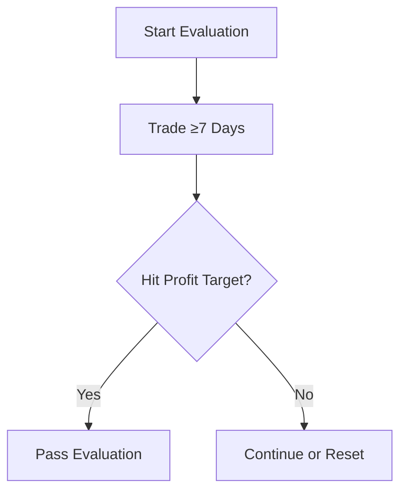

[Placeholder: screenshot of Apex evaluation dashboard]


---
**From:** `docs/apex/02_funded_rules.md`

# Apex Trader Funding – Funded (Performance) Account Rules

## 1. Consistency Rules

- 30% profit distribution rule
- 30% max daily loss relative to profits

## 2. Risk Management

- Mandatory stop-loss on every trade
- 5:1 max risk-reward ratio
- Half-contract rule until drawdown buffer cleared

## 3. Payout Rules

- First $25k 100% to trader
- 90/10 split after until payout #6 → then 100%
- 8-day minimum trading cycle between withdrawals
- Safety net balance requirement for first 3 payouts

## Visuals

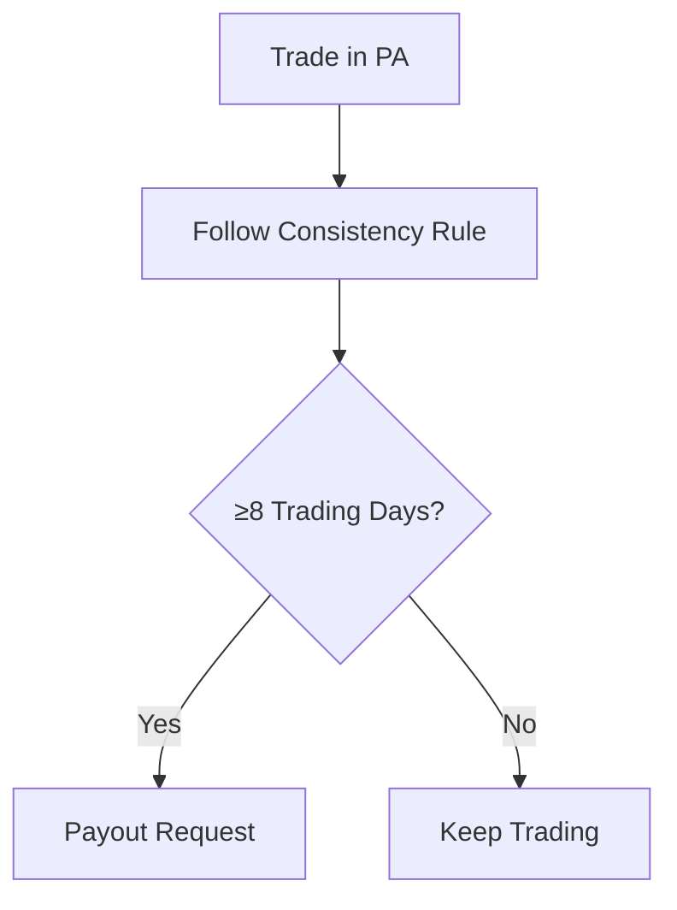

[Placeholder: payout dashboard screenshot]


---
**From:** `docs/apex/03_funding_process.md`

# Apex Trader Funding – Step-by-Step Process

## 1. Purchase Evaluation Plan

- Select account size + platform

## 2. Platform Setup

- Rithmic → NinjaTrader
- Tradovate → Web, Mobile, TradingView
- WealthCharts → All-in-One

## 3. Trading the Evaluation

- Close positions daily
- Obey trailing drawdown
- No multi-account hedging

## 4. Passing Evaluation

- Hit profit goal
- Trade 7+ days
- Maintain compliance

## 5. Activation of PA

- Sign contract
- Pay $85/month PA fee
- Transition to funded trading

## Visuals

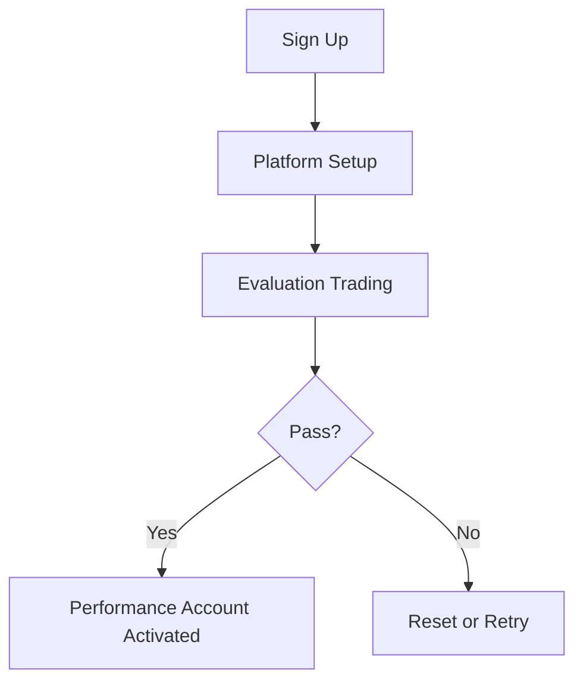

[Placeholder: onboarding email screenshot]


---
**From:** `docs/apex/04_platforms.md`

# Apex Trader Funding – Platform Integration Guide

## Rithmic + NinjaTrader

### How the Connection Works

- Rithmic supplies low-latency futures data feed and order routing.
- NinjaTrader is the desktop trading platform; it connects to Rithmic using credentials issued in the Apex dashboard.
- One set of Rithmic credentials per evaluation/funded account; cannot share across platforms.

### Difficulty Rating: 8/10

### Pros

- Industry-grade performance and fills.
- Advanced charting and order flow tools.
- Supports custom indicators and automated strategies via NinjaScript/ATMs.

### Cons

- Windows-only installation.
- Learning curve for data routing and strategy configuration.
- Single concurrent Rithmic session per login.

### Step-by-Step Setup (Apex-Specific)

1. **Buy Evaluation**
   - When purchasing an Apex evaluation, select a _Rithmic/NinjaTrader_ account. Platform choice is locked for that account.
2. **Retrieve Rithmic Credentials**
   - In the Apex dashboard, open _Credentials_ and copy the Rithmic username/password for the account.
3. **Install Rithmic R | Trader Pro**
   - Download from rithmic.com and install on Windows. Log in once to activate the username and declare non‑pro data status.
4. **Install NinjaTrader 8**
   - Download from ninjatrader.com and install.
5. **Link Rithmic in NinjaTrader**
   - In _Connections → Configure_, create a new Rithmic connection.
   - Enter the Apex‑supplied username/password.
   - For evaluation use `Rithmic Paper Trading – Chicago`; for funded use `Rithmic Live – Chicago`.
6. **Connect and Trade**
   - From _Connections_, choose the configured Rithmic connection.
   - Confirm the account drop‑down shows the Apex evaluation or funded account ID.

### Watchouts & Best Practices

- **Single Login** – Rithmic blocks concurrent logins. Disconnect R | Trader Pro before launching NinjaTrader or vice versa.
- **Trailing Drawdown Visibility** – NinjaTrader does not display trailing drawdown. Use R | Trader Pro or the Apex dashboard to track.
- **Data Declaration** – If you mistakenly register as a professional during R | Trader Pro login, your feed may be blocked or billed.
- **Strategy Testing** – Backtest with playback data before enabling live automation.
- **Windows-Only** – Mac users need Boot Camp or virtualization.

## Tradovate + TradingView

### How the Connection Works

- Tradovate provides the brokerage layer and data feed.
- TradingView (or the Tradovate web/desktop app) is the front end.
- Apex issues Tradovate credentials tied to the evaluation or funded account.

### Difficulty Rating: 3/10

### Pros

- Browser and mobile friendly; works on Windows, macOS, and Linux.
- Fast signup and no local software install.
- Easy chart sharing and community scripts via TradingView.

### Cons

- Limited automation; no full custom NinjaScript-style strategies.
- Dependent on stable internet; offline trading not supported.
- Trailing drawdown not shown natively.

### Step-by-Step Setup (Apex-Specific)

1. **Buy Evaluation**
   - Choose a _Tradovate/TradingView_ account when ordering from Apex.
2. **Retrieve Tradovate Credentials**
   - In the Apex dashboard, copy the Tradovate username and temporary password.
3. **Create/Link Tradovate Profile**
   - Navigate to tradovate.com or install the Tradovate app.
   - Log in using the credentials; change the temporary password when prompted.
   - Accept the non‑professional data declaration.
4. **Connect in TradingView (Optional)**
   - Open tradingview.com, log in, and click _Trading Panel → Tradovate_.
   - Enter the same Apex-issued credentials to link the broker.
5. **Select the Account**
   - In Tradovate or TradingView, pick the Apex evaluation account from the account selector and begin trading.

### Watchouts & Best Practices

- **Plan Lock-In** – Accounts created for Tradovate cannot later migrate to Rithmic/NinjaTrader.
- **Session Limits** – Avoid logging in on multiple browsers/devices simultaneously to prevent order sync issues.
- **Trailing Drawdown** – Monitor via the Apex dashboard or third-party widgets.
- **Order Types** – Some advanced order types (server OCO, custom strategies) are unavailable; confirm before relying on them.
- **Data Reset** – Clear browser cache or app data when switching accounts.

## WealthCharts

### How the Connection Works

- WealthCharts is an all-in-one web platform bundling charting, execution, and Apex‑specific risk tools.
- Apex provides a WealthCharts login that maps directly to the evaluation or funded account; no separate data feed setup is required.

### Difficulty Rating: 4/10

### Pros

- Turnkey access with pre-built Apex layouts and liquidation indicator.
- Web-based; no installs and minimal system requirements.
- Integrated account analytics and news.

### Cons

- Closed ecosystem with limited third‑party extensions or automation.
- Fewer hotkeys and advanced DOM features compared to NinjaTrader.
- Reliant on WealthCharts’ servers; fewer backup options.

### Step-by-Step Setup (Apex-Specific)

1. **Buy Evaluation**
   - Select a _WealthCharts_ account type during Apex checkout.
2. **Receive Credentials**
   - Apex emails activation link and credentials for WealthCharts.
3. **Activate and Log In**
   - Follow the activation link, set a password, and sign in at wealthcharts.com.
4. **Link the Account**
   - Under _Settings → Connections_, choose Apex Trader Funding and enter the provided credentials.
5. **Load Apex Layout**
   - From the layout library, import the Apex template to access liquidation indicator and trailing drawdown panels.
6. **Confirm Trading Access**
   - Verify the account selector shows the evaluation or funded ID before placing orders.

### Watchouts & Best Practices

- **Automation Limits** – No official API; manual trading only.
- **Liquidation Indicator** – Provides an estimate; cross-check with Apex dashboard for accuracy.
- **Browser Compatibility** – Use a modern browser and disable aggressive ad blockers that may block websockets.
- **Account Switching** – Log out fully before switching between multiple Apex accounts.

## Comparison Matrix

| Platform                | Difficulty | Key Pros                                     | Key Cons                                | Ideal Use Case                        |
| ----------------------- | ---------: | -------------------------------------------- | --------------------------------------- | ------------------------------------- |
| Rithmic + NinjaTrader   |       8/10 | Low-latency fills, full automation, deep DOM | Windows-only, complex setup             | Windows power users & algo developers |
| Tradovate + TradingView |       3/10 | Easiest onboarding, web/mobile access        | Limited automation, cloud dependency    | Cross-platform discretionary traders  |
| WealthCharts            |       4/10 | Turnkey with Apex-specific risk tools        | Closed ecosystem, limited extensibility | Traders wanting built-in risk visuals |

## Recommendations

- **Mac or Mobile Beginners** → _Tradovate + TradingView_ for quick, cross-platform access.
- **Windows Power Users & Automation** → _Rithmic + NinjaTrader_ for advanced DOM and strategy support.
- **Traders Needing Built-In Risk Tools** → _WealthCharts_ for the liquidation indicator and simplified setup.


---
**From:** `docs/apex/05_notifications.md`

# Notifications Integration

## Supported Channels

- Email
- Telegram
- Slack

## How to Use It

- Configure webhook in Apex dashboard
- Connect Slack workspace (via bot token)
- Test alerts on evaluation + PA status changes

## Visuals

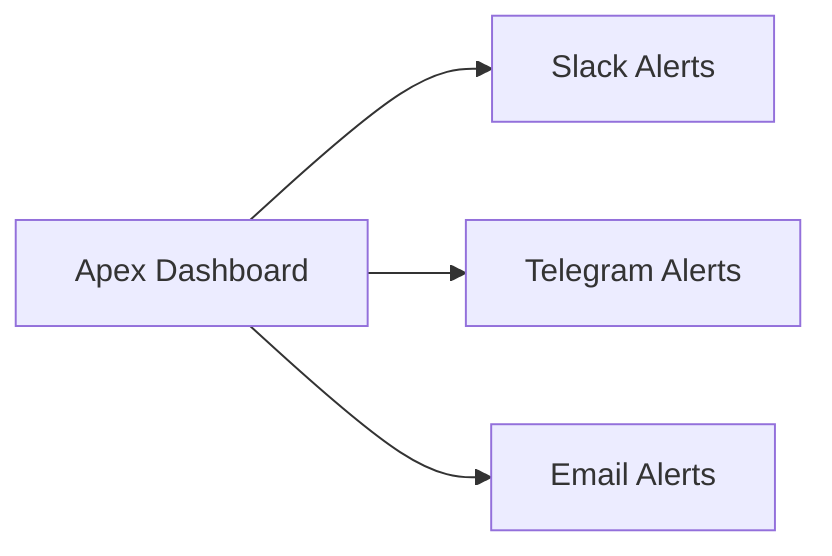

[Placeholder: screenshot Slack channel with Apex alert]


---
**From:** `docs/apex/06_knowledge_base.md`

# Apex Trader Funding – Rules, Funding Process, and Technical Platforms

## Evaluation Phase Rules

- **Profit Target:** Each evaluation account has a fixed goal. Example: a **$50,000** account must earn **$3,000**.
- **Trailing Drawdown:** Real-time max loss that trails peak balance. Example: the $50k plan has a **$2,500** trailing drawdown.
- **Minimum Trading Days:** Trade at least **7 separate days**. Half-day market sessions **do not count**.
- **End-of-Day Flat:** All positions and orders must be closed by **4:59 PM ET**.
- **Scaling:** No contract scaling limits during evaluation; you may use the full contract allotment.
- **News Trading:** Permitted unless Apex issues a specific restriction.
- **Resets:** Account can be reset at cost and begins a new evaluation cycle.
- **Pass Criteria:** Reach profit target, respect trailing drawdown, and trade 7 qualifying days.

### Evaluation Account Example

| Plan Balance | Profit Target | Trailing Drawdown | Max Contracts\* |
| ------------ | ------------- | ----------------- | --------------- |
| $50,000      | $3,000        | $2,500            | 10              |

\*Max contracts are defined by Apex's plan; no scaling rules apply in evaluation.

## Funded Phase Rules

- **30% Consistency Rule:** No single day may exceed **30%** of total profits at payout. Violations can deny payout and place the account on **consistency probation**.
- **Loss Limits:** Breaching the trailing drawdown or the daily loss cap closes the account.
- **Mandatory Stop-Loss:** Every order must include a protective stop.
- **Risk/Reward Cap:** Targets may be no more than **5×** the stop distance (max **5:1 R/R**).
- **Half-Contract Scaling:** Trade **half** the account’s max contracts until the trailing drawdown buffer is cleared.
- **Trailing Drawdown Lock-In:** Once balance reaches starting balance plus drawdown (e.g., $52,500 on a $50k PA), the drawdown locks at the start balance.
- **No Gambling Strategies:** Apex may terminate for unsound tactics or reckless trading.
- **Account Limits:** Up to **20** active Performance Accounts per trader; **no resets** allowed.
- **Payout Structure:** First **$25,000** kept **100%**, then **90/10** split until the **6th payout**, after which split returns to **100%**.
- **Payout Cadence:** Minimum **8 trading days** between withdrawals.
- **Payout Caps:** Payout #1 capped at **$2,000**, #2 at **$2,500**, #3 at **$5,000**; caps removed after third payout.
- **Safety Net:** After each payout, account must retain trailing-drawdown amount.
- **Transition to Live Trading:** After consistent performance, trader may elect to go live with a broker.

## Funding Step-by-Step

1. **Sign Up:** Purchase evaluation plan and choose platform (Rithmic/NinjaTrader, Tradovate/TradingView, or WealthCharts).
2. **Platform Setup:** Install or access the platform with credentials from Apex.
3. **Trade Evaluation:** Follow evaluation rules, monitor trailing drawdown, and flat by 4:59 PM ET.
4. **Hit Targets:** Reach profit goal and complete 7 qualifying days.
5. **Sign PA Contract:** Apex emails Performance Account agreement; pay **$85/month** fee.
6. **Trade Funded Account:** Apply funded rules and build consistency.
7. **Request Payout:** After 8 trading days and meeting consistency, request withdrawal via Apex dashboard.

## Technical Platforms

### Rithmic + NinjaTrader

- **Difficulty:** 7/10
- **Pros:** Low-latency data, advanced charting, automation via NinjaScript.
- **Cons:** Windows-only, requires software installation, steep learning curve.
- **Setup Tips:** Use Apex-provided Rithmic credentials; configure NinjaTrader connection manually.
- **Apex Restrictions:** One Rithmic login per machine; Apex data only.

### Tradovate + TradingView

- **Difficulty:** 3/10
- **Pros:** Web and mobile access, intuitive UI, native TradingView charts.
- **Cons:** Limited automation, dependent on cloud connectivity.
- **Setup Tips:** Create Tradovate login through Apex; link account to TradingView if charting there.
- **Apex Restrictions:** Cannot share credentials; close all browser sessions before switching accounts.

### WealthCharts

- **Difficulty:** 4/10
- **Pros:** Turnkey layouts tailored for Apex, built-in liquidation indicator.
- **Cons:** Closed ecosystem, less third-party integration.
- **Setup Tips:** Use Chrome; enable Apex template for trailing-drawdown overlay.
- **Apex Restrictions:** Trading limited to provided symbols and time frames.

### Platform Comparison

| Platform                | Difficulty | Pros                             | Cons                        | Apex Nuances                     |
| ----------------------- | ---------- | -------------------------------- | --------------------------- | -------------------------------- |
| Rithmic + NinjaTrader   | 7/10       | Low latency, automation          | Windows only, complex setup | One login per machine            |
| Tradovate + TradingView | 3/10       | Web/mobile, easy to start        | Limited automation          | Logout before switching accounts |
| WealthCharts            | 4/10       | Apex presets, liquidation alerts | Closed ecosystem            | Only Apex-approved instruments   |

## Comparison Table – Evaluation vs Funded Accounts

| Rule / Feature        | Evaluation Account                 | Funded/Performance Account                     |
| --------------------- | ---------------------------------- | ---------------------------------------------- |
| Trailing Drawdown     | Real-time; trails until target hit | Locks once start balance + drawdown is reached |
| Minimum Trading Days  | 7 days; half-days excluded         | 8 trading days between payouts                 |
| Scaling               | No scaling limits                  | Half-contract rule until buffer built          |
| Resets                | Allowed (paid)                     | Not permitted                                  |
| News Trading          | Allowed                            | Allowed unless Apex issues restriction         |
| Consistency Rule      | Not enforced                       | 30% daily profit cap; violations deny payout   |
| Payout Structure      | N/A                                | 1st $25k 100%; then 90/10 until 6th payout     |
| Payout Caps           | N/A                                | $2k / $2.5k / $5k for payouts #1-#3            |
| Stop-Loss Requirement | Not mandatory (recommended)        | Mandatory on every order                       |
| Transition Option     | Move to funded after pass          | Can opt into live trading after consistency    |


---
**From:** `docs/audit/guide.md`

# Prism Apex Tool — Audit Trail Guide

## Purpose

- Records all **system events**, **rule checks**, and **operator actions**.
- Ensures compliance with Apex rules (manual input, EOD flat).

## Log Formats

- **audit.log** → plain text, human readable.
- **audit_YYYY-MM-DD.jsonl** → structured JSON lines for parsing.

## Example Entry

```json
{
  "timestamp": "2025-08-17T13:45:01Z",
  "event_type": "RULE_CHECK",
  "message": "Breaches detected",
  "details": { "breaches": ["daily_loss"] }
}
```

## Retention

- Keep logs for 90 days minimum.
- Archive older logs to cloud if required.

## Visuals

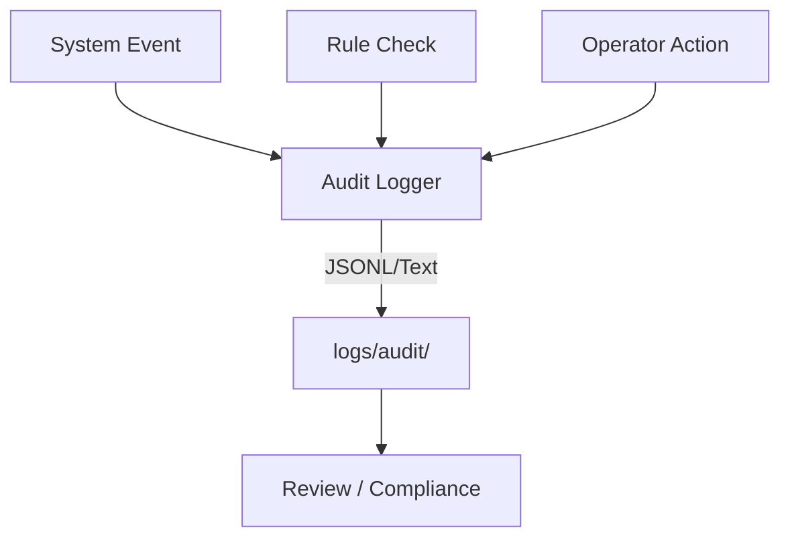


---
**From:** `docs/backtest/overview.md`

# Prism Apex Backtesting Framework

## What It Does

- Replays OHLCV bars to simulate ORB and VWAP strategies.
- Applies Apex guardrails: stop required, ≤5R cap, EOD flat (session close), daily loss proximity.
- Outputs JSON + CSV (fills, daily summaries).

## Quick Start

```bash
node apps/cli/src/backtest.js \
  --strategy=ORB \
  --data=data/ES_1m.csv \
  --mode=evaluation \
  --open=14:30 --close=21:59 \
  --tickValue=50 --seed=42
```

Outputs
`backtest.json` → summary + fills + daily

`backtest-fills.csv` → one row per filled trade

`backtest-daily.csv` → per-day PnL summary

## Config Notes (MVP)

- Session times: use UTC/GMT equivalents to enforce EOD flat.
- ≤5R cap: engine clamps targets above 5R.
- Daily loss cap: soft emulation via per-day PnL in backtest.
- Determinism: `--seed` controls slippage randomness (if enabled).

## Extend Later (Tick-Level)

- Replace simulateTrade with tick-matching engine.
- Add partial fills, queue priority, and latency models.
- Plug in full Prompt 24 compliance pass per-trade & end-of-day.

## Caveats

- Bar-level fills can over-estimate executions vs ticks.
- Use conservative slippage settings in pre-prod studies.

---

**QUALITY GATES (must pass)**

- `npm run test -w tests` (Vitest) → `tests/backtest/engine.spec.ts` passes.
- CLI produces `*.json` and `*.csv` and prints a summary.
- 5R clamp verified; daily loss proximity flags populated.
- No `any`, TypeScript strict OK.

**COMPLETION CHECK**
Files created/updated:

- `packages/backtest/src/types.ts`
- `packages/backtest/src/io.ts`
- `packages/backtest/src/util.ts`
- `packages/backtest/src/fills.ts`
- `packages/backtest/src/engine.ts`
- `packages/backtest/src/adapters/orb.ts`
- `packages/backtest/src/adapters/vwap.ts`
- `packages/backtest/src/index.ts`
- `apps/cli/src/backtest.ts`
- `tests/backtest/engine.spec.ts`
- `docs/backtest/overview.md`


---
**From:** `docs/backtest/tick-readiness.md`

# Tick-Level Readiness (Post-MVP)

## What’s Included Now

- **Tick replay hooks** with a simple **cross-through fill** model.
- Feature-flagged CLI (`--modeReplay=tick`).
- Tiny sample tick CSV for demos.

## What’s Next (Not Included Yet)

- Queue/latency modeling.
- Partial fills & order book depth.
- Realistic slippage tied to spreads & volume.
- Parquet reader for high-volume tick data (planned).

## Usage

```bash
# Tick replay (uses sample ticks)
node apps/cli/dist/backtest.js \
  --strategy=ORB \
  --modeReplay=tick \
  --tickData=data/ES_ticks.sample.csv \
  --mode=evaluation --open=14:30 --close=21:59 \
  --tickValue=50 --seed=42 --out=out/es_orb_tick
```

Diagram

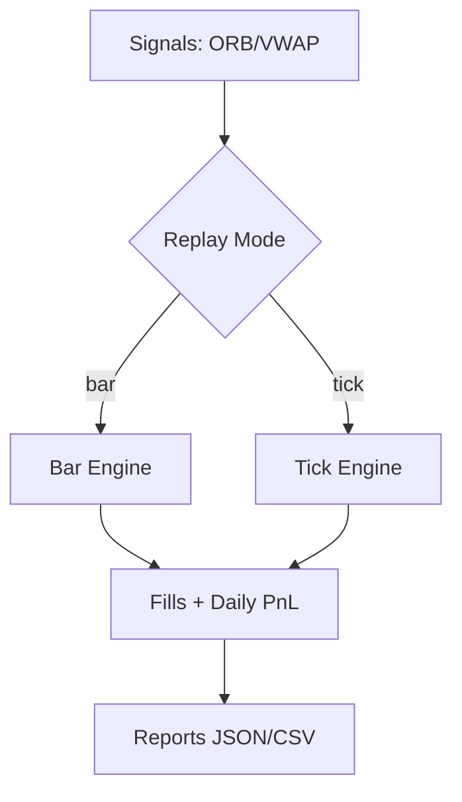


---
**From:** `docs/calibration/summary.md`

# Prism Apex Tool — Risk Calibration Summary

This document summarizes parameter sweeps of **ORB** and **VWAP** strategies
against Apex Trader Funding guardrails.

## Key Findings (Example)

- ORB with 15m window, 8 tick stop, 2R target → 61% win rate, **passes all Apex rules**.
- VWAP with 20bps band, 8 tick stop → strong expectancy but **breaches daily loss cap** in 8% of days.
- Across all runs, ~72% parameter sets breached at least one Apex rule.

## Metrics Recorded

- Win rate (%)
- Expectancy ($ per trade)
- Max drawdown
- Rule breaches (daily loss, trailing drawdown, consistency, EOD flat)

## Next Steps

- Narrow parameter ranges to those that consistently pass Apex rules.
- Incorporate into **live guardrails** (Prompt 14).
- Share CSV/JSON results with strategy engineers.

[Placeholder: charts from notebooks/calibration.ipynb]


---
**From:** `docs/compliance/rule-engine.md`

# Compliance Rule Engine

## Purpose

Codify Apex Trader Funding rules into machine-enforceable checks.

## How It Works

- Loads `apex/rules.json` definitions.
- Validates `AccountState` against all rules via `checkCompliance`.
- Returns `{ ok, violations[] }`.
- Violations feed into the Alerts pipeline.

## Example

```ts
import { checkCompliance, AccountState } from '../../apps/api/src/services/rules/engine.js';

const state: AccountState = {
  phase: 'evaluation',
  balance: 50000,
  equityHigh: 50000,
  openPositions: [],
  tradeHistory: [],
  dayPnL: {},
  trailingDrawdown: 49000,
};

const res = checkCompliance(state);
console.log(res.ok);
```

## Rules Covered

| JSON id             | Rule                  | Apex Reference                       |
| ------------------- | --------------------- | ------------------------------------ |
| eval-profit-target  | Profit Target         | Evaluation Handbook §Profit Target   |
| eval-trailing-dd    | Trailing Drawdown     | Evaluation Handbook §Drawdown        |
| eval-min-days       | Minimum Trading Days  | Evaluation Handbook §7 Days          |
| eval-eod-flat       | End of Day Flat       | Evaluation Handbook §EOD             |
| eval-resets         | Account Resets        | Evaluation Handbook §Resets          |
| funded-stoploss     | Stop-Loss Required    | Funded Account Handbook §Stops       |
| funded-consistency  | Consistency Rule      | Funded Account Handbook §Consistency |
| funded-scaling      | Half-Contract Scaling | Funded Account Handbook §Scaling     |
| funded-windfall     | No All-In/Windfall    | Funded Account Handbook §Windfall    |
| funded-dd-lock      | Trailing DD Lock      | Funded Account Handbook §DD Lock     |
| funded-news         | News Trading Ban      | Funded Account Handbook §News        |
| payout-safety-net   | Safety Net            | Payouts Handbook §Safety Net         |
| payout-cadence      | Payout Cadence        | Payouts Handbook §Cadence            |
| payout-profit-split | Profit Split          | Payouts Handbook §Profit Split       |

## Operator Impact

- Operators see compliance alerts before inputting trades.
- Violations mean: **do not place ticket**.

## Future Work

- Map remaining Apex rules into `apex/rules.json`.
- Add a diagram of the compliance flow.


---
**From:** `docs/config.md`

# Guardrails & Sizing (Env)

| Key                            | Default        | Notes                                       |
| ------------------------------ | -------------- | ------------------------------------------- |
| MIN_RR                         | 1.5            | minimum risk/reward                         |
| MAX_RR                         | 5              | maximum risk/reward (≤5)                    |
| FLAT_BY_UTC                    | 20:59          | EOD flat cutoff (UTC)                       |
| SIZE_POLICY                    | percent-of-max | sizing policy                               |
| PCT_OF_MAX_WHEN_NO_BUFFER      | 0.5            | percent of max contracts without buffer     |
| PCT_OF_MAX_WHEN_BUFFER         | 1.0            | percent of max contracts after buffer       |
| HALF_SIZE_UNTIL_BUFFER         | true           | start half size until buffer cleared        |
| ENFORCE_SIZE_HINTS             | false          | reject qty above allowed when true          |
| SIZE_JUMP_MULTIPLIER           | 2              | flag when qty > lastSuggested \* multiplier |
| ENFORCE_SIZE_JUMPS             | false          | reject when jumpExceeded and this is true   |
| CONSISTENCY_TRACKING_ENABLED   | true           | metrics only; no enforcement in V1          |
| CONSISTENCY_DAY_SHARE_LIMIT    | 0.3            | 30% single-day share limit                  |
| CONSISTENCY_MIN_PROFIT_DAY_USD | 50             | minimum profit to count a day               |
| CONSISTENCY_WINDOW_DAYS        | 8              | rolling summary window                      |
| MIN_PROFIT_TICKS               | (blank)        | profit floor disabled                       |
| MIN_EXPECTED_PROFIT_USD        | (blank)        | profit floor disabled                       |

Consistency is tracked only in V1; enforcement comes later.

## TradingView Webhook

Set `TRADINGVIEW_WEBHOOK_SECRET` in your environment.

Example alert:

```json
{
  "symbol": "ES1!",
  "side": "BUY",
  "entry": 5050.25,
  "stop": 5046.25,
  "target": 5055.25
}
```

Send to `POST /webhooks/tradingview` with header `x-webhook-secret: <secret>`.


---
**From:** `docs/configs/ACCOUNTS.md`

# accounts.json — Fields

- **name**: label for the account (e.g., "PA-1")
- **accountId**: Tradovate numeric account ID
- **accountSpec**: Tradovate account spec (e.g., "PA123456")
- **mode**: "eval" or "funded"
- **planMaxContracts**: hard cap from the plan
- **baseSize**: our default ticket size before guards (≥1)
- **multiplier**: per-account multiplier (e.g., 1.2 to scale up)
- **minQty**: clamp low (≥0)

Start from `configs/accounts.example.json` and run:


pnpm config:check


---
**From:** `docs/configs/README.md`

# Configs — Accounts & Strategies

## Accounts (`configs/accounts.json`)
**Shape**
- `name` (string) — label for the account
- `accountId` (integer > 0)
- `accountSpec` (string) — broker account spec
- `mode` ("eval" | "funded")
- `planMaxContracts` (integer > 0)
- `baseSize` (integer > 0, default 1)
- `multiplier` (number > 0, default 1)
- `minQty` (integer ≥ 0, default 1)

Copy `configs/accounts.example.json` and edit your values.

## Strategies (`configs/strategies/*.json`)
Each strategy file contains the **numeric knobs** your strategy reads at runtime.
Common fields (examples):
- `lookbackBars`, `rangeLookbackMinutes`, `bufferTicks`, `cooldownBars`, `minRR`
- Optional time fields: `sessionStart`, `sessionEnd` in `HH:MM` or `HH:MM:SS`

Use the `*.example.json` files as templates and align keys with your actual strategy code.

## Validation
Run:


pnpm config:check

- Checks: types, numeric finiteness, non-negative durations/counts; accounts schema also rejects **unknown keys** and bad types.
- Strategy validation is **generic** and safe: it enforces numeric/time types; for strict key lists, pass `allowedKeys` in your own loader or extend the schema.


---
**From:** `docs/consistency.md`

# Consistency Metrics

The Consistency Enforcer computes Apex-style payout eligibility metrics:

- **Top-day share** must be \u2264 30% of total net.
- At least **5 profit days** with \u2265 $50 net in the last 8 days.

For now the system runs in **metrics-only** mode. Tickets include
`meta.consistencyNotes = "metrics-only; enforce=false"`.

An optional flag `CONSISTENCY_ENFORCE=true` prepares the system for
pre-blocking funded accounts but is disabled until real PnL telemetry
arrives.

## API

`GET /report/consistency?accountId=<id>&window=8`

Returns the computed metrics and pass/fail reasons. A mock PnL provider is
used for tests and development. Real PnL will be supplied in PR-C1.


---
**From:** `docs/dashboard/guide.md`

# Prism Apex Tool — Operator Dashboard Guide

## What It Does

- Shows live strategy performance (win rate, expectancy, max drawdown).
- Monitors Apex guardrail compliance (✅ pass / ❌ fail).
- Displays payout eligibility and next payout date.
- Summarizes calibration sweep results.

## How to Use

1. Start with `make dashboard`.

3. Review widgets:
   - **Performance**: are strategies profitable?
   - **Guardrails**: any Apex breaches?
   - **Payouts**: when can money be withdrawn?
   - **Calibration**: are current parameters safe?

## Config Options

- All data pulled from `reports/` folder.
- Refresh dashboard by re-running sweeps or payouts.
- Frontend is single-page, minimal.

## Visuals

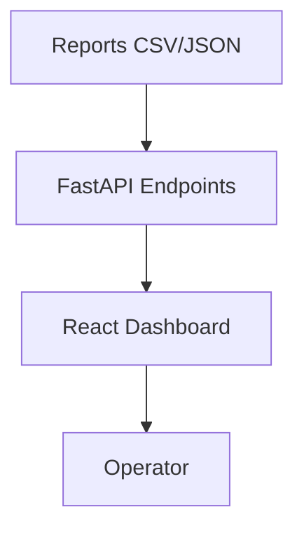


---
**From:** `docs/dashboard/overview.md`

# Prism Apex Operator Dashboard

## What It Does

The dashboard is the operator's command center. It displays:

- **Trade Tickets** from ORB and VWAP strategies.
- **Account Status** with balance, drawdown, and open positions.
- **Alerts** for Apex violations, EOD requirements, and scaling notices.
- **Reports** summarizing historical performance.

### Market Data View (Candles tab)
- Per-symbol **resolution selector** (1m / 5m / 15m) backed by `/api/metrics/bars?granularity=…`.
- Session-based **VWAP overlay** (yellow) plus toggleable **ATR** (purple) and **Range** histograms (blue) so operators can size up volatility without leaving the page.
- Upgraded tooltip with solid background that surfaces price, deltas vs. baseline, VWAP, ATR, and range values whether you are in candlestick mode or the BTC/EURUSD line mode.

### Reports View
- Backed by the new `/api/reports/dashboard` endpoint which aggregates symbol coverage, price buckets, and ticket summaries in a single payload.
- Filter by date range, symbol, strategy, and bucket interval (hour/day), then review KPI tiles, market-activity table (newest buckets first), coverage grid, ticket summary, and ticket trend tables.
- Toggle ticket insights on/off when you only need market context; the filters stay in sync with the backend filters shown in `appliedFilters`.

## How to Use

1. Open the dashboard in your browser.
2. Review the **Tickets** tab for trades to input into Tradovate.
3. Monitor **Account Status** for balance and drawdown.
4. Watch the **Alerts** panel for Apex risk warnings.
5. Switch to **Reports** to inspect simulator metrics and win rates.

## Data Sources

All information is fetched from the API endpoints:

- `/tickets`
- `/account`
- `/alerts`
- `/reports`

Alerts refresh automatically every 5 seconds.


---
**From:** `docs/deployment/guide.md`

# Prism Apex Tool — Deployment Guide

## Local Development

- Run `make dashboard` for local API/UI.
- Calibration: `make calibrate`.
- Payouts: `make payouts`.

## Docker

```bash
make up
# seeding runs automatically (rerun manually only if needed)
# make seed
```

## GitHub Actions

CI runs on develop: lint, tests, calibration.

CD runs on main: deploys to server via SSH + Docker.

## Server Deployment

SSH into server.

```bash
cd ~/prism-apex-tool
./infra/deploy.sh
```

## Visuals

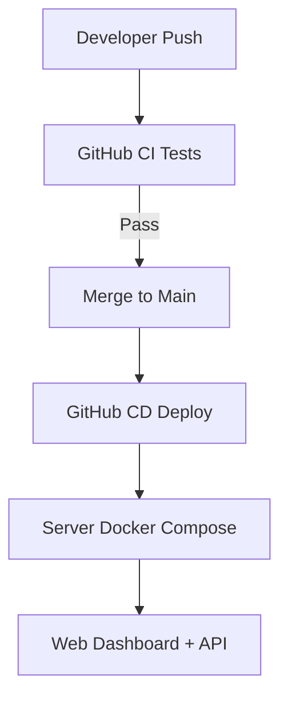


---
**From:** `docs/deployment/hardening.md`

# Production Hardening — Prism Apex Tool

## Overview

This guide ensures the tool runs safely in production.

## Key Safeguards

- Panic Brake → one-click OFF.
- Auto-restart → crashes restart within 10s.
- Healthcheck → /api/health shows system OK.
- Secrets → stored only in .env.production.
- Monitoring → Prometheus + Grafana.

## Steps

1. Deploy with Docker/Helm.
2. Run `make panic` to confirm panic button works.
3. Check Grafana for CPU/mem + guardrail alerts.
4. Ensure liveness probe auto-restarts container if stuck.


---
**From:** `docs/dev/quickstart.md`

# Prism Apex – Dev Quickstart

This guide gives you three one-liners to prove the MVP works locally without real credentials.

---

## 0) Prereqs

- Node 20+
- npm workspaces installed (`npm ci` at repo root)
- (Optional) Docker if you want to run the API in containers

---

## 1) Seed the API store (safe demo state)
*(Automatically runs during `make up`; re-run manually if you nuked data.)*

```bash
make seed
```

Outputs: `.data/state.json` with demo tickets, recipients, and risk context.

## 2) Run a sample backtest (ORB on ES 1m)

```bash
make backtest
```

Outputs:

- `out/es_orb_sample.json` (summary)
- `out/es_orb_sample-fills.csv`
- `out/es_orb_sample-daily.csv`

## 3) Full demo script

```bash
make demo
```

Builds CLI, runs backtest, writes results to `./out`.

### What you should see

- JSON summary printed to console.
- CSV files with fills and per-day PnL.
- No network calls or secrets required.

---

## Next Steps

- Point the API to read-only Tradovate credentials (when ready).
- Connect Slack/Telegram tokens to receive alerts (Prompt 18).
- Follow the Operator Handbook (Prompt 21) for the manual input workflow.

---

**QUALITY GATES (must pass)**

- `make seed` (also run automatically via `make up`) creates `.data/state.json` without errors.
- `make backtest` writes `out/es_orb_sample.*` files and prints a JSON summary.
- `make demo` runs end-to-end without external dependencies.
- All new TS compiles with `tsc` (strict) and no `any`.

**COMPLETION CHECK**
Files created/updated:

- `data/ES_1m.sample.csv`
- `apps/api/scripts/seed.ts`
- `apps/cli/scripts/demo.sh`
- `Makefile` (new targets)
- `docs/dev/quickstart.md`


---
**From:** `docs/export.md`

# Ticket export

`GET /export/tickets?date=YYYY-MM-DD&format=json|csv&accountId=ID`

Exports tickets for a given UTC date. The default `format` is `json`. Use `format=csv` for a compact CSV output. When `accountId` is supplied and the account exists, sizing suggestions are included.

## JSON example

```json
[
  {
    "when": "2024-08-24T12:00:00Z",
    "symbol": "ES",
    "side": "BUY",
    "qty": 1,
    "entry": 1,
    "stop": 0,
    "target": 2,
    "accepted": true,
    "rr": 2,
    "reasons": [],
    "preCloseSuppressed": false,
    "flatByUtc": "20:59",
    "sizeSuggested": 2,
    "sizeAllowed": 2,
    "halfSizeSuggested": false,
    "overAllowed": false,
    "jumpExceeded": false
  }
]
```

## CSV example

```
ts,symbol,side,entry,stop,target,rr,accepted,reason_summary,pre_close,flat_by_utc,size_suggested,size_allowed,half_size_suggested,over_allowed,jump_exceeded
2024-08-24T12:00:00Z,ES,BUY,1,0,2,2,true,,false,20:59,2,2,false,false,false
```

Sizing fields appear only when `accountId` is provided and an account file exists in the data directory. `sizeAllowed` mirrors `sizeSuggested` for backward compatibility. `overAllowed` and `jumpExceeded` appear when the stored ticket includes a `qty`.


---
**From:** `docs/multi-account/guide.md`

# Multi-Account Management — Operator Guide

## What This Does

- Shows all your Apex accounts grouped by **trader group** (you).
- **Blocks hedging**: you cannot be long and short the same symbol across your accounts.
- **Copy-Trade** helper: generates same-direction tickets per account with safe sizes.

## Plain English Rules

- **No Hedging:** If one account is **BUY ES**, another account in your group **cannot** be **SELL ES** at the same time.
- **Same Direction Copying:** You may place the **same direction** across your accounts if each account obeys its own limits.
- **Sizing:** We cap sizes by each account’s `maxContracts`. If a funded account has no buffer, we auto **half-size**.

## How to Use

1. Open the dashboard → **Multi-Account** section.
2. Click **Preview Copy-Trade** on your group.
3. If preview is ✅, the system lists per-account tickets for you to enter in Tradovate.
4. If ❌ shows **would_create_hedge**, you must close the opposite position first.

## Alerts & Logs

- Any detected hedge triggers a **🚫 Slack/Email alert** and appears in **audit logs**.
- All copy-trade generations are logged as **OPERATOR_ACTION**.

```mermaid
flowchart TD
    A[Strategy Ticket] --> B[Copy-Trader Preview]
    B -->|OK| C[Per-Account Tickets (Same Direction)]
    B -->|Hedge| D[BLOCK + Alert]
    C --> Operator[Manual Entry in Tradovate]
```


---
**From:** `docs/notifications/guide.md`

# Prism Apex Tool — Notifications Guide

## What It Does

- Sends alerts via **Slack** and **Email**.
- Covers:
  - Guardrail breaches (Apex rules).
  - Payout readiness.
  - CI/CD deployment results.

## How to Set Up

1. Create a Slack Incoming Webhook.
2. Add SMTP email credentials (Gmail works).
3. Copy `.env.example` → `.env` and fill in values.

## Test It

```bash
make notify-test
```

## Notification Flow

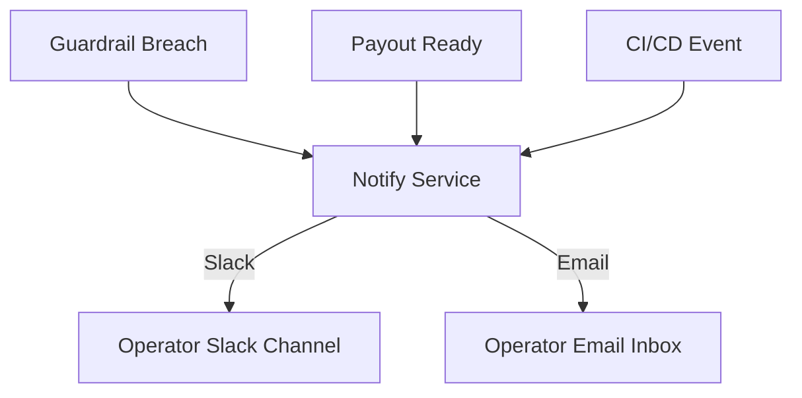


---
**From:** `docs/operator/handbook.md`

# Prism Apex Tool – Operator Handbook

---

## 1. Start of Day Checklist

### Step-by-step

1. Open your browser and log in to the **Prism Apex Dashboard**.
2. Review the dashboard home page.
3. Confirm system health:
   - Trade tickets display current signals.
   - Alerts panel is empty.
   - Account status shows correct balance and margin.
4. Verify trading session open times:
   - CME Futures open **9:30 AM ET (14:30 GMT)**.
   - Prism Apex Tool begins generating tickets from this time.
5. Log in to **Tradovate** and keep the order entry panel ready.
6. Ensure Slack/Telegram connection for automated alerts.

[Placeholder: screenshot of dashboard home]

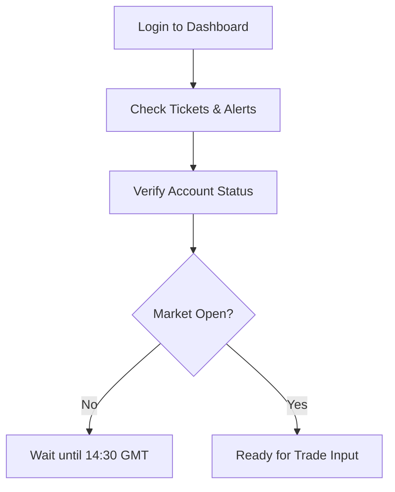

---

## 2. During Session

### 2.1 Inputting Trades

1. On the dashboard, review each trade ticket (symbol, side, entry, stop, target).
2. In **Tradovate**, manually enter orders with matching values.
3. Include stop-loss and target on every order (**Apex rule**).
4. Confirm the order is accepted in Tradovate and visible on the dashboard.

[Placeholder: screenshot of ticket table]
[Placeholder: screenshot of Tradovate order entry]

### 2.2 Monitoring Alerts

- Alerts panel refreshes every 5 seconds.
- Watch for:
  - Daily loss cap approaching
  - Trailing drawdown breach
  - Scaling exceeded
  - Flat required (EOD)

### 2.3 Responding to Pause Conditions

1. If a **"System Paused"** alert appears:
   - Do **not** enter new trades.
   - Close any pending entries if instructed.
   - Notify Solutions Architect via Slack/Telegram.
2. Resume only when the dashboard shows **"System Active"**.

---

## 3. End of Day (EOD) Close

### Step-by-step

1. At **4:45 PM ET (21:45 GMT)** begin wind-down.
2. Ensure all trades are closed by **4:59 PM ET (21:59 GMT)** (Apex rule: daily flat).
3. Check dashboard Account Status → confirm no open positions or working orders.
4. Export or screenshot the daily dashboard summary.
5. Verify Slack/Telegram confirmation message is received.

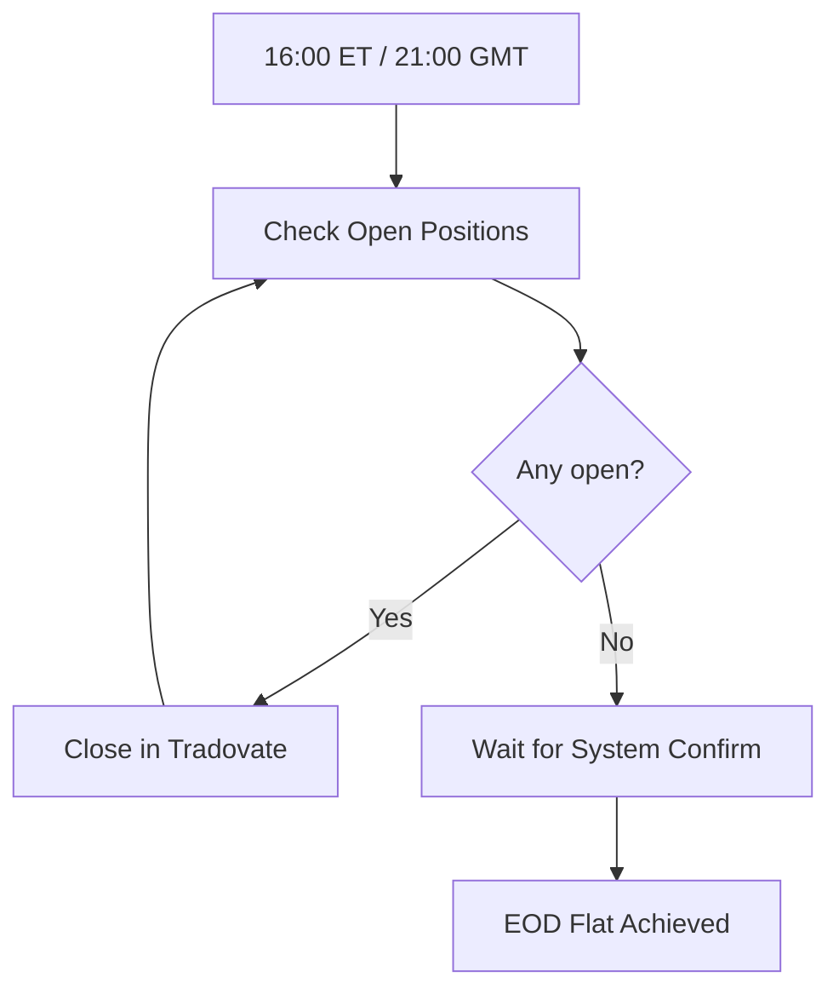

[Placeholder: screenshot of flat positions screen]

---

## 4. Incident Steps & Escalation

### 4.1 Platform/API Down

1. Pause trading immediately.
2. Attempt one reconnect.
3. If unresolved → notify **Project Manager (PM)** and **Solutions Architect**.
4. Document the outage in the daily log.

### 4.2 Ticket Cannot Be Entered

1. Retry order entry once.
2. If still failing → flag in Slack `#ops-incidents`.
3. Record the issue in the daily log and wait for guidance.

### 4.3 Rule Breach Alert Triggered

1. Stop trading immediately.
2. Close any open positions.
3. Notify **Senior Operator**.
4. Wait for clearance before resuming.

### Escalation Path

- Primary contact: **PM**
- Secondary contact: **Solutions Architect**
- Tertiary contact: **Senior Operator**

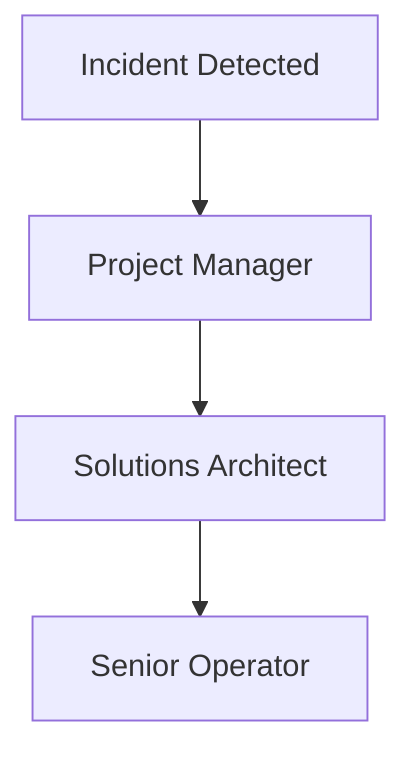

---

## 5. Glossary

- **ORB (Opening Range Breakout)** – Trade triggered when price breaks the first 15–30 minute range.
- **VWAP (Volume Weighted Average Price)** – Average price weighted by volume; benchmark for fair value.
- **Trailing Drawdown** – Apex rule: peak balance minus fixed buffer; breaching this pauses trading.
- **Scaling** – Limiting contract size based on account balance.
- **Stop-loss** – Pre-set order to exit a trade if it moves against us.
- **Flat** – No open positions or working orders.

---


---
**From:** `docs/operator/quick-cards/cheat-sheet.md`

# Cheat Sheet — Terms & Times

## Terms (Plain English)

- **ORB (Open Session Breakout):** Trade the break of the first ~15m range after open.
- **VWAP:** Volume-weighted average price; “fair” intraday benchmark.
- **OCO:** One-Cancels-the-Other (Stop + Target paired).
- **Flat:** No open positions.
- **≤5R:** Max target is 5× risk distance from entry to stop.
- **Consistency:** In funded mode, one day’s profit should not exceed ~30% of period profit.

## Times (GMT)

- **Session focus (CME RTH):** 14:30–21:59 GMT
- **EOD alerts:** T–10 (20:49–20:54), T–5 (20:55–20:59), **Flat by 21:59**

## Quick Math

- **R (Risk):** |Entry − Stop|
- **5R target:** Entry ± 5×R (system clamps automatically)

## Do / Don’t

- **Do:** Follow tickets exactly; confirm OCO; watch alerts.
- **Don’t:** Trade after 21:59 GMT; ignore CRITICAL alerts.


---
**From:** `docs/operator/quick-cards/eod-flat.md`

# Quick Card — End-of-Day Flat (21:59 GMT)

**Goal:** Be **flat** (no positions) by **21:59 GMT**.

## Timeline (GMT)

- **20:49–20:54:** System sends **WARN** “EOD T–10”.
- **20:55–20:59:** System sends **CRITICAL** “EOD T–5”.
- **21:59:** Must be **FLAT**.

## Steps

1. Check **open positions** in Tradovate — close if any.
2. Verify **dashboard** shows no open positions.
3. Capture daily summary (export or screenshot).
4. Post **EOD flat** confirmation in Slack.

## Do / Don’t

**Do:** Close early if in doubt.
**Don’t:** Carry any position past **21:59 GMT**.

[Placeholder: screenshot flat confirmation]


---
**From:** `docs/operator/quick-cards/execute-ticket.md`

# Quick Card — Execute a Ticket (Tradovate Manual Entry)

**Goal:** Enter the system’s ticket with OCO **Stop + Target**.

## Steps

1. In dashboard **Tickets**, pick the next ticket.
   - Fields: symbol, side, **entry**, **stop**, **target**, size.
2. Open **Tradovate** order ticket for the same symbol/account.
3. Select **OCO / Bracket** order type (Stop + Target).
4. Fill **Entry**, **Stop**, **Target**, **Size** exactly as shown.
5. Review → **Submit**.
6. Confirm in Tradovate **Working Orders** that OCO is present.
7. Record the ticket ID in the daily log.

## Checks

- Stop present? **Yes** (mandatory)
- Target ≤ **5R**? (System ensures; verify number)
- No **Pause** flag on dashboard? (If **Pause**, do not submit)

## Do / Don’t

**Do:** Double-check symbol & account before submit.
**Don’t:** Modify ticket values unless instructed by PM/SA.

[Placeholder: screenshot Tradovate OCO ticket]


---
**From:** `docs/operator/quick-cards/incidents-&-escalation.md`

# Quick Card — Incidents & Escalation

**Goal:** Stay safe, fast, and compliant.

## Common Incidents

- **Platform/API down** → Pause trading; notify PM/SA.
- **Cannot enter ticket** → Log issue; skip ticket; escalate.
- **OCO missing** → **CRITICAL** alert; hard **Pause**; fix order.
- **Daily loss/consistency breach** → Flatten; escalate.

## Escalation Path

1. Post 1-liner in **#ops-incidents** (time, symbol, issue).
2. DM **Solutions Architect**, then **IT PM**, then **CTO** (as needed).

## Break-Glass

- If a position is at risk → **CLOSE FIRST**, then escalate.

[Placeholder: Slack incident snippet]


---
**From:** `docs/operator/quick-cards/monitor-&-alerts.md`

# Quick Card — Monitor & Alerts

**Goal:** React quickly to warnings and blocks.

## Alert Types

- **WARN (amber):**
  - Daily loss ≥70% cap
  - Consistency (funded) ≥25%
  - EOD T–10 window
- **CRITICAL (red):**
  - Daily loss ≥85% cap
  - Missing OCO
  - Consistency (funded) ≥30%
  - EOD T–5 window

## What To Do

- **WARN:** Slow down; prepare to flatten or skip new tickets.
- **CRITICAL:** **Stop** new entries. Verify positions. Escalate if needed.

## Tools

- Dashboard **alerts panel** (refresh ~5–60s).
- Slack/Email notifications from system.
- `/jobs/status` for recent job run times and flags.

[Placeholder: screenshot alert banner]


---
**From:** `docs/operator/quick-cards/sod-checklist.md`

# Quick Card — Start of Day (SOD)

**Goal:** Be fully ready when the session opens.

## Checklist

- [ ] Open **Prism Apex Dashboard** → `/health` shows **OK**.
- [ ] Check **/jobs/status** → no stale errors; `ocoMissing=false`.
- [ ] Confirm **notifications** work (Slack/Email visible).
- [ ] Verify **session times** (CME RTH): **14:30–21:59 GMT** (MVP focus).
- [ ] Confirm **account** and **symbol universe** for the day (ES, NQ; or as configured).
- [ ] Read any **operator notes** in Slack.

## Do / Don’t

**Do:** Keep Slack open.
**Don’t:** Enter trades before session open.

[Placeholder: screenshot dashboard health]


---
**From:** `docs/operator/training-deck.md`

# Prism Apex Tool — Operator Training Deck (MVP)

## 1) Context & Roles

- **What you do:** Manually key trades into **Tradovate** from system-generated **tickets**.
- **What you don’t do:** You **do not** pick instruments, sides, or sizes.
- **Why:** Apex rules require strict guardrails; our system computes signals and monitors risk.

## 2) Daily Flow (High-Level)

1. **SOD:** Health check → recipients → session time.
2. **Execute:** Read ticket → enter order in Tradovate **with OCO stop + target**.
3. **Monitor:** Watch alerts (Slack/Email) and dashboard status.
4. **EOD:** **Flat by 21:59 GMT** → confirm zero positions.
5. **Incidents:** Use the escalation playbook.

```mermaid
flowchart TD
    A[SOD Checks] --> B[Read Ticket]
    B --> C[Enter in Tradovate (OCO)]
    C --> D[Monitor Alerts & Rules]
    D --> E[EOD Flat by 21:59 GMT]
    D --> F{Alert?}
    F -->|WARN/CRIT| G[Pause & Escalate]
```

## 3) Tickets (Plain English)

A ticket contains: symbol, side (BUY/SELL), entry, stop, target, size.

Stop is mandatory. Target is capped at ≤5R by our system.

If the dashboard shows Pause or OCO Missing, do not enter new trades.

## 4) Alerts (What They Mean)

WARN (amber): Approaching a limit (e.g., 70% daily loss). Be cautious.

CRITICAL (red): Breach imminent or detected (e.g., 85% daily loss; missing OCO). Stop and escalate.

EOD T–10 / T–5: Close out to be flat by 21:59 GMT.

## 5) EOD Flat (Non-Negotiable)

By 21:59 GMT, zero open positions.

The system nudges you but you own the final check.

## 6) Do / Don’t

**Do**
Double-check stop and target are attached (OCO).

Confirm account and symbol match the ticket.

Take screenshots of anomalies.

**Don’t**
Don’t freestyle entries or sizes.

Don’t trade past 21:59 GMT.

Don’t ignore CRITICAL alerts.

## 7) Escalation

Post in #ops-incidents with a one-liner (time, symbol, issue).

Ping Solutions Architect → IT PM → CTO (if needed).

If positions are at risk, close then escalate.

[Placeholder: screenshot of dashboard with tickets and alerts]


---
**From:** `docs/operator-console.md`


Operator Console Guide (Prism-Apex → Tradovate OCO)

You don’t need to code. Follow these steps exactly. Prism-Apex never places orders—you do, using the ticket details shown in the dashboard or API.

1) Find the Ticket

Open the local dashboard (or call the API):

GET /tickets?date=YYYY-MM-DD[&strategy=STRATEGY] → list of today’s tickets (optionally filter by strategy)

GET /export/tickets?date=YYYY-MM-DD → CSV export

Each ticket shows: symbol, side, entry, stop, target, qty, accountId, rr, sizingHint.

Quick Copy Format

When you copy from the ticket, use this exact line:

SYMBOL SIDE QTY ENTRY STOP TARGET


Example:

MESZ5 BUY 2 5550.25 5544.25 5560.25

2) Enter as OCO in Tradovate (Manual)

You’ll create one entry order and attach two linked exits (OCO: target + stop).

A. Entry

Select account shown on the ticket (e.g., APEX-123456).

Select contract = symbol (e.g., MESZ5).

Choose BUY or SELL (from side).

Type: use Limit at entry price (or Market if strategy specifies; default is Limit).

Qty: set to qty (sizingHint may recommend half-size).

Enable Bracket/OCO (Tradovate calls this Bracket or OSO).

Do not send yet.

B. Exits (OCO children)

Take Profit (Limit) at target.

Stop Loss (Stop/Stop-Market) at stop.

Tip: If Tradovate uses ticks for offsets, just switch to absolute price mode and type the prices directly.

C. Submit

Send the bracketed order.

After the entry fills, the two exits become active OCO legs. If one exits, the other auto-cancels.

3) Fanout (Same Ticket to Multiple Accounts)

If you operate multiple Apex accounts:

Repeat the exact OCO entry per account.

If the ticket’s qty is per account, keep it.
If it’s total size, divide by number of accounts and round down.

Keep identical prices across accounts to preserve the intended risk:reward.

4) Rejection Codes (what the console will show)

A ticket may be rejected (you won’t enter it). Reasons appear on the ticket as a list:

STOP_REQUIRED: Stop is required by policy.

STOP_SIDE_INVALID: Stop not on the safe side for the side (buy/sell).

RR_OUT_OF_RANGE: Risk:Reward outside [min,max].

SIZE_CLAMPED: Size reduced by policy (anti-windfall / half-size until buffer).

TRAILING_DRAWDOWN: Account drawdown risk exceeded.

EOD_WINDOW: Inside End-Of-Day flat window (no new positions).

OUT_OF_HOURS: Strategy session closed.

CONFIG_DISABLED: Strategy turned off by config/schedule.

DUPLICATE_SIGNAL: De-dupe caught a repeat.

SYMBOL_INVALID: Contract/symbol not tradeable under current rules.

If a ticket shows accepted=false, do not enter it.

5) EOD Countdown

The console shows time remaining until the EOD flat window starts.

When countdown reaches zero:

New tickets are suppressed (you won’t see any accepted=true).

Manage any open positions normally inside Tradovate as per your plan.

6) Quick Troubleshooting

No tickets appear: strategy may be disabled or out of session; check the countdown and config.

Prices look off: confirm contract month (e.g., MESZ5) and decimal format.

Size changes: sizingHint may be half-size due to risk buffer; follow the qty in the ticket.

Account mismatch: ensure the Tradovate account in the top-right matches accountId on the ticket.

7) Reference Shapes (read-only)

JSON Ticket

{"symbol":"MESZ5","side":"BUY","entry":5550.25,"stop":5544.25,"target":5560.25,"qty":2,"accountId":"APEX-123456","timestampUtc":"2025-09-09T14:31:22Z","meta":{"strategy":"vwap-first-touch","rr":1.5,"guardrails":["stopSideOk","rrInRange"],"sizingHint":"half-size"},"accepted":true,"reasons":[]}


CSV Export (columns)

symbol,side,entry,stop,target,qty,accountId,timestampUtc,strategy,rr,accepted,reasons,sizingHint


That’s it. Copy the line, enter the OCO, and you’re done.


---
**From:** `docs/payouts/calendar.md`

# Prism Apex Tool — Payout Calendar

## Rules Recap

- **First payout**: After 10 trading days AND $1,000 net profit.
- **Cycle**: Every 14 days after first payout.
- **Amounts**:
  - 100% of first $25,000.
  - 90% of profits above $25,000.

## Current Account Example

- Trading days completed: 12
- Total profit: $2,050
- Eligible? **Yes**
- Next payout date: 2025-09-01
- Estimated payout: $2,050

_All dates are in UTC/GMT._

## Mermaid Flow

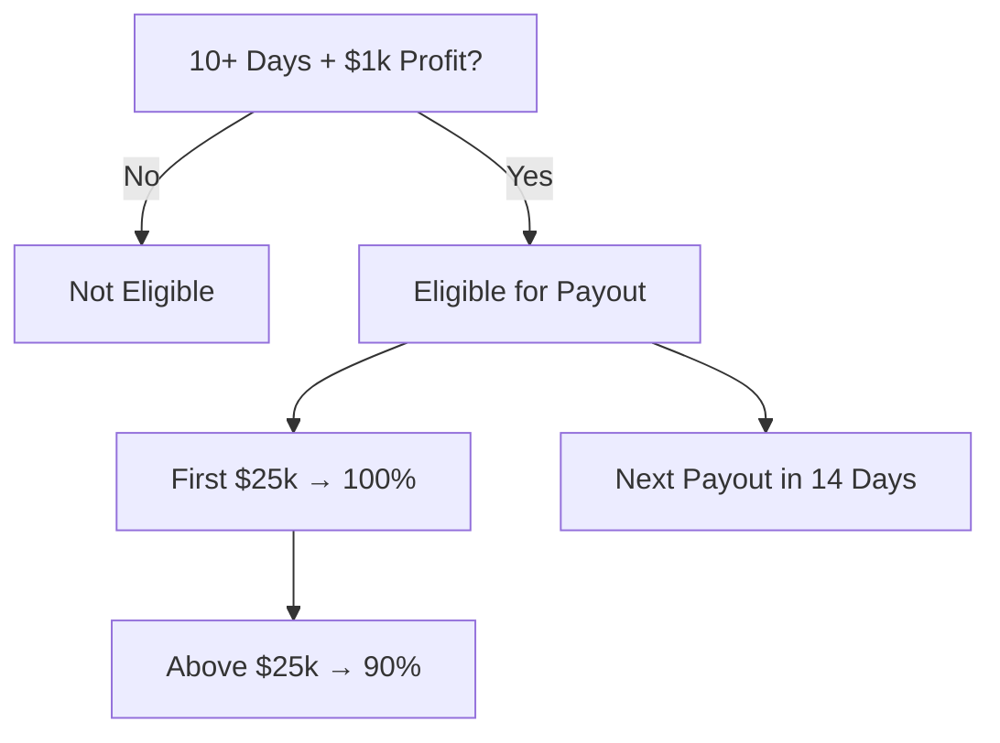

[Placeholder: operator calendar screenshot]


---
**From:** `docs/ports-and-env.md`

# Ports & Environment Notes

The local stack exposes two primary ports by default:

- **8080** – Prism Apex API (compose service `api`).


They are currently documented directly inside `README-dev.md` and compose files. To reduce drift and make overrides easier, prefer exporting the ports via environment variables, for example:

```env
API_PORT=8080

```

You can then reference these variables inside compose overrides or `.env` files. This change does not modify any Docker compose files yet—it simply notes the convention so future updates can centralise port management.

Remember: runtime remains **tickets-only**. These ports expose telemetry and operator dashboards; no automated order placement endpoints exist.


---
**From:** `docs/release/checklist.md`

# Release Checklist — Prism Apex Tool

## Preflight

- [ ] All unit tests pass (`make test`)
- [ ] All guardrail monitors pass (`make guardrails:test`)
- [ ] Simulator run successful (`make simulate`)

## Operator Signoff

- [ ] Operator confirms panic button works
- [ ] Operator confirms notifications (Slack/Email) received
- [ ] Operator confirms training mode works

## PM Signoff

- [ ] PM validates checklist complete
- [ ] Version bump confirmed

## Release

- [ ] Run `make release VERSION=vX.Y.Z`
- [ ] GitHub Actions pipeline must pass
- [ ] Tag pushed and CI confirms release


---
**From:** `docs/release/go-live-checklist.md`

# Prism Apex Tool — Go-Live Master Checklist (Oct 1)

**Owners:** Sean (CTO), Craig (CEO), Solutions Architect, IT PM, Lead Operator
**Environment:** Production (single Ubuntu host, Docker)
**Decision Gate:** All boxes ✅ before enabling live operations on Oct 1.

---

## 1) Infrastructure & Deploy

- [ ] Server specs validated against plan (CPU/RAM/disk/network).
- [ ] OS updated and rebooted within last 7 days.
- [ ] Docker + compose plugin installed (see `infra/scripts/bootstrap.sh`).
- [ ] `infra/docker-compose.prod.yml` present on server.
- [ ] `infra/.env.prod.example` copied to `${PROD_STACK_DIR}/.env` with real values.
- [ ] GitHub Actions `deploy` workflow green on the latest tagged release.
- [ ] `http://<server>:8080/health` returns `{ ok: true }`.
- [ ] `http://<server>/` dashboard loads.

## 2) Configuration & Secrets

- [ ] TRADOVATE read-only credentials stored in `.env` (no write permissions).
- [ ] TradingView `TRADINGVIEW_WEBHOOK_SECRET` set (if alerts used).
- [ ] SMTP/Telegram/Slack/Twilio tokens loaded (optional; at least one required).
- [ ] `DAILY_LOSS_CAP_USD` configured to Apex account level.
- [ ] Timezone assumptions documented as GMT/UTC in Operator Handbook.

## 3) Notifications (at least one must work)

- [ ] `/notify/register` called with recipients (Slack channel ID or email).
- [ ] `/notify/test` returns transports OK (non-200 is a blocker).
- [ ] Operator sees test alert in chosen channel (screenshot captured).

## 4) Signals & Tickets (MVP manual flow)

- [ ] TradingView → Webhook → `/ingest` (or equivalent) verified with HMAC.
- [ ] `/signals/preview` normalizes to ≤5R target and blocks invalid tickets.
- [ ] `/tickets/commit` creates ticket visible on dashboard.
- [ ] Operator can manually key ticket into **Tradovate** with matching Stop + Target.
- [ ] Missing OCO triggers **CRITICAL** alert and dashboard **Pause** flag.

## 5) Guardrails & Rules (Apex)

- [ ] EOD window alerts fire at **20:49–20:54 (WARN)** and **20:55–20:59 (CRITICAL)** GMT.
- [ ] Daily loss proximity alerts at **≥70%** (WARN) and **≥85%** (CRITICAL).
- [ ] Consistency proximity alerts in funded mode at **≥25%/≥30%**.
- [ ] Stop-loss required — tickets without stops are **blocked** in preview.
- [ ] Dashboard shows **flat** state at EOD (no open positions).

## 6) Observability & Logs

- [ ] API logs include request IDs and warning/error lines are visible with `docker compose logs`.
- [ ] `/jobs/status` shows recent run times and `flags.ocoMissing` = false in steady state.
- [ ] Disk space > 20% free; log rotation plan in place.

## 7) Security & Access

- [ ] SSH keys restricted to deployment user.
- [ ] No secrets committed to repo; all via GitHub Secrets or server `.env`.
- [ ] Dashboard behind allowed IPs or temporary auth (MVP), documented.

## 8) Operator Handbook & Training

- [ ] Operators trained on **handbook** (SOD, During Session, EOD, Incidents).
- [ ] Dry-run session completed with sample tickets and screenshots.
- [ ] Escalation tree clear (names, Slack handles, phone on file).

## 9) UAT Completion

- [ ] All **UAT scenarios** in `docs/release/uat-scenarios.md` show **PASS**.
- [ ] Evidence (screens, JSON exports) archived in `/evidence/YYYY-MM-DD`.

## 10) Executive Sign-Off

- [ ] `docs/release/sign-off-template.md` completed with signatures/dates.

**Final Decision:**

- [ ] ✅ GO LIVE on Oct 1
- [ ] ❌ BLOCKED (attach reason)


---
**From:** `docs/release/operator_signoff.md`

# Operator Release Signoff — Plain English

## Why This Matters

We need to be sure Prism Apex Tool is safe to run under Apex rules.

## What You Do

1. Run `make simulate` → confirms rules are respected.
2. Run `make guardrails:test` → ensures brakes work.
3. Test panic button in dashboard → system must stop.
4. Confirm Slack/Email alerts arrive.
5. Confirm training mode works (`make training`).

If all checks pass:

- Tell PM "OK to release."
- PM will tag the release.

If any checks fail:

- Stop and report back.


---
**From:** `docs/release/runbook-rollback.md`

# Prism Apex Tool — Rollback & Incident Runbook

**Priority:** Restore safe operations quickly, protect Apex compliance, prevent irreversible loss.

---

## 1) Immediate Actions

- [ ] Announce incident in Slack `#ops-incidents` (include time, symptoms).
- [ ] **Pause** new tickets (dashboard Pause or temporary block in API).
- [ ] Verify positions in Tradovate — **flatten** if risk is elevated.

## 2) Quick Diagnostics (5–10 min)

- [ ] `GET /health` — should be OK.
- [ ] `docker compose ps` — containers running.
- [ ] `docker compose logs --since=10m` — check errors.
- [ ] `/jobs/status` — lastOk timestamps present.

## 3) Rollback (Tag N → N-1)

- [ ] Select previous tag (e.g., `v0.1.2` → `v0.1.1`).
- [ ] Run:

```bash
TAG=v0.1.1 make deploy
```

- [ ] Confirm health:

```bash
curl -fsS http://<server>:8080/health
```

- [ ] Open dashboard `/`

## 4) Data Safety

- Volumes preserved; no destructive migrations in MVP.
- Backup `.env` and `.data/state.json` before manual edits.

## 5) Recovery & Resume

- Clear dashboard **Pause** flag when safe.
- Announce resolution in Slack with incident summary.
- Create follow-up ticket for root cause & action items.

## 6) Post-Mortem Template

- What happened:
- Impact window:
- Root cause:
- Actions taken:
- Preventative measures:
- Owners & due dates:


---
**From:** `docs/release/sign-off-template.md`

# Prism Apex Tool — Executive Go-Live Sign-Off

**Project:** Prism Apex Tool (Path 1b — Prop-Firm Equities/Futures Trading)
**Go-Live Date:** Oct 1 (GMT)

---

## Summary

- MVP Scope: Manual execution via Tradovate; strategies ORB + VWAP.
- Risk Controls: Apex guardrails enforced (EOD flat, daily loss proximity, consistency, stop-loss, ≤5R).
- Monitoring: Email/Telegram/Slack alerts + background jobs.
- Deployment: Docker on single Ubuntu host; health-gated.

---

## Readiness Checklist Status

- Go-Live Master Checklist: **All items ✅**
- UAT Scenarios: **All PASS** (see `docs/release/uat-scenarios.md`)

---

## Residual Risks (Known & Accepted)

- Manual order entry risk (operator error) — mitigated by ticket UI + OCO + alerts.
- Bar-level backtest approximation — conservative execution assumptions.
- Single-host deployment — acceptable for MVP; DR plan documented.

---

## Approval

**CTO (Sean):**
Name: \***\*\*\*\*\***\_\_\_\***\*\*\*\*\*** Signature: \***\*\*\*\*\***\_\_\_\***\*\*\*\*\*** Date: \***\*\_\_\*\***

**CEO (Craig):**
Name: \***\*\*\*\*\***\_\_\_\***\*\*\*\*\*** Signature: \***\*\*\*\*\***\_\_\_\***\*\*\*\*\*** Date: \***\*\_\_\*\***

**Solutions Architect:**
Name: \***\*\*\*\*\***\_\_\_\***\*\*\*\*\*** Signature: \***\*\*\*\*\***\_\_\_\***\*\*\*\*\*** Date: \***\*\_\_\*\***

**IT PM:**
Name: \***\*\*\*\*\***\_\_\_\***\*\*\*\*\*** Signature: \***\*\*\*\*\***\_\_\_\***\*\*\*\*\*** Date: \***\*\_\_\*\***


---
**From:** `docs/release/uat-scenarios.md`

# Prism Apex Tool — UAT Scenarios & Scripts

**Goal:** Prove MVP works end-to-end with manual execution and Apex guardrails before Oct 1.
**Test Window:** Preferably same time window as live operations. All times GMT.

---

## Legend

- **Actor:** System / Operator
- **Input:** What to do
- **Expected:** Pass criteria
- **Evidence:** What to capture (screenshot/json)

---

## UAT-01 Health & Deploy

- **Actor:** System
- **Input:** `GET /health`
- **Expected:** `{ ok: true }`
- **Evidence:** cURL output saved

---

## UAT-02 Notifications (Slack or Email)

- **Actor:** System
- **Input:** `POST /notify/test { "message": "UAT-02", "level": "INFO", "tags": ["UAT"] }`
- **Expected:** At least one transport returns OK; operator sees message
- **Evidence:** Slack/email screenshot

---

## UAT-03 Signal Preview — ORB

- **Actor:** System
- **Input:** `POST /signals/preview` with an ORB long (entry=5000, stop=4990, target=5025, size=1, mode="evaluation")
- **Expected:** `normalized.target` ≤ 5R; `block=false`; reasons empty or informational
- **Evidence:** JSON response saved

---

## UAT-04 Ticket Commit — ORB

- **Actor:** System → Operator
- **Input:** `POST /tickets/commit` using normalized values from UAT-03; Operator keys order in **Tradovate** with Stop+Target OCO
- **Expected:** Ticket appears on dashboard; Tradovate shows working order with linked OCO
- **Evidence:** Dashboard + Tradovate screenshots

---

## UAT-05 Missing OCO Detected

- **Actor:** Operator (negative test)
- **Input:** Enter a dummy order **without** OCO on Tradovate (test/sim)
- **Expected:** Within 15s, **CRITICAL** alert + dashboard **Pause** flag
- **Evidence:** Alert screenshot + `/jobs/status` showing `flags.ocoMissing=true`

---

## UAT-06 Daily Loss Proximity (Simulated)

- **Actor:** System
- **Input:** Set `DAILY_LOSS_CAP_USD=100` (temp) and seed negative PnL via backtest hook or mock
- **Expected:** WARN at ≥70%, CRITICAL at ≥85%
- **Evidence:** Alert screenshots; `/rules/status` JSON

---

## UAT-07 EOD Alerts

- **Actor:** System
- **Input:** Temporarily stub time to fall inside **20:49–20:54** and **20:55–20:59** GMT windows
- **Expected:** WARN then CRITICAL emitted once per day
- **Evidence:** Alert transcripts or logs; `/jobs/status` timestamps

---

## UAT-08 Consistency Proximity (Funded Mode)

- **Actor:** System
- **Input:** Set `store.setPeriodProfit(1000)` and `store.setTodayProfit(310)` (test route or script)
- **Expected:** CRITICAL alert (≥30%)
- **Evidence:** Alert screenshot; `/rules/status` JSON

---

## UAT-09 VWAP Ticket Lifecycle

- **Actor:** System → Operator
- **Input:** `POST /signals/preview` for VWAP; then `POST /tickets/commit`; operator keys into Tradovate with OCO
- **Expected:** Same as ORB flow; block if missing stop/invalid R
- **Evidence:** JSON + screenshots

---

## UAT-10 End-of-Day Flat

- **Actor:** Operator
- **Input:** Before **21:59 GMT**, close any open trades; verify no positions remaining
- **Expected:** Dashboard shows **flat**; system sends EOD confirmation alert
- **Evidence:** Dashboard flat screen + alert screenshot

---

## UAT-11 Readiness Reports

- **Actor:** System
- **Input:** `GET /reports`
- **Expected:** JSON shows realistic metrics (win_rate, avg_r, max_dd, rule_breaches)
- **Evidence:** JSON saved

---

## UAT-12 OpenAPI & SDK Smoke

- **Actor:** System
- **Input:** `GET /openapi.json` then call a couple of SDK methods (`getHealth`, `listTickets`)
- **Expected:** SDK returns valid objects without runtime errors
- **Evidence:** Console output + snippet

---

## UAT Summary Table (to be completed)

| ID     | Result (PASS/FAIL) | Owner | Evidence Link | Notes |
| ------ | ------------------ | ----- | ------------- | ----- |
| UAT-01 |                    |       |               |       |
| UAT-02 |                    |       |               |       |
| UAT-03 |                    |       |               |       |
| UAT-04 |                    |       |               |       |
| UAT-05 |                    |       |               |       |
| UAT-06 |                    |       |               |       |
| UAT-07 |                    |       |               |       |
| UAT-08 |                    |       |               |       |
| UAT-09 |                    |       |               |       |
| UAT-10 |                    |       |               |       |
| UAT-11 |                    |       |               |       |
| UAT-12 |                    |       |               |       |


---
**From:** `docs/rules/overview.md`

# PrismOne Rules Overview

PrismOne embeds Apex Trader Funding rules to maintain profitability and
operational discipline. The platform differentiates between evaluation
and funded accounts, applying appropriate controls for each stage.

## Evaluation Accounts

- **Profit Target** – account must reach the configured profit target
  before advancing.
- **Trailing Drawdown** – balance may not fall more than the defined
  amount below the high-water mark.
- **Minimum Trading Days** – at least seven unique trading days are
  required.
- **End-of-Day Flat** – no positions may remain open after the allowed
  trading session.
- **Allowed Trading Times** – trades outside the configured session are
  flagged for review.

## Funded Accounts

- **30% Consistency Rule** – profit from any single day may not exceed
  30% of total profits.
- **Stop-Loss Requirement** – every trade must carry a protective
  stop-loss order.
- **Scaling Limits** – contract counts are capped until trailing
  drawdown is cleared.
- **Payout Rules** – eligibility requires minimum trading days,
  profitable days, and observes payout caps.
- **Forbidden Strategies** – predefined strategies are automatically
  rejected.

## Operator Checklist

| Rule / Control        | Enforced Automatically | Notes                                              |
| --------------------- | ---------------------- | -------------------------------------------------- |
| Trailing Drawdown     | ✅                     | Both phases emit violations when breached          |
| Minimum Trading Days  | ✅                     | Evaluation module tracks unique trading days       |
| End-of-Day Flat       | ✅                     | Evaluation module raises events for open positions |
| Consistency Rule      | ✅                     | Funded module validates 30% limit                  |
| Stop-Loss Presence    | ✅                     | Funded module requires stop-loss on each trade     |
| Payout Caps           | ✅                     | Funded module computes capped payouts              |
| Discretionary Conduct | ⚠️                     | Operators monitor for reckless behaviour           |

## Quick Start
Preview (no deletions):
```bash
./safe_cleanup.sh
```

Execute interactively (you will be prompted):
```bash
DRY_RUN=0 ./safe_cleanup.sh
```

Run unattended (CI/script) and capture output:
```bash
AUTO_YES=1 DRY_RUN=0 ./safe_cleanup.sh | tee cleanup_real.log
```

---

## Behavior Matrix
| Setting / Mode            | Default | Effect                                                                | Best For                      |
|---------------------------|---------|-----------------------------------------------------------------------|-------------------------------|
| `DRY_RUN=1`               | ✅      | Plan only; prints intended deletions.                                 | First pass / sanity check.    |
| `DRY_RUN=0`               | ❌      | Performs deletions limited to the allow-list.                         | Actual cleanup once vetted.   |
| `AUTO_YES=1`              | ❌      | Skips confirmation prompt (non-interactive environments).             | CI jobs, scripts, cron.       |
| `AUTO_YES=0` with a TTY   | ✅      | Prompts “Proceed with this plan?” before deleting.                    | Local interactive runs.       |
| Logging (always on)       | —       | Appends summary to `docs/YAHOO_DATA_CLEANUP.md` with ISO timestamp.   | Audit trail / operator notes. |

---

## Exit Codes & Return Behavior
| Code | Meaning             | Typical Cause / Action                                              |
|:----:|---------------------|---------------------------------------------------------------------|
| `0`  | Success             | Dry-run or execute completed as planned.                           |
| `1`  | Generic failure     | Not in a git repo, cannot change to repo root, or runtime error.   |
| `2`  | Usage error         | Unsupported flag or invalid invocation; rerun with defaults.       |
| `130`| Operator aborted    | You declined the confirmation prompt during interactive execution. |

> The script uses `set -euo pipefail` to fail fast. CI runners should set `AUTO_YES=1` to avoid hanging on prompts.

---

## Allow-List & Directory Handling
- Allow-listed roots: `backups/`, `data/`, `.cache/`, `cache/`, `caches/`, `tmp/`
- Build caches: `coverage/`, `.nyc_output/`, `.pytest_cache/`, `.ruff_cache/`, `.mypy_cache/`, `.turbo/`, `.next/`, `.vercel/`, `build/`
- Uses `git ls-files --others --exclude-standard -z` to consider **untracked-only** entries
- Skips directories that contain tracked files (`git ls-files -- <dir>` check)
- Removes allow-listed directories only if they become empty after cleanup

---

## Logging & Audit Trail
Each run appends a section similar to:
```
## 2025-02-10T21:34:11-05:00
=== SAFE CLEANUP (UNTRACKED ONLY) ===
Git root: /path/to/repo
Dry run: 0
-- Files to delete (untracked, in allow-listed dirs): 3
  - tmp/foo.log
```
Keep `docs/YAHOO_DATA_CLEANUP.md` in version control to share context across operators.

---

## Usage Patterns & CI
- Post-build tidy: clear `.next/`, `.turbo/`, or other caches between compose runs.
- Merge readiness: ensure scratch artifacts are gone before opening PRs.
- CI housekeeping: scheduled hygiene on ephemeral runners.

### CI Snippet
```yaml
- name: Safe cleanup of untracked caches
  run: AUTO_YES=1 DRY_RUN=0 ./safe_cleanup.sh
```
> Decide whether to archive or discard the updated `docs/YAHOO_DATA_CLEANUP.md` in CI artifacts.

---

## Safety Guarantees
- Never deletes tracked files.
- Dry-run by default; destructive mode requires `DRY_RUN=0`.
- Confirmation prompt enforced unless `AUTO_YES=1`.
- Bound strictly to the allow-listed locations.

---

## Why Untracked-Only?
Caches, build outputs, and scratch data should be ignored by Git. Limiting deletions to untracked content prevents accidental removal of fixtures, migrations, or other tracked assets.

---

## Operator Checklist
1. Preview: `./safe_cleanup.sh`
2. Execute locally: `DRY_RUN=0 ./safe_cleanup.sh` (confirm when prompted)
3. Execute in CI/script: `AUTO_YES=1 DRY_RUN=0 ./safe_cleanup.sh | tee cleanup_real.log`
4. Verify: `git status -sb` (no unintended changes) and skim `docs/YAHOO_DATA_CLEANUP.md`
5. Optional: rerun Docker stack (`make up`)
6. Operate: follow the tickets-only posture; copy tickets into Tradovate manually

---

## Operator Runbook Snippets
- **Preview candidates (local):**
  ```bash
  ./safe_cleanup.sh
  ```
- **Interactive execute:**
  ```bash
  DRY_RUN=0 ./safe_cleanup.sh
  ```
- **CI / scripted execute with log:**
  ```bash
  AUTO_YES=1 DRY_RUN=0 ./safe_cleanup.sh | tee cleanup_real.log
  ```
- **Verify workspace & tail log:**
  ```bash
  git status -sb
  tail -n 40 docs/YAHOO_DATA_CLEANUP.md
  ```
- **Optional follow-up (stack + tickets-cron logs):**
  ```bash
  make up \
    && sleep 8 \
    && docker compose logs --no-color tickets-cron | tail -n 120
  ```

---

## Known Pitfalls
- **No TTY during interactive run:** Without a TTY, the prompt can’t read input. Use `AUTO_YES=1` for non-interactive contexts.
- **Tracked files inside caches:** Directories containing tracked files are skipped intentionally. Remove or untrack them if you want the script to clean them.
- **Commit hooks noise:** Docs-only commits may print “No staged files match…”. If hooks stall or fail, re-run with `--no-verify` (docs-only).
- **CI log growth:** Repeated CI runs append to `docs/YAHOO_DATA_CLEANUP.md`. Decide whether to keep or reset it between runs.

---

## Security & PII
- Cleanup logs contain only relative file paths within the allow-listed directories; no credentials or PII are captured.
- It is safe to share the log within the team, but review entries before posting externally.
- In CI, either archive the log as an artifact for visibility or prune it if builds are ephemeral.

---

## FAQ
- **Shell lacks `mapfile` — will it fail?** No. The script uses a POSIX-friendly loop.
- **“No candidates” output — is something wrong?** Usually not; the tree may be clean or files are out of scope.
- **Does it delete Docker volumes or containers?** No. Only affects repo files. Use `docker compose down -v` separately if needed.

---

## Troubleshooting
### Docker daemon / `docker.sock` permission error
```
permission denied while trying to connect to the Docker daemon socket ...
```
1. Ensure Docker Desktop/daemon is running.
2. macOS: restart Docker Desktop if sockets become stale.
3. Linux: add user to `docker` group (`sudo usermod -aG docker $USER && newgrp docker`).
4. Remote contexts: `docker context use <context>`.

### Pre-commit hook loops
Docs-only commits may loop noisily. Bypass carefully with:
```bash
git commit -m "docs: update cleanup guide" --no-verify
```
Use `--no-verify` only for documentation-only changes.

---

## Glossary
- **Untracked:** Files not known to Git (`git ls-files --others --exclude-standard`).
- **Allow-list:** Explicit directories where deletions are permitted.
- **TTY:** Interactive terminal required for prompts when `AUTO_YES=0`.
- **CI:** Continuous Integration; non-interactive runners should set `AUTO_YES=1`.

---

## Tickets-Only Posture Reminder
Local maintenance only — no order placement and no strategy changes. Continue the operator flow: tidy → run Docker stack → manually copy tickets into Tradovate OCO orders.

### Platform Notes & Shell Equivalents
**macOS/Linux (POSIX shells like bash/zsh):**
```bash
./safe_cleanup.sh                # dry-run (default)
DRY_RUN=0 ./safe_cleanup.sh      # execute with prompt
AUTO_YES=1 DRY_RUN=0 ./safe_cleanup.sh | tee cleanup_real.log
```

**Windows PowerShell:**
```powershell
# Dry-run
./safe_cleanup.sh

# Execute with auto-yes and capture log
$env:AUTO_YES = "1"
$env:DRY_RUN  = "0"
./safe_cleanup.sh | Tee-Object -FilePath cleanup_real.log

# Optional cleanup
Remove-Item Env:AUTO_YES, Env:DRY_RUN -ErrorAction SilentlyContinue
```

**Windows Subsystem for Linux (WSL):**
Use the POSIX examples inside WSL. If the repo lives on the Windows filesystem, prefer a WSL path (e.g., `/home/...`) to avoid permission quirks.

---

## Operator Integration (Makefile / Justfile)
**Makefile**
```make
.PHONY: clean:safe
clean:safe:
	@AUTO_YES?=0 DRY_RUN?=1 bash -lc './safe_cleanup.sh'
# Examples:
#   make clean:safe                         # dry-run
#   make clean:safe DRY_RUN=0               # execute with prompt
#   make clean:safe DRY_RUN=0 AUTO_YES=1    # execute no prompt
```

**Justfile**
```just
# just clean-safe
clean-safe:
    AUTO_YES={{AUTO_YES | default("0")}} DRY_RUN={{DRY_RUN | default("1")}} ./safe_cleanup.sh
# Examples:
#   just clean-safe
#   just clean-safe DRY_RUN=0
#   just clean-safe AUTO_YES=1 DRY_RUN=0
```

---

## What It Does

The simulator replays historical market data (bars) to test PrismOne strategies under Apex rules. It demonstrates profitability **and** whether the strategy stays within guardrails.

## How to Use

1. Collect historical OHLCV bar data (1m or 5m).
2. Run:

```bash
python -m simulator.run --strategy ORB --data data/ES_5m.csv --mode evaluation
```

This writes `results.json` and `results.csv` for review.

## Design

- **Bar-level**: Fast MVP using OHLCV bars.
- **Tick-level**: Future enhancement for precision.

## Outputs

- Trade log with PnL and balance.
- Metrics: win rate, average R, drawdown, daily PnL.
- Breach log: any Apex rule violations.

Operators can load the CSV/JSON into spreadsheets; engineers can reproduce backtests via the CLI.


---
**From:** `docs/strategy-switcher/guide.md`

# Strategy Switcher — Operator Guide

## What This Does

- Controls whether **ORB** or **VWAP** strategy is active.
- Scheduler automatically turns strategies ON/OFF based on time windows.
- Blocks strategies during restricted periods (e.g., news, EOD).

## Plain English

- ORB runs at market open (14:30–15:00 GMT).
- VWAP runs until near close (15:00–20:50 GMT).
- EOD Flat: everything turns OFF at 20:50 GMT, operator must be flat.
- Restrictions: system disables trading around major events like CPI.

## How to Use

1. See **current active strategy** in dashboard.
2. Use dropdown/buttons to override manually (logged).
3. Add restricted windows to config JSON if needed.
4. Scheduler ensures Apex rules are met (no trading after EOD).

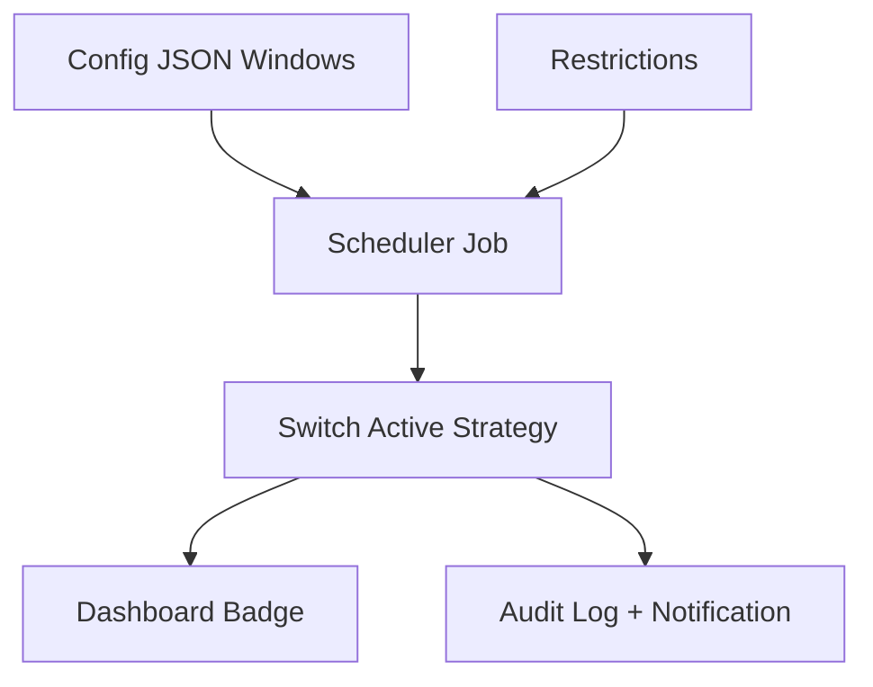


---
**From:** `docs/telemetry.md`

# Telemetry (Demo)

This repository includes a read-only telemetry client for the Tradovate demo environment. The client polls account balances, open positions, fills, and computes simple daily PnL and a buffer-cleared flag. Telemetry is **demo-only**; live wiring will arrive in a future PR.

## Configuration

Set the following environment variables (see `.env.example`):

```
ENABLE_TELEMETRY=true
TELEMETRY_POLL_MS=5000
TRADOVATE_DEMO_REST_BASE=https://demo.tradovateapi.com/v1
TRADOVATE_USER=...
TRADOVATE_PASSWORD=...
TRADOVATE_APP_ID=...
TRADOVATE_APP_VERSION=prism-apex/0.2.0
TRADOVATE_API_CID=...
TRADOVATE_API_SEC=...
TRADOVATE_DEVICE_ID=prism-apex-dev-telemetry
BUFFER_CLEAR_THRESHOLD=2500
```

## API

When telemetry is enabled the API exposes:

- `GET /telemetry/positions?accountId=...`
- `GET /telemetry/account?accountId=...`
- `GET /telemetry/fills?date=YYYY-MM-DD&accountId=...`
- `/ready` includes a `telemetry` block with basic metrics.

The consistency report uses telemetry-derived PnL when enabled; otherwise it falls back to mock data.

## Dashboard

A `/positions` tab displays open positions, account balance, and buffer status. The page polls the API at a selectable interval (3s/5s/10s/Off).

## Buffer Cleared

The buffer flag is derived from cumulative realized PnL crossing `BUFFER_CLEAR_THRESHOLD`. This is a placeholder heuristic for demo purposes and may be replaced when the live platform exposes an explicit flag.


---
**From:** `infra/README-DEPLOY.md`

# Prism Apex Tool — Deployment (Production)

## Overview

This stack deploys two containers:


- **Dashboard** on port **80** (proxies `/api/*` to API via Nginx in the image)

## One-time Server Setup

1. Provision Ubuntu 22.04 server.
2. Add GitHub Actions secrets (below).
3. First CI run will **bootstrap** Docker automatically.

## Required GitHub Secrets

- `GHCR_USERNAME`, `GHCR_TOKEN` — push images to GHCR
- `PROD_SSH_HOST`, `PROD_SSH_USER`, `PROD_SSH_KEY` — deploy over SSH
- `PROD_STACK_DIR` — e.g., `/home/ubuntu/prism-stack`
- `STACK_NAME` — e.g., `prism`

## First Deploy

1. Copy `infra/.env.prod.example` → create **server** file `${PROD_STACK_DIR}/.env`.
2. Tag a release locally:
   ```bash
   make release TAG=v0.1.0
   ```
3. CI builds & pushes images, then deploys to the server.

## Verify:

- <http://<server-ip>/> (dashboard)


## Rollback

Re-deploy previous tag:

```
TAG=v0.0.9 make deploy
```

## Notes

- Volumes are preserved across updates (prism_data).
- Health-gated rollout avoids serving broken builds.
- Add a reverse proxy + TLS later (Caddy/Traefik) if you need HTTPS.


---
**From:** `infra/README.md`

# Infra

Infrastructure configuration for Prism Apex Tool. Docker Compose and deployment scripts will be added in later prompts.


---
**From:** `infra/nginx/README.md`

# Prism Apex — Nginx + Let’s Encrypt TLS

## Prereqs

- DNS A/AAAA records for **YOUR_DOMAIN** pointing to this VM’s public IP

- Ubuntu 22.04+ (or Debian-based)

## One-time setup

```bash
# From repo root, as sudo-capable user
export DOMAIN=YOUR_DOMAIN
export EMAIL=you@example.com
bash infra/nginx/setup-nginx-certbot.sh
```

### What this does

- Installs Nginx + Certbot
- Places site config at /etc/nginx/sites-available/prism-apex.conf
- Obtains a Let’s Encrypt cert for $DOMAIN
- Forces HTTPS + HTTP/2

- Adds rate limiting and security headers

### Verify

```bash
curl -I https://$DOMAIN/health
# Should return HTTP/2 200
```

### Logs

- /var/log/nginx/prism-apex.access.log
- /var/log/nginx/prism-apex.error.log

### Renewals

Certbot installs a systemd timer. To test:

```bash
sudo certbot renew --dry-run
```

### TradingView

Point your webhook to: https://$DOMAIN/webhooks/tradingview

Add header: x-webhook-secret: <your secret>


---
**From:** `infra/systemd/README.md`

# Prism Apex — Ubuntu VM (systemd) Runbook

## Prereqs

- Ubuntu 22.04+ VM (you chose VM deployment)

- Node LTS and pnpm (installer script handles it)

## Top TS files (current)
     14 packages/indicators/__tests__/swings.spec.ts
     14 packages/indicators/__tests__/atr.spec.ts
     13 apps/api/test/rules/engine.test.ts
     12 packages/strategies/src/vwapFirstTouch.ts
     11 packages/sdk/src/index.ts
     10 packages/indicators/__tests__/vwap.spec.ts
      8 apps/api/src/jobs/strategies.ts
      7 packages/clients-tradovate/__tests__/telemetry.spec.ts
      6 packages/rules-apex/src/applyGuards.ts
      6 packages/indicators/src/swings.ts
      6 apps/api/src/jobs/ticketizer.ts
      5 packages/strategies/tests/osbBreakout.spec.ts
      5 packages/runtime/__tests__/ws.resilience.spec.ts
      4 packages/strategies/tests/vwapFirstTouch.spec.ts
      4 packages/strategies/src/osbBreakout.ts

## Top TS codes (current)
     56 error TS18048
     54 error TS2532
     13 error TS2305
     12 error TS2345
      8 error TS2339
      5 error TS2561
      5 error TS2322
      4 error TS2307
      3 error TS2769
      3 error TS2554
      3 error TS1343
      2 error TS2540
      1 error TS4104
      1 error TS2614
      1 error TS2578

## Tail: lint_l4_tail.txt
```
No matching log found for pattern: reports/lint/l4/*/lint.out
```

## Tail: lint_r3_tail.txt
```
No matching log found for pattern: reports/lint/round3/*/lint.out
```

## Tail: lint_r2_1_tail.txt
```
No matching log found for pattern: reports/lint/round2_1/*/lint.out
```

## Tail: unit_t7_tail.txt
```
No matching log found for pattern: reports/tests/t7/*/unit.out
```

## Tail: types_r5_tail.txt

## Tail: types_r3_tail.txt


---
**From:** `var/pnl/README.md`

# Daily PnL Data (for Consistency Metrics)

Create `var/pnl/daily.json` with an array of objects:

```json
[
  { "date": "2025-08-18", "pnl": 320.5 },
  { "date": "2025-08-19", "pnl": -150.0 }
]
```

date: YYYY-MM-DD

pnl: number (positive for profit, negative for loss)

The API route GET /report/consistency?window=8 reads this file. If it is missing or empty,
the route responds with 204 No Content.

====================
INTEGRATION NOTES

Register apps/api/src/routes/consistency.ts in your API server the same way other routes are registered.

No external services required.

Keep the window query between 1..15 (clamped in code).

====================
RUN / VERIFY

pnpm --filter @prism-apex/metrics typecheck

pnpm --filter @prism-apex/metrics test

pnpm --filter @prism-apex/api test

(Optional) create var/pnl/daily.json and curl:
curl -s "http://localhost:3000/report/consistency?window=8
" | jq .

## Realtime mode (ops-only)

Prism-Apex can run in realtime without changing strategy code.

**Enable (local/server):**
```bash
# Optional: point COMPOSE_FILE at your bundle if not docker-compose.yml
# export COMPOSE_FILE=/path/to/your-compose.yml
TOOLS="tools/codex"
$TOOLS/enable-realtime.sh
```

**Disable:**
```bash
$TOOLS/disable-realtime.sh
```

**Verify (bars → tickets → API):**
```bash
$TOOLS/check-realtime.sh
```

- `gapfill-realtime` keeps `bars_1m` current (today → now) every 60s.
- `tickets-realtime` discovers all `apps/tickets/dist/backfill-*.js` runners and executes each every minute so every strategy emits tickets continuously.
- Works on macOS and Linux hosts; reads `DATABASE_URL` from the live API container (or your compose env).
- The helper bundles these compose overlays automatically: `compose.ingress-db.override.yml`, `compose.gapfill-realtime.override.yml`, `compose.tickets-realtime.override.yml`, `compose.codex-governor.override.yml`, and `compose.codex-forcecurl.override.yml`. If you prefer calling `docker compose` manually (e.g., via CI/server automation), include the same overlays when starting `gapfill-realtime`/`tickets-realtime`.
