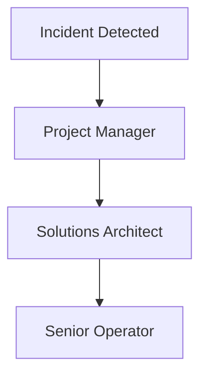

## Development


### 4. Incident Steps & Escalation

### 4.1 Platform/API Down

1. Pause trading immediately.
2. Attempt one reconnect.
3. If unresolved → notify **Project Manager (PM)** and **Solutions Architect**.
4. Document the outage in the daily log.

### 4.2 Ticket Cannot Be Entered

1. Retry order entry once.
2. If still failing → flag in Slack `#ops-incidents`.
3. Record the issue in the daily log and wait for guidance.

### 4.3 Rule Breach Alert Triggered

1. Stop trading immediately.
2. Close any open positions.
3. Notify **Senior Operator**.
4. Wait for clearance before resuming.

### Escalation Path

- Primary contact: **PM**
- Secondary contact: **Solutions Architect**
- Tertiary contact: **Senior Operator**



---

### Common Incidents

- **Platform/API down** → Pause trading; notify PM/SA.
- **Cannot enter ticket** → Log issue; skip ticket; escalate.
- **OCO missing** → **CRITICAL** alert; hard **Pause**; fix order.
- **Daily loss/consistency breach** → Flatten; escalate.

### Usage Patterns & CI

- Post-build tidy: clear `.next/`, `.turbo/`, or other caches between compose runs.
- Merge readiness: ensure scratch artifacts are gone before opening PRs.
- CI housekeeping: scheduled hygiene on ephemeral runners.

### CI Snippet
```yaml
- name: Safe cleanup of untracked caches
  run: AUTO_YES=1 DRY_RUN=0 ./safe_cleanup.sh
```
> Decide whether to archive or discard the updated `docs/YAHOO_DATA_CLEANUP.md` in CI artifacts.

---
