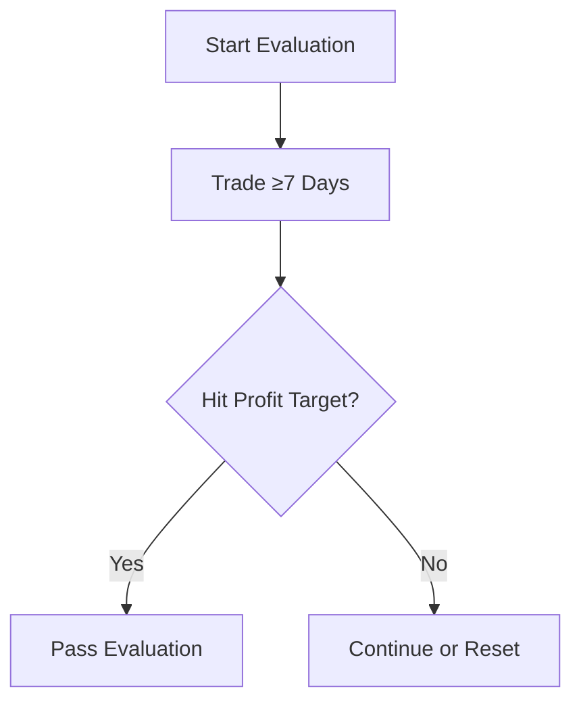

# Apex Trader Funding – Proprietary Trading Rules

## 1. Evaluation Phase Rules
### What It Does
- Profit targets and trailing drawdown thresholds  
- Minimum 7 trading days  
- End-of-day flat requirement  
- No daily drawdown or scaling limits  

### How to Use It
- Track trailing drawdown daily  
- Close all positions before 4:59 PM ET  
- Maintain ≥7 unique trade days  

### Config Options
- Account size (25k, 50k, 100k, etc.)  
- Trailing drawdown amount  
- Platform (Rithmic, Tradovate, WealthCharts)  

### Visuals

[Placeholder: screenshot of Apex evaluation dashboard]
