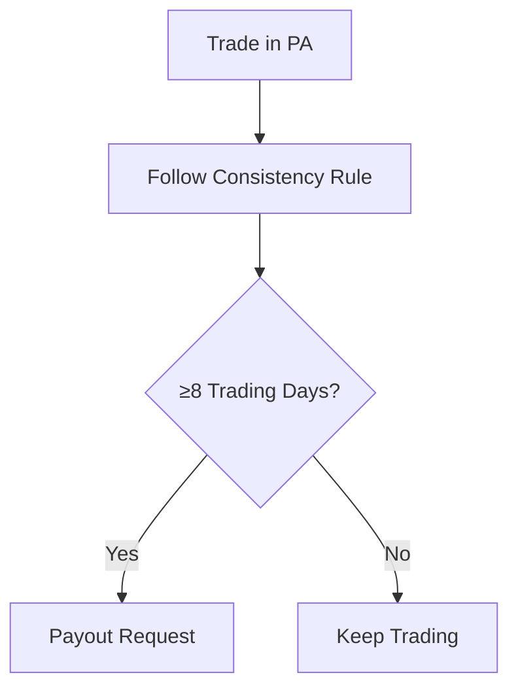

# Apex Trader Funding – Funded (Performance) Account Rules

## 1. Consistency Rules
- 30% profit distribution rule  
- 30% max daily loss relative to profits  

## 2. Risk Management
- Mandatory stop-loss on every trade  
- 5:1 max risk-reward ratio  
- Half-contract rule until drawdown buffer cleared  

## 3. Payout Rules
- First $25k 100% to trader  
- 90/10 split after until payout #6 → then 100%  
- 8-day minimum trading cycle between withdrawals  
- Safety net balance requirement for first 3 payouts  

## Visuals

[Placeholder: payout dashboard screenshot]
