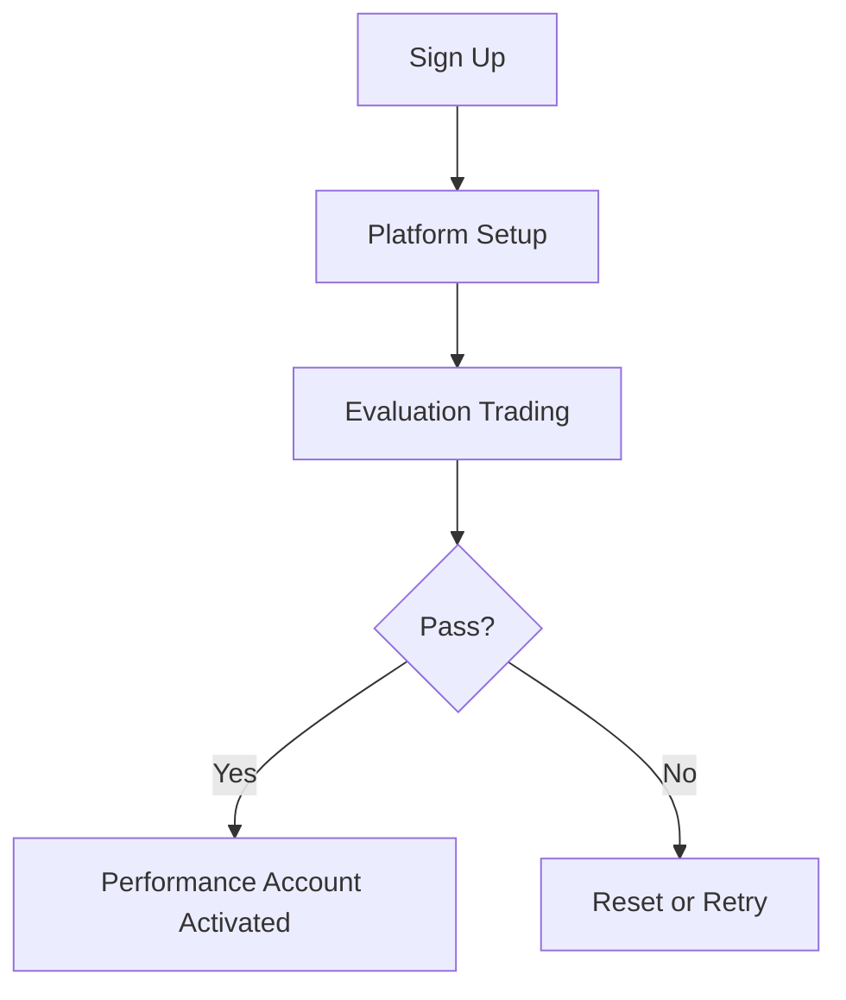

# Apex Trader Funding – Step-by-Step Process

## 1. Purchase Evaluation Plan
- Select account size + platform  

## 2. Platform Setup
- Rithmic → NinjaTrader  
- Tradovate → Web, Mobile, TradingView  
- WealthCharts → All-in-One  

## 3. Trading the Evaluation
- Close positions daily  
- Obey trailing drawdown  
- No multi-account hedging  

## 4. Passing Evaluation
- Hit profit goal  
- Trade 7+ days  
- Maintain compliance  

## 5. Activation of PA
- Sign contract  
- Pay $85/month PA fee  
- Transition to funded trading  

## Visuals

[Placeholder: onboarding email screenshot]
