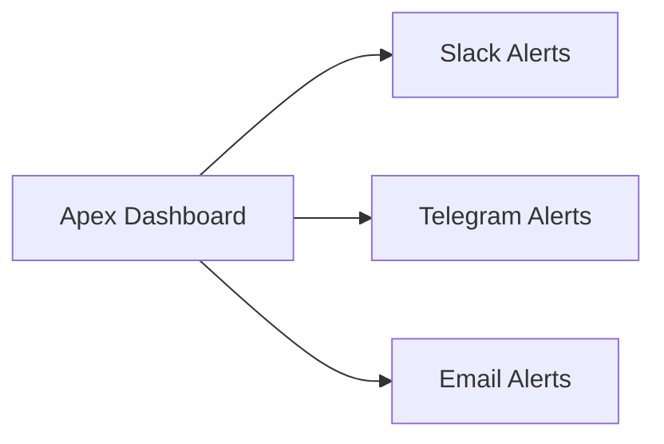

# Notifications Integration

## Supported Channels
- Email  
- Telegram  
- Slack  

## How to Use It
- Configure webhook in Apex dashboard  
- Connect Slack workspace (via bot token)  
- Test alerts on evaluation + PA status changes  

## Visuals

[Placeholder: screenshot Slack channel with Apex alert]
