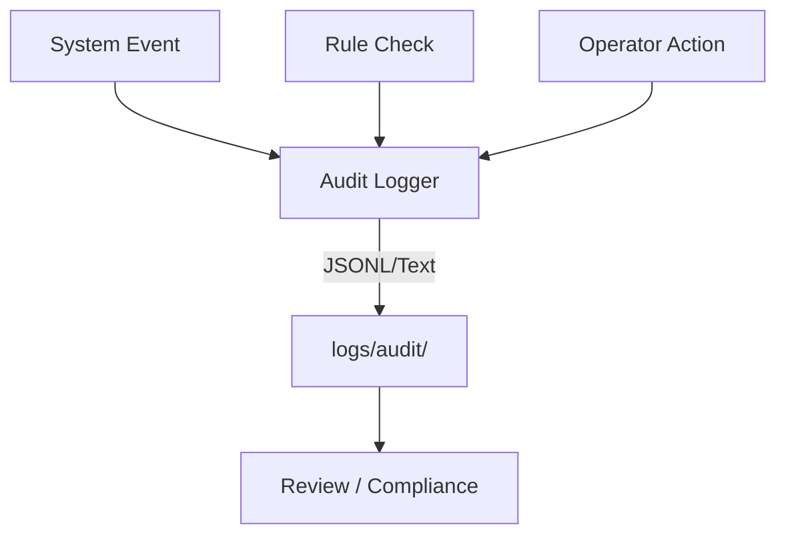

# Prism Apex Tool — Audit Trail Guide

## Purpose
- Records all **system events**, **rule checks**, and **operator actions**.
- Ensures compliance with Apex rules (manual input, EOD flat).

## Log Formats
- **audit.log** → plain text, human readable.
- **audit_YYYY-MM-DD.jsonl** → structured JSON lines for parsing.

## Example Entry
```json
{
  "timestamp": "2025-08-17T13:45:01Z",
  "event_type": "RULE_CHECK",
  "message": "Breaches detected",
  "details": {"breaches": ["daily_loss"]}
}
```

## Retention
- Keep logs for 90 days minimum.
- Archive older logs to cloud if required.

## Visuals

