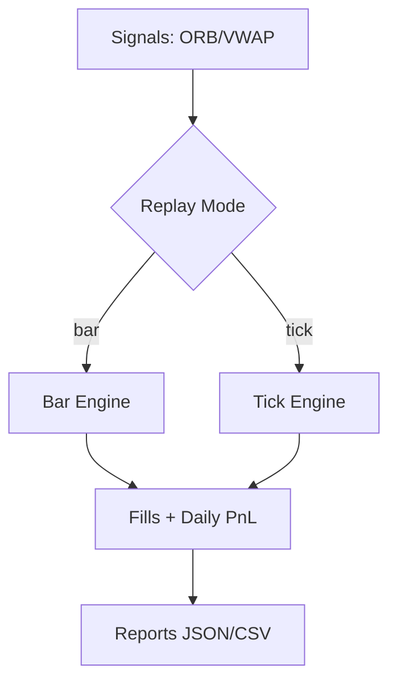

# Tick-Level Readiness (Post-MVP)

## What’s Included Now
- **Tick replay hooks** with a simple **cross-through fill** model.
- Feature-flagged CLI (`--modeReplay=tick`).
- Tiny sample tick CSV for demos.

## What’s Next (Not Included Yet)
- Queue/latency modeling.
- Partial fills & order book depth.
- Realistic slippage tied to spreads & volume.
- Parquet reader for high-volume tick data (planned).

## Usage
```bash
# Tick replay (uses sample ticks)
node apps/cli/dist/backtest.js \
  --strategy=ORB \
  --modeReplay=tick \
  --tickData=data/ES_ticks.sample.csv \
  --mode=evaluation --open=14:30 --close=21:59 \
  --tickValue=50 --seed=42 --out=out/es_orb_tick
```

Diagram

