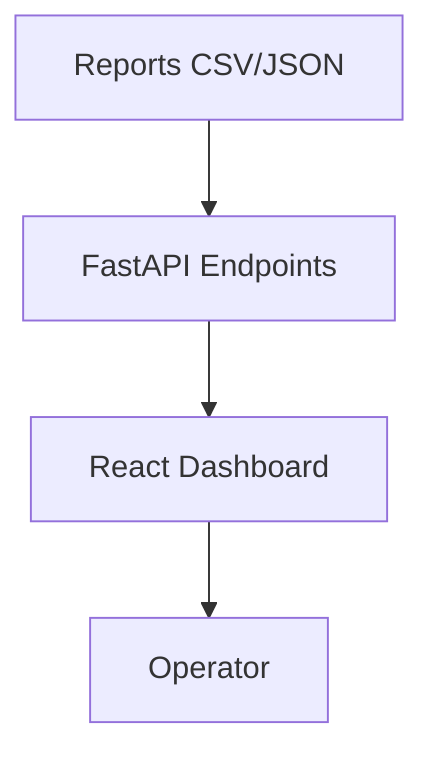

# Prism Apex Tool — Operator Dashboard Guide

## What It Does
- Shows live strategy performance (win rate, expectancy, max drawdown).
- Monitors Apex guardrail compliance (✅ pass / ❌ fail).
- Displays payout eligibility and next payout date.
- Summarizes calibration sweep results.

## How to Use
1. Start with `make dashboard`.
2. Open browser at `http://localhost:8000`.
3. Review widgets:
   - **Performance**: are strategies profitable?
   - **Guardrails**: any Apex breaches?
   - **Payouts**: when can money be withdrawn?
   - **Calibration**: are current parameters safe?

## Config Options
- All data pulled from `reports/` folder.
- Refresh dashboard by re-running sweeps or payouts.
- Frontend is single-page, minimal.

## Visuals

