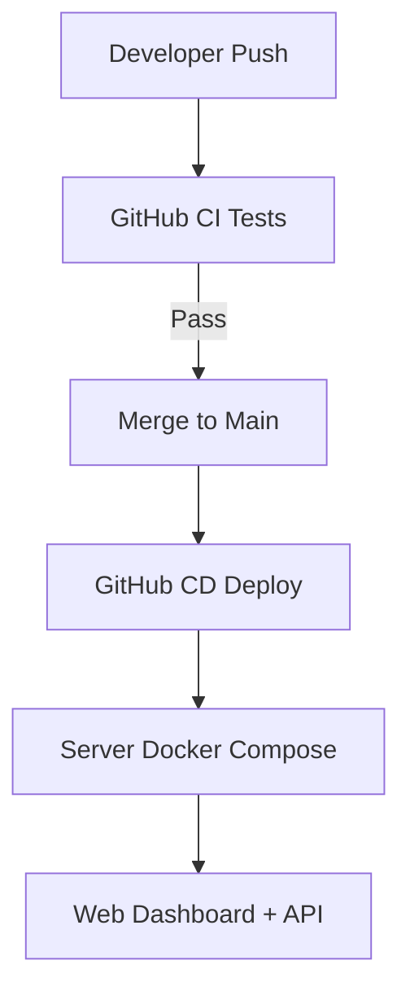

# Prism Apex Tool — Deployment Guide

## Local Development
- Run `make dashboard` for local API/UI.
- Calibration: `make calibrate`.
- Payouts: `make payouts`.

## Docker
```bash
docker-compose build
docker-compose up -d
```

## GitHub Actions
CI runs on develop: lint, tests, calibration.

CD runs on main: deploys to server via SSH + Docker.

## Server Deployment
SSH into server.

```bash
cd ~/prism-apex-tool
./infra/deploy.sh
```

## Visuals

