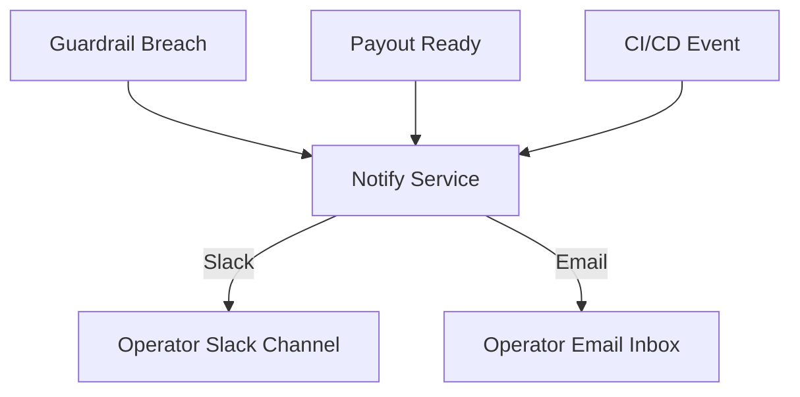

# Prism Apex Tool — Notifications Guide

## What It Does
- Sends alerts via **Slack** and **Email**.
- Covers:
  - Guardrail breaches (Apex rules).
  - Payout readiness.
  - CI/CD deployment results.

## How to Set Up
1. Create a Slack Incoming Webhook.
2. Add SMTP email credentials (Gmail works).
3. Copy `.env.example` → `.env` and fill in values.

## Test It
```bash
make notify-test
```

## Notification Flow

