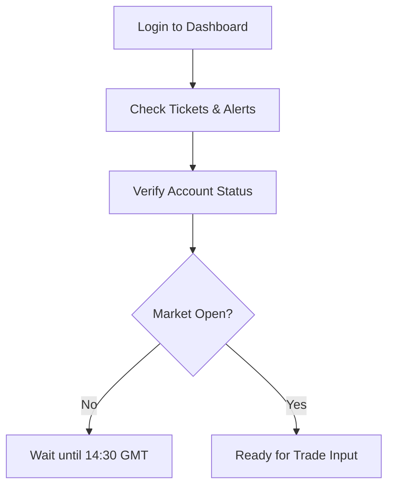
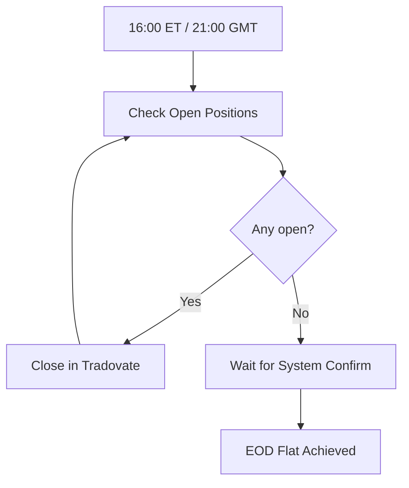
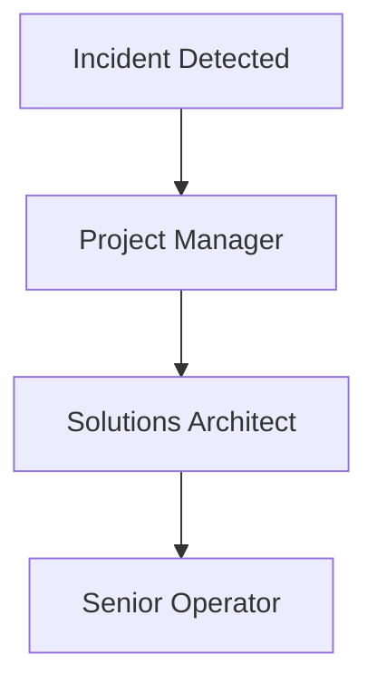

# Prism Apex Tool – Operator Handbook

---

## 1. Start of Day Checklist
### Step-by-step
1. Open your browser and log in to the **Prism Apex Dashboard**.
2. Review the dashboard home page.
3. Confirm system health:
   - Trade tickets display current signals.
   - Alerts panel is empty.
   - Account status shows correct balance and margin.
4. Verify trading session open times:
   - CME Futures open **9:30 AM ET (14:30 GMT)**.
   - Prism Apex Tool begins generating tickets from this time.
5. Log in to **Tradovate** and keep the order entry panel ready.
6. Ensure Slack/Telegram connection for automated alerts.

[Placeholder: screenshot of dashboard home]

---

## 2. During Session
### 2.1 Inputting Trades
1. On the dashboard, review each trade ticket (symbol, side, entry, stop, target).
2. In **Tradovate**, manually enter orders with matching values.
3. Include stop-loss and target on every order (**Apex rule**).
4. Confirm the order is accepted in Tradovate and visible on the dashboard.

[Placeholder: screenshot of ticket table]
[Placeholder: screenshot of Tradovate order entry]

### 2.2 Monitoring Alerts
- Alerts panel refreshes every 5 seconds.
- Watch for:
  - Daily loss cap approaching
  - Trailing drawdown breach
  - Scaling exceeded
  - Flat required (EOD)

### 2.3 Responding to Pause Conditions
1. If a **"System Paused"** alert appears:
   - Do **not** enter new trades.
   - Close any pending entries if instructed.
   - Notify Solutions Architect via Slack/Telegram.
2. Resume only when the dashboard shows **"System Active"**.

---

## 3. End of Day (EOD) Close
### Step-by-step
1. At **4:45 PM ET (21:45 GMT)** begin wind-down.
2. Ensure all trades are closed by **4:59 PM ET (21:59 GMT)** (Apex rule: daily flat).
3. Check dashboard Account Status → confirm no open positions or working orders.
4. Export or screenshot the daily dashboard summary.
5. Verify Slack/Telegram confirmation message is received.

[Placeholder: screenshot of flat positions screen]

---

## 4. Incident Steps & Escalation
### 4.1 Platform/API Down
1. Pause trading immediately.
2. Attempt one reconnect.
3. If unresolved → notify **Project Manager (PM)** and **Solutions Architect**.
4. Document the outage in the daily log.

### 4.2 Ticket Cannot Be Entered
1. Retry order entry once.
2. If still failing → flag in Slack `#ops-incidents`.
3. Record the issue in the daily log and wait for guidance.

### 4.3 Rule Breach Alert Triggered
1. Stop trading immediately.
2. Close any open positions.
3. Notify **Senior Operator**.
4. Wait for clearance before resuming.

### Escalation Path
- Primary contact: **PM**
- Secondary contact: **Solutions Architect**
- Tertiary contact: **Senior Operator**

---

## 5. Glossary
- **ORB (Opening Range Breakout)** – Trade triggered when price breaks the first 15–30 minute range.
- **VWAP (Volume Weighted Average Price)** – Average price weighted by volume; benchmark for fair value.
- **Trailing Drawdown** – Apex rule: peak balance minus fixed buffer; breaching this pauses trading.
- **Scaling** – Limiting contract size based on account balance.
- **Stop-loss** – Pre-set order to exit a trade if it moves against us.
- **Flat** – No open positions or working orders.

---
