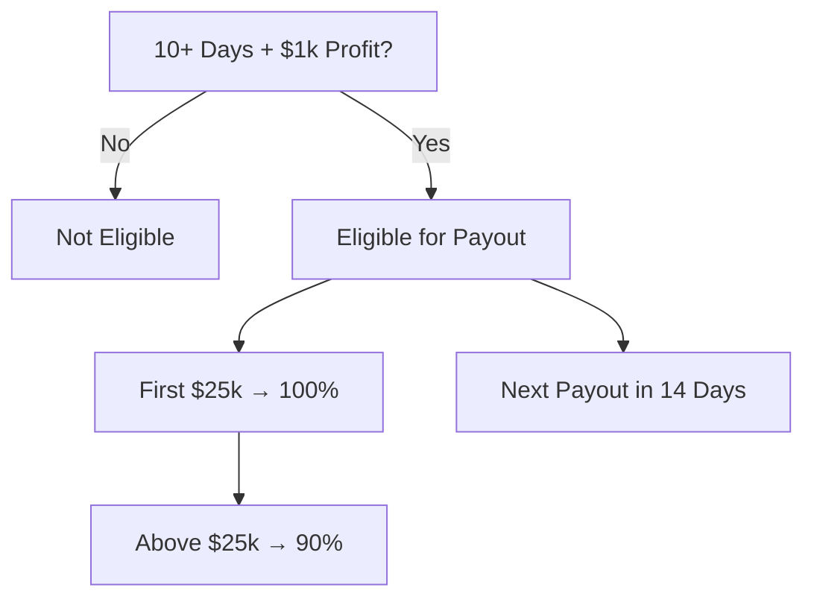

# Prism Apex Tool — Payout Calendar

## Rules Recap
- **First payout**: After 10 trading days AND $1,000 net profit.
- **Cycle**: Every 14 days after first payout.
- **Amounts**:
  - 100% of first $25,000.
  - 90% of profits above $25,000.

## Current Account Example
- Trading days completed: 12
- Total profit: $2,050
- Eligible? **Yes**
- Next payout date: 2025-09-01
- Estimated payout: $2,050

_All dates are in UTC/GMT._

## Mermaid Flow

[Placeholder: operator calendar screenshot]
