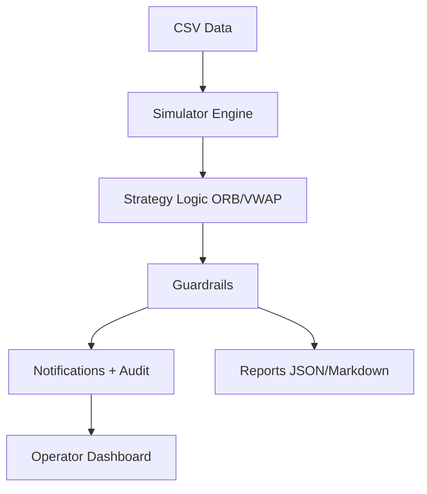

# Dry-Run Simulator — Operator Guide

## What This Does
- Replays a trading session (from CSV data).
- Runs both ORB and VWAP strategies as if live.
- Applies Apex guardrails.
- Sends notifications + logs events.
- Shows what would have happened without risking real accounts.

## Plain English
This is a **practice run** for the whole system.
- Feed in a day of data.
- System tells you what trades it would generate.
- If rules like “daily loss cap” are broken, you’ll see it flagged.
- At the end, you get a report in plain English + numbers.

## Steps
1. Upload CSV file via dashboard.
2. Select ORB, VWAP, or ALL.
3. Run simulation.
4. View results in dashboard + reports folder.

