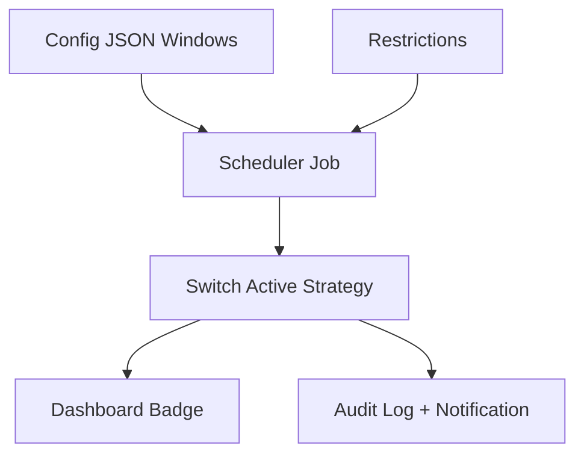

# Strategy Switcher — Operator Guide

## What This Does
- Controls whether **ORB** or **VWAP** strategy is active.
- Scheduler automatically turns strategies ON/OFF based on time windows.
- Blocks strategies during restricted periods (e.g., news, EOD).

## Plain English
- ORB runs at market open (14:30–15:00 GMT).
- VWAP runs until near close (15:00–20:50 GMT).
- EOD Flat: everything turns OFF at 20:50 GMT, operator must be flat.
- Restrictions: system disables trading around major events like CPI.

## How to Use
1. See **current active strategy** in dashboard.
2. Use dropdown/buttons to override manually (logged).
3. Add restricted windows to config JSON if needed.
4. Scheduler ensures Apex rules are met (no trading after EOD).

